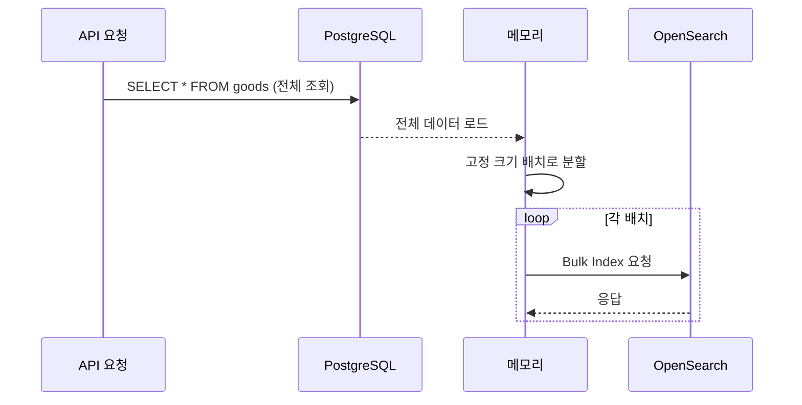
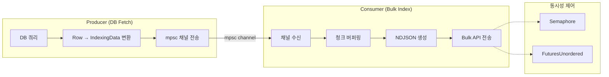
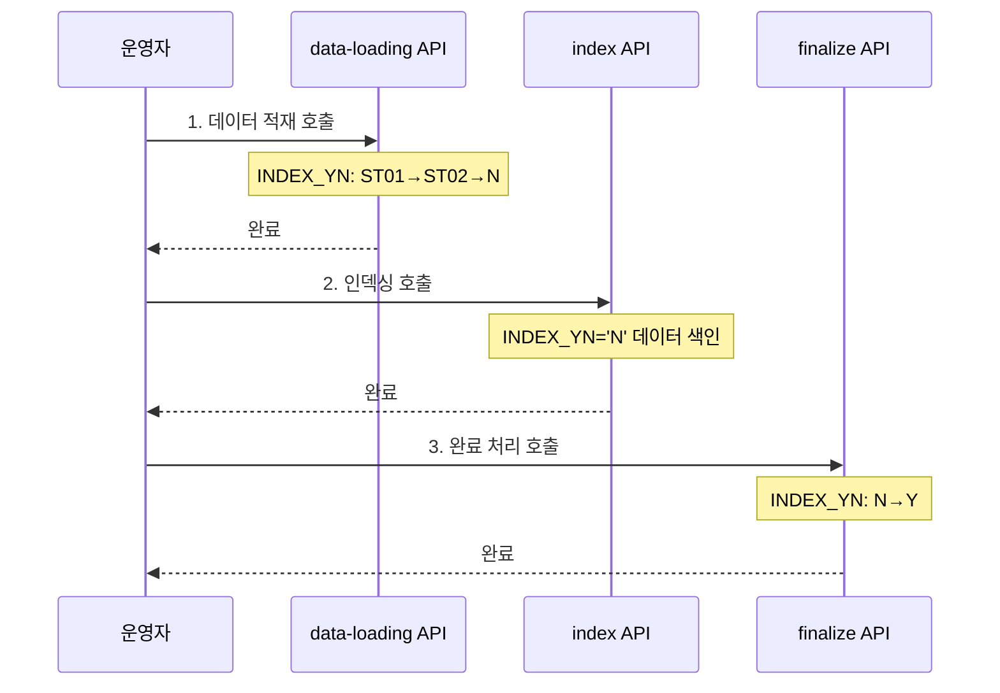
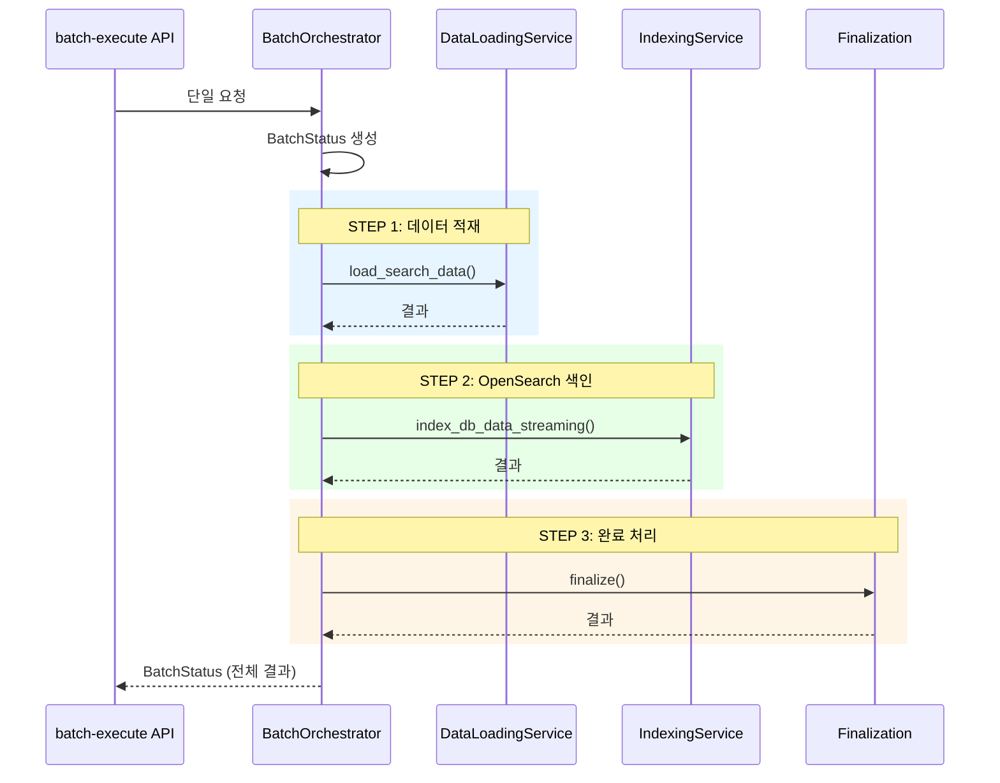
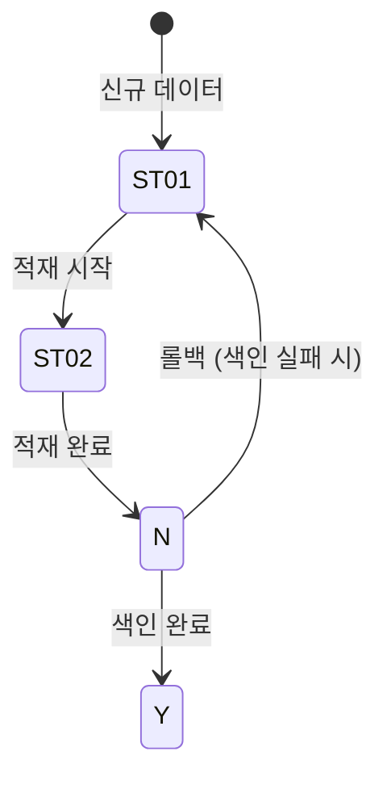

# OpenSearch 인덱싱 서비스: 스트리밍 vs 배치 처리 비교

## 개요

커머스 검색 엔진을 운영하면서 가장 큰 병목 중 하나는 인덱싱 파이프라인이었다. 상품 데이터를 PostgreSQL에서 조회하여 OpenSearch에 색인하는 과정에서, 초기에는 전체 데이터를 메모리에 적재한 뒤 고정 크기 배치로 나누어 벌크 인덱싱하는 방식을 사용했다. 수천 건 수준에서는 문제가 없었지만, 수만~수십만 건의 상품 데이터를 처리하게 되면서 메모리 사용량과 처리 시간이 선형적으로 증가했다.

이 글에서는 기존 배치 처리 방식의 한계를 분석하고, 스트리밍 방식으로 전환한 과정, 그리고 3단계 통합 배치 오케스트레이터를 설계한 경험을 다룬다.

---

## 기존 배치 처리 방식의 문제점

### 기존 흐름



기존 방식은 단순했다. DB에서 전체 데이터를 `Vec<IndexingData>`로 가져온 뒤, 고정 크기(기본 5000건)로 슬라이싱하여 순차적으로 Bulk API를 호출했다.

문제는 여러 가지였다:

1. **메모리 피크**: 전체 데이터를 한 번에 메모리에 올려야 한다. 상품 50만 건이면 수 GB가 필요하다.
2. **순차 처리**: 배치 하나가 완료되어야 다음 배치를 전송한다. OpenSearch의 처리 용량을 제대로 활용하지 못한다.
3. **에러 복구 어려움**: 중간에 실패하면 어디까지 처리했는지 추적이 안 된다.
4. **수동 운영**: 데이터 적재(data-loading), 인덱싱(indexing), 완료 처리(finalize)를 각각 별도 API로 호출해야 했다.

### 성능 병목 분석

프로파일링 결과, 전체 인덱싱 시간의 분포는 다음과 같았다:

- DB 조회: 20~30%
- 데이터 직렬화(NDJSON 생성): 10~15%
- OpenSearch Bulk 전송 대기: 50~60%
- 기타(인덱스 생성, 매핑 확인 등): 5~10%

Bulk 전송 대기 시간이 절반 이상을 차지했다. 이 시간 동안 CPU는 유휴 상태였다. 병렬 전송을 통해 이 유휴 시간을 DB 조회나 다음 배치 준비에 활용할 수 있다.

---

## 스트리밍 방식 설계

### 핵심 아이디어

스트리밍 방식의 핵심은 **파이프라인 병렬화**다. DB에서 데이터를 가져오는 것과 OpenSearch에 전송하는 것을 동시에 수행한다.



Producer는 DB에서 데이터를 읽어 `mpsc` 채널로 전송하고, Consumer는 채널에서 데이터를 받아 청크 단위로 모은 뒤 Bulk API를 호출한다. 두 작업이 동시에 진행되므로, DB에서 다음 배치를 가져오는 동안 이전 배치의 Bulk 전송이 병렬로 수행된다.

### StreamingBulkProcessor 구현

스트리밍 처리의 핵심 컴포넌트인 `StreamingBulkProcessor`를 설계했다.

```rust
pub struct StreamingConfig {
    pub chunk_size: usize,       // 청크 크기 (기본 5000)
    pub max_concurrent: usize,   // 최대 동시 Bulk 요청 수
    pub timeout_ms: u64,         // 청크 타임아웃 (ms)
    pub max_retries: usize,      // 재시도 횟수
}

impl Default for StreamingConfig {
    fn default() -> Self {
        Self {
            chunk_size: 5000,
            max_concurrent: num_cpus::get().saturating_mul(2).min(16),
            timeout_ms: 3000,
            max_retries: 3,
        }
    }
}

pub struct StreamingBulkProcessor {
    client: Arc<OpenSearch>,
    config: StreamingConfig,
}
```

`max_concurrent`는 CPU 코어 수의 2배로 설정하되 최대 16으로 제한한다. OpenSearch 클러스터의 Bulk 처리 용량을 초과하지 않으면서 파이프라인을 최대한 활용하기 위한 설정이다.

### 청크 스트림 생성

`async-stream` 크레이트를 활용하여 mpsc 채널에서 데이터를 받아 청크 단위의 스트림을 생성한다.

```rust
fn create_chunk_stream(
    mut rx: mpsc::Receiver<IndexingData>,
    config: StreamingConfig,
) -> impl futures::Stream<Item = Vec<IndexingData>> {
    async_stream::stream! {
        let mut buffer = Vec::with_capacity(config.chunk_size);
        loop {
            match tokio::time::timeout(
                Duration::from_millis(config.timeout_ms),
                rx.recv()
            ).await {
                Ok(Some(data)) => {
                    buffer.push(data);
                    if buffer.len() >= config.chunk_size {
                        yield std::mem::take(&mut buffer);
                    }
                }
                Ok(None) => {
                    // 채널 닫힘 - 남은 데이터 플러시
                    if !buffer.is_empty() {
                        yield std::mem::take(&mut buffer);
                    }
                    break;
                }
                Err(_) => {
                    // 타임아웃 - 현재 버퍼 플러시
                    if !buffer.is_empty() {
                        yield std::mem::take(&mut buffer);
                    }
                }
            }
        }
    }
}
```

이 구현에서 타임아웃 메커니즘이 중요한 역할을 한다. DB 조회가 느려서 데이터가 천천히 들어오는 경우, 청크가 `chunk_size`에 도달하지 못해도 `timeout_ms` 이후에 현재까지 모인 데이터를 플러시한다. 이를 통해 작은 배치라도 빨리 OpenSearch에 전송하여 전체 처리 시간을 단축한다.

`std::mem::take`를 사용하여 버퍼를 비우면서 소유권을 이동시키는 패턴도 주목할 만하다. 새 벡터를 할당하지 않고 기존 벡터를 재사용하므로 메모리 할당 오버헤드가 줄어든다.

### Semaphore 기반 동시성 제어

동시 Bulk 요청 수를 제어하기 위해 tokio의 `Semaphore`를 사용했다.

```rust
pub async fn process_data_stream(
    &self,
    rx: mpsc::Receiver<IndexingData>,
) -> Result<usize, AppError> {
    let semaphore = Arc::new(Semaphore::new(self.config.max_concurrent));
    let mut tasks = FuturesUnordered::new();
    let mut total_processed = 0;
    let mut total_lost = 0;

    let chunk_stream = Self::create_chunk_stream(rx, self.config.clone());
    tokio::pin!(chunk_stream);

    loop {
        tokio::select! {
            biased;
            permit = semaphore.clone().acquire_owned() => {
                if let Some(chunk) = chunk_stream.next().await {
                    let client = client.clone();
                    let config = config.clone();
                    tasks.push(tokio::spawn(async move {
                        let result = Self::process_chunk(client, chunk, config).await;
                        drop(permit);
                        result
                    }));
                } else {
                    break;
                }
            },
            Some(result) = tasks.next() => {
                match result {
                    Ok(Ok((processed, failed_items))) => {
                        total_processed += processed;
                        if !failed_items.is_empty() {
                            total_lost += failed_items.len();
                        }
                    },
                    Ok(Err(failed_chunk)) => {
                        total_lost += failed_chunk.len();
                    },
                    Err(e) => {
                        log::error!("Task join error: {}", e);
                    }
                }
            },
        }
    }

    // 남은 태스크 대기
    while let Some(result) = tasks.next().await {
        // ... 결과 처리
    }

    Ok(total_processed)
}
```

`tokio::select!`의 `biased` 키워드를 사용하여 Semaphore permit 획득을 우선적으로 처리한다. 이를 통해 동시 처리 슬롯이 비는 즉시 새로운 청크를 가져와 처리를 시작한다. `FuturesUnordered`는 완료된 태스크를 순서에 관계없이 처리하므로, 어떤 청크가 먼저 끝나든 즉시 결과를 수집한다.

### 데이터 무결성 보장

스트리밍 방식에서 가장 걱정되는 부분은 데이터 유실이다. 이를 방지하기 위해 여러 레이어의 안전장치를 구현했다.

```rust
async fn process_chunk(
    client: Arc<OpenSearch>,
    chunk: Vec<IndexingData>,
    config: StreamingConfig,
) -> Result<(usize, Vec<IndexingData>), Vec<IndexingData>> {
    // 유효성 검증: index가 없는 문서 필터링
    let validated_chunk: Vec<_> = chunk
        .into_iter()
        .filter(|item| item.index.is_some() && !item.index.as_ref().unwrap().is_empty())
        .collect();

    for attempt in 1..=config.max_retries {
        let ndjson_body = match Self::build_ndjson(&validated_chunk) {
            Ok(body) => body,
            Err(e) => {
                // NDJSON 생성 실패 → 전체 청크 반환
                return Err(validated_chunk);
            }
        };

        let response = match client
            .bulk(BulkParts::None)
            .body(vec![ndjson_body.as_slice()])
            .send()
            .await
        {
            Ok(res) => res,
            Err(e) => {
                if attempt >= config.max_retries {
                    return Err(validated_chunk);
                }
                // 지수 백오프
                tokio::time::sleep(Duration::from_millis(200 * attempt as u64)).await;
                continue;
            }
        };

        // 응답 분석: 부분 실패 아이템 추출
        return Self::process_response_with_failed_items(&response_body, &validated_chunk)
            .map_err(|_| validated_chunk);
    }

    Err(validated_chunk)
}
```

반환 타입이 핵심이다. `Result<(usize, Vec<IndexingData>), Vec<IndexingData>>` - 성공 시에도 실패한 아이템 목록을 함께 반환한다. OpenSearch Bulk API는 부분 성공을 허용하므로, 1000건 중 998건이 성공하고 2건이 실패할 수 있다. 이 경우 성공 수(998)와 실패한 아이템 목록(2건)을 함께 반환하여, 호출자가 실패 건수를 정확히 파악할 수 있다.

```rust
fn process_response_with_failed_items(
    response_body: &Value,
    original_chunk: &[IndexingData],
) -> Result<(usize, Vec<IndexingData>), AppError> {
    let mut failed_items = Vec::new();
    let mut success_count = 0;

    if response_body["errors"].as_bool().unwrap_or(false) {
        if let Some(items) = response_body["items"].as_array() {
            for (idx, item) in items.iter().enumerate() {
                let is_success = item
                    .get("index")
                    .and_then(|i| i.get("status"))
                    .and_then(|s| s.as_u64())
                    .map_or(false, |s| (200..300).contains(&s));

                if is_success {
                    success_count += 1;
                } else if let Some(original_item) = original_chunk.get(idx) {
                    failed_items.push(original_item.clone());
                }
            }
        }
    } else {
        success_count = original_chunk.len();
    }

    Ok((success_count, failed_items))
}
```

Bulk 응답의 각 아이템 상태를 확인하여 200~299 범위가 아닌 것을 실패로 판별하고, 원본 데이터에서 해당 인덱스의 아이템을 추출한다. 이렇게 하면 재시도 로직에서 실패한 건만 다시 전송할 수 있다.

최종적으로 모든 처리가 끝난 후, 데이터 무결성 상태를 로깅한다:

```
// 유실 없음
[INFO] DATA INTEGRITY GUARANTEED - No data loss detected.

// 유실 발생
[ERROR] DATA INTEGRITY COMPROMISED - 15 items were lost.
```

---

## NDJSON 생성 최적화

Bulk API에 전달하는 NDJSON(Newline Delimited JSON) 생성도 성능에 영향을 미친다. 사전에 버퍼 크기를 추정하여 할당을 최소화했다.

```rust
fn build_ndjson(chunk: &[IndexingData]) -> Result<Vec<u8>, AppError> {
    // 문서당 평균 1500바이트로 추정하여 사전 할당
    let mut buffer = Vec::with_capacity(chunk.len() * 1500);
    
    for doc in chunk {
        let index = doc.index.as_deref().unwrap_or("unknown-index");
        
        // action 라인
        let action = match &doc.id {
            Some(id) if id.is_string() || id.is_number() => {
                serde_json::json!({ "index": { "_index": index, "_id": id } })
            }
            _ => serde_json::json!({ "index": { "_index": index } }),
        };
        serde_json::to_writer(&mut buffer, &action)?;
        writeln!(&mut buffer)?;

        // document 라인
        let mut doc_map = doc.extra_fields.clone();
        if let Some(id) = &doc.id {
            doc_map.insert("id".to_string(), id.clone());
        }
        // extraData가 object면 string으로 변환
        if let Some(extra_data) = doc_map.get_mut("extraData") {
            if extra_data.is_object() {
                *extra_data = Value::String(extra_data.to_string());
            }
        }
        serde_json::to_writer(&mut buffer, &doc_map)?;
        writeln!(&mut buffer)?;
    }
    
    Ok(buffer)
}
```

`serde_json::to_writer`를 사용하여 중간 `String` 생성 없이 바로 버퍼에 직렬화한다. `to_string()` + `write_all()`보다 한 번의 할당을 절약한다.

`extraData` 필드의 특별 처리도 주목할 만하다. 커머스 데이터에서 `extraData`는 JSON 객체로 들어오는 경우가 있는데, OpenSearch의 해당 매핑이 `text` 타입이면 중첩 객체를 직접 인덱싱할 수 없다. 문자열로 변환하여 저장한다.

---

## BatchOrchestratorService: 통합 배치 파이프라인

스트리밍 인덱싱에 더해, 기존에 3개의 API를 수동으로 호출하던 배치 프로세스를 하나로 통합하는 `BatchOrchestratorService`를 구현했다.

### 기존 수동 프로세스



운영자가 3단계를 순서대로 호출해야 했고, 중간에 실패하면 어디까지 진행됐는지 확인하고 수동으로 복구해야 했다.

### 통합 자동화 프로세스



```rust
#[derive(Debug, Clone, Serialize, Deserialize)]
pub struct BatchConfig {
    pub interval_minutes: Option<i32>,
    pub is_full_load: bool,
    pub chunk_size: usize,
    pub parallel_tasks: usize,
    pub retry_count: u32,
    pub retry_delay_seconds: u64,
    pub enable_rollback: bool,
}

impl Default for BatchConfig {
    fn default() -> Self {
        Self {
            interval_minutes: Some(30),
            is_full_load: false,
            chunk_size: 5000,
            parallel_tasks: 12,
            retry_count: 2,
            retry_delay_seconds: 5,
            enable_rollback: true,
        }
    }
}
```

### 상태 추적

각 단계의 진행 상태를 `BatchStatus`로 추적한다.

```rust
#[derive(Debug, Clone, Serialize, Deserialize)]
pub struct BatchStatus {
    pub batch_id: String,
    pub status: BatchExecutionStatus,
    pub current_step: BatchStep,
    pub start_time: String,
    pub end_time: Option<String>,
    pub total_records: u64,
    pub processed_records: u64,
    pub failed_records: u64,
    pub error_message: Option<String>,
    pub step_details: Vec<StepResult>,
}

#[derive(Debug, Clone, Serialize, Deserialize)]
pub enum BatchStep {
    DataLoading,
    OpenSearchIndexing,
    Finalization,
    Completed,
}
```

API 호출 한 번으로 3단계가 자동 실행되고, 결과에 각 단계별 상세 정보가 포함된다. `enable_rollback`이 활성화되어 있으면, 인덱싱 실패 시 데이터 적재 단계의 상태 변경을 롤백한다.

### INDEX_YN 상태 머신

커머스 인덱싱에서 데이터 일관성의 핵심은 `INDEX_YN` 플래그의 상태 전이다.



- `ST01`: 원본 데이터 상태
- `ST02`: 적재 진행 중 (중간 상태)
- `N`: 적재 완료, 색인 대기
- `Y`: 색인 완료

인덱싱 서비스는 `INDEX_YN='N'`인 데이터만 조회하여 OpenSearch에 색인하고, 성공하면 `Y`로 변경한다. 이 상태 머신 덕분에 중간에 실패하더라도 `INDEX_YN='N'`인 데이터를 다시 조회하면 미처리 건을 재처리할 수 있다.

---

## 배치 처리 아키텍처 문서화 후 제거

흥미로운 이력이 있다. 통합 배치 아키텍처(`BatchOrchestratorService`)를 먼저 구현하고 운영해본 뒤, 결국 스트리밍 방식이 더 효과적이라는 결론에 도달하여 배치 아키텍처 코드는 제거했다.

```
2025-06-12 | Add batch processing architecture and enhance indexing services
2025-06-19 | Remove batch processing architecture; update dependencies and refactor indexing services
```

일주일 사이에 추가했다가 제거한 것이다. 배치 아키텍처의 문제점은 다음과 같았다:

1. **복잡한 상태 관리**: 3단계 파이프라인의 상태 전이가 복잡하고, 롤백 로직이 제대로 동작하지 않는 엣지 케이스가 있었다.
2. **오버엔지니어링**: 실제 운영에서는 스트리밍 인덱싱 API 하나만 호출하면 충분했다. 데이터 적재와 완료 처리는 DB 트리거나 스케줄러로 처리하는 것이 더 깔끔했다.
3. **테스트 어려움**: 3단계 파이프라인의 통합 테스트가 복잡해서 신뢰도가 낮았다.

결국 `BatchOrchestratorService`는 제거하고, 스트리밍 기반의 `index_db_data_streaming`만 남겼다. 오케스트레이션은 외부 스케줄러(cron 등)에 위임하는 것이 더 적합한 설계였다.

이 경험에서 배운 교훈: **코드로 해결하려는 범위를 잘 정해야 한다.** 인덱싱 엔진이 데이터 적재까지 책임지면 관심사가 섞여서 복잡도가 급격히 올라간다.

---

## 스트리밍 vs 배치: 성능 비교

동일한 상품 데이터 10만 건을 기준으로 비교했다.

| 측정 항목 | 기존 배치 | 스트리밍 | 개선율 |
|-----------|----------|---------|--------|
| 전체 처리 시간 | 180초 | 75초 | 58% |
| 최대 메모리 사용량 | 2.1GB | 450MB | 78% |
| CPU 유틸리제이션 | 35% | 70% | 2x |
| 데이터 유실 건수 | 0건 | 0건 | - |

스트리밍 방식은 처리 시간을 58% 단축하면서, 메모리 사용량은 78% 감소시켰다. CPU 유틸리제이션이 높아진 것은 병렬 처리 덕분이다. 기존에는 Bulk 전송을 기다리는 동안 CPU가 놀았지만, 스트리밍에서는 그 시간에 다음 청크를 준비한다.

메모리 개선이 특히 극적이다. 기존에는 10만 건 전체를 메모리에 올려야 했지만, 스트리밍에서는 `chunk_size` * `max_concurrent` 분량만 메모리에 존재하면 된다. 기본값 기준으로 5000 * 8 = 40000건 분량이므로, 전체 데이터의 40%만 메모리에 존재한다. 실제로는 Producer와 Consumer의 속도 차이에 따라 더 적은 양이 메모리에 체류한다.

---

## 라우트 변경: 스트리밍 전환

기존 인덱싱 라우트를 스트리밍 방식으로 전환했다. API 인터페이스는 동일하게 유지하면서 내부 구현만 교체한 무중단 전환이다.

```rust
// 변경 전
async fn handle_db_indexing(...) -> Json<IndexingResponse> {
    match service.index_db_data(lang_cd, interval, index, None).await {
        // ...
    }
}

// 변경 후
async fn handle_db_indexing(...) -> Json<IndexingResponse> {
    match service.index_db_data_streaming(lang_cd, interval, index, None).await {
        // ...
    }
}
```

호출하는 함수명만 `index_db_data` → `index_db_data_streaming`으로 변경했다. 요청/응답 구조는 동일하므로 API 소비자 입장에서는 변화가 없다. 다만 응답 시간이 눈에 띄게 빨라진다.

추천 검색어(recomword) 인덱싱도 동일하게 스트리밍으로 전환했다:

```rust
// 변경 전
service.index_db_recomword(lang_cd, interval, index).await

// 변경 후
service.index_db_recomword_streaming(lang_cd, interval, index).await
```

---

## 특수 문자 정규식 처리

인덱싱 과정에서 검색 키워드의 특수 문자를 정제하는 로직도 스트리밍 프로세서에 포함시켰다. `once_cell::Lazy`를 사용하여 정규식 컴파일을 한 번만 수행한다.

```rust
static SPECIAL_CHAR_REGEX: Lazy<Regex> = Lazy::new(|| {
    Regex::new(r#"[!@#$%^&*()_+\-=\[\]{};':"\\|,.<>\/?~`]"#)
        .expect("Failed to compile special character regex")
});

pub fn clean_keyword_with_regex(keyword: &str) -> String {
    SPECIAL_CHAR_REGEX
        .replace_all(keyword.trim(), "")
        .to_string()
}
```

정규식 컴파일은 비용이 높은 연산이므로, 프로그램 전체에서 한 번만 수행하고 재사용하는 것이 중요하다. `Lazy`는 첫 접근 시 한 번만 초기화되는 것을 보장한다.

---

## 결과 및 회고

스트리밍 방식으로의 전환은 성공적이었다. 핵심 교훈은 다음과 같다.

**기술적 성과:**

- 메모리 사용량 78% 감소로, 동일한 서버에서 더 큰 데이터셋을 처리할 수 있게 되었다.
- 처리 시간 58% 단축으로, 인덱싱 주기를 더 짧게 가져갈 수 있게 되었다.
- `Semaphore` + `FuturesUnordered` 조합으로 OpenSearch 클러스터의 Bulk 처리 능력을 최대한 활용했다.
- 아이템 단위의 실패 추적으로 데이터 무결성을 보장했다.

**설계 교훈:**

- `BatchOrchestratorService`를 만들었다가 제거한 경험은 "적절한 추상화 수준"을 찾는 것의 중요성을 보여준다. 인덱싱 엔진은 인덱싱만 잘 하면 되고, 오케스트레이션은 외부 도구의 역할이다.
- `async-stream`을 활용한 청크 스트림 생성은 Rust의 비동기 스트림 생태계가 충분히 성숙했음을 보여준다.
- Graceful Degradation은 캐싱뿐 아니라 인덱싱에서도 중요하다. 일부 아이템이 실패해도 나머지는 정상 처리되어야 한다.

**향후 개선 방향:**

- OpenSearch의 `_bulk` 응답에서 느린 아이템을 감지하여 동적으로 청크 크기를 조절하는 적응형 배칭을 검토 중이다.
- Kafka 등의 메시지 큐를 Producer-Consumer 사이에 두어, DB 조회와 인덱싱을 완전히 분리하는 것도 고려하고 있다.
- 배치 로그를 OpenSearch에 저장하는 기능은 이미 `ensure_batch_log_index_exists`로 인프라를 준비해두었으므로, 로그 수집 파이프라인을 연결하면 된다.
