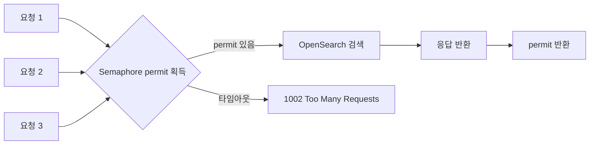
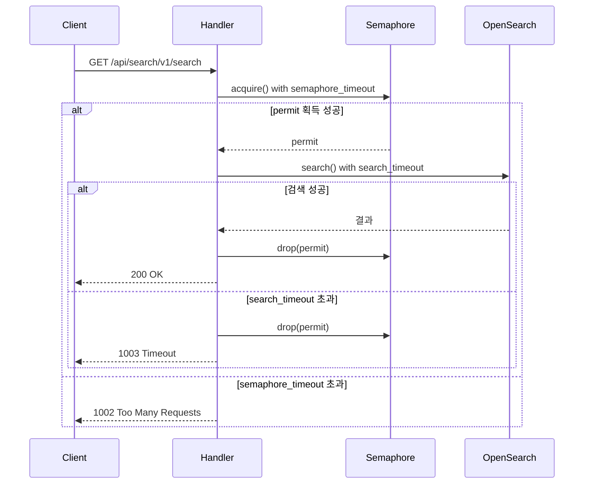

# Rate Limiting이 적용된 검색 API 설계

커머스 검색 API는 트래픽 폭증에 취약하다. 특가 이벤트, 타임세일, 마케팅 캠페인이 겹치면 수초 안에 요청이 수십 배로 급증한다. 이때 아무런 제어 없이 요청을 받으면 OpenSearch 클러스터가 응답 불능 상태에 빠지고, 한 번 무너진 검색 서비스는 복구까지 시간이 걸린다.

search-rust에서는 IP 기반 토큰 버킷 방식이 아니라 **Tokio Semaphore 기반 동시성 제어**를 선택했다. 이 선택의 배경, 구현 세부사항, 이중 타임아웃 구조를 정리한다.

## Rate Limiting 방식의 선택

### 처음 설계: IP 기반 Rate Limiting

초기 설계에서는 일반적인 Rate Limiting 방식을 고려했다. `config.toml`에는 이 흔적이 남아있다.

```toml
# config/stg.toml, config/prd.toml 공통
rate_limit_enabled = false
rate_limit_requests = 100       # 허용 요청 수
rate_limit_period_seconds = 60  # 기간(초)
```

`AppConfig`에도 필드가 정의되어 있다.

```rust
// src/config.rs
pub struct AppConfig {
    pub rate_limit_enabled: Option<bool>,
    pub rate_limit_requests: Option<u32>,
    pub rate_limit_period_seconds: Option<u32>,
    // ...
}
```

100 req/60s 같은 IP별 요청 제한을 붙이려 했다. 하지만 이 방식을 포기한 이유가 있었다.

### IP 기반 방식의 한계

커머스 환경에서 IP 기반 Rate Limiting은 효과가 제한적이다.

첫째, **내부 클라이언트 문제**다. 동일한 내부 네트워크에서 여러 서비스가 검색 API를 호출할 때, 모두 같은 프록시 IP나 게이트웨이 IP로 집계된다. IP 제한을 걸면 정상적인 내부 트래픽이 차단된다.

둘째, **실제 병목 지점 미반영**이다. IP별로 초당 요청 수를 제한해도, 실제 서비스 병목은 OpenSearch 커넥션 수다. IP 제한 100 req/60s를 적용해도 동시에 100개의 요청이 OpenSearch로 향하면 클러스터가 과부하된다.

셋째, **역방향 프록시 환경**이다. Nginx나 API Gateway 뒤에 배치된 경우 `X-Forwarded-For` 헤더 처리가 복잡해지고, 이를 신뢰하기 어려운 환경도 있다.

결론적으로 IP 기반 제한은 설정 필드를 예약해두고 `rate_limit_enabled = false`로 비활성화 상태로 남겼다. 실제 과부하 방어는 다른 방식으로 해결했다.

### Semaphore 기반 동시성 제어의 선택

검색 API의 실제 병목은 OpenSearch 커넥션이다. 동시에 처리할 수 있는 검색 요청 수는 OpenSearch 커넥션 풀 크기에 의해 제한된다. 그렇다면 **동시 실행 중인 요청 수 자체를 OpenSearch 풀 크기에 맞추는 것**이 가장 직접적인 해법이다.

Tokio의 `Semaphore`는 이 목적에 딱 맞는 도구다. 허용 가능한 동시 실행 수(permit 수)를 정하고, 초과 요청은 permit을 획득할 때까지 대기하거나 타임아웃으로 즉시 거절한다.

## OpenSearch 커넥션 풀 크기 계산

Semaphore의 permit 수는 OpenSearch 커넥션 풀 크기와 동일하게 설정된다. 풀 크기는 서버 CPU 코어 수에 따라 동적으로 결정된다.

```rust
// src/util/opensearch/client.rs
let available_cpus = num_cpus::get();

let default_pool_size = if available_cpus <= 4 {
    available_cpus * 2       // 소형 서버 (4코어 이하): 코어 × 2
} else if available_cpus <= 8 {
    available_cpus * 3       // 중형 서버 (8코어 이하): 코어 × 3
} else {
    (available_cpus * 4).min(32)  // 대형 서버: 코어 × 4, 최대 32
};

let pool_size = config.opensearch_pool_size.unwrap_or(default_pool_size);
```

4코어 서버라면 기본 풀 크기가 8, 8코어라면 24, 16코어라면 32(최대)가 된다. `config.toml`에 `opensearch_pool_size`를 명시하면 이 값을 오버라이드할 수 있다.

이 숫자는 곧 **서버가 동시에 처리할 수 있는 최대 검색 요청 수**가 된다.



## Semaphore 싱글톤 구현

Semaphore는 서버 전체에서 하나의 인스턴스를 공유해야 한다. `once_cell`로 싱글톤으로 관리한다.

```rust
// src/routes/search/routes.rs
use once_cell::sync::OnceCell;
use std::sync::Arc;
use tokio::sync::Semaphore;

static SEARCH_LIMITER: OnceCell<SearchLimiter> = OnceCell::new();

struct SearchLimiter {
    semaphore: Arc<Semaphore>,
}

async fn get_search_limiter() -> &'static SearchLimiter {
    SEARCH_LIMITER
        .get_or_init(|| async {
            // OpenSearch 클라이언트가 초기화된 후 풀 크기를 가져온다
            let pool_size = client::get_pool_size().await;
            let semaphore = Arc::new(Semaphore::new(pool_size));
            SearchLimiter { semaphore }
        })
        .await
}
```

`get_or_init`은 최초 호출 시 한 번만 초기화되고, 이후 호출에서는 기존 인스턴스를 반환한다. OpenSearch 클라이언트가 초기화된 후 풀 크기를 읽기 때문에, 서버 시작 직후 첫 번째 검색 요청이 들어올 때 Semaphore가 생성된다.

## 이중 타임아웃 구조

검색 요청은 두 단계의 타임아웃으로 보호된다.



```rust
// src/routes/search/routes.rs
async fn execute_search(search_params: SearchParams) -> Json<ApiResponse> {
    let limiter = get_search_limiter().await;

    // 1단계: Semaphore permit 획득 (semaphore_timeout_seconds 내)
    let permit_result = timeout(
        Duration::from_secs(CONFIG.semaphore_timeout_seconds as u64),
        limiter.semaphore.acquire(),
    )
    .await;

    let permit = match permit_result {
        Ok(Ok(permit)) => permit,
        Ok(Err(e)) => {
            error!("Semaphore error: {}", e);
            return create_error_response(ERR_SEMAPHORE_FAILED, "Search limiter error");
        }
        Err(_timeout) => {
            // semaphore_timeout 초과 → 동시 요청 한도 초과
            return create_error_response(ERR_TOO_MANY_REQUESTS, "Too many concurrent requests");
        }
    };

    // 2단계: 검색 실행 (search_timeout_seconds 내)
    let search_result = timeout(
        Duration::from_secs(CONFIG.search_timeout_seconds as u64),
        search_service::search(&search_params),
    )
    .await;

    // permit은 drop 시 자동 반환 (명시적 drop으로 즉시 해제)
    drop(permit);

    match search_result {
        Ok(Ok(response)) => Json(response),
        Ok(Err(e)) => {
            error!("Search service error: {}", e);
            create_error_response(ERR_INTERNAL, "Internal server error")
        }
        Err(_timeout) => create_error_response(ERR_TIMEOUT, "Search operation timed out"),
    }
}
```

### 두 타임아웃의 역할 분리

**`semaphore_timeout_seconds`** — 동시 요청이 풀 크기를 초과했을 때 얼마나 기다릴지다. 이 시간 안에 다른 요청이 완료되면 permit을 받아 처리된다. 초과하면 즉시 `1002`를 반환하고 클라이언트에게 재시도를 유도한다. 보통 2~5초로 설정한다.

**`search_timeout_seconds`** — OpenSearch 검색 자체에 허용되는 최대 실행 시간이다. 인덱스 크기, 쿼리 복잡도에 따라 검색이 느려질 수 있는데, 이 한도를 초과하면 `1003`을 반환한다. 보통 10~30초로 설정한다.

두 값을 분리한 이유는 서로 다른 의미를 갖기 때문이다. `semaphore_timeout`은 "얼마나 기다릴 것인가"이고, `search_timeout`은 "검색 자체가 얼마나 걸릴 수 있는가"다. 전자는 부하 상황에 따라 조정하고, 후자는 쿼리 복잡도에 따라 조정한다.

## 에러 코드 체계

에러 상황을 네 가지로 분류하고 고유 코드를 부여했다.

```rust
const ERR_SEMAPHORE_FAILED: &str = "1001";   // Semaphore 자체 오류 (버그)
const ERR_TOO_MANY_REQUESTS: &str = "1002";  // 동시 요청 한도 초과 (정상 제어)
const ERR_TIMEOUT: &str = "1003";            // 검색 타임아웃 (OpenSearch 느림)
const ERR_INTERNAL: &str = "9999";           // 그 외 내부 오류
```

클라이언트 입장에서 `1002`와 `1003`은 다른 의미다. `1002`는 "지금 서버가 바빠서 잠시 후 재시도하라"는 신호고, `1003`은 "요청은 접수됐지만 처리가 너무 오래 걸렸다"는 신호다. 이 구분이 있어야 클라이언트가 재시도 전략을 다르게 적용할 수 있다.

`1001`은 Semaphore 자체가 오류를 반환한 경우인데, 이는 Semaphore가 닫혔을 때만 발생한다. 정상 운영 중에는 발생하지 않아야 하고, 발생하면 서버 내부 버그를 의심해야 한다.

## 설정 구성

`config.toml`에서 조정 가능한 값들이다.

```toml
# config/prd.toml
opensearch_pool_size = 24          # OpenSearch 커넥션 풀 크기 (= Semaphore permit 수)
semaphore_timeout_seconds = 3      # Semaphore 대기 최대 시간
search_timeout_seconds = 15        # 검색 실행 최대 시간

# 미구현 (예약 상태)
rate_limit_enabled = false
```

운영 환경에서는 `opensearch_pool_size`를 CPU 코어 수와 OpenSearch 클러스터 사양에 맞게 조정하는 것이 중요하다. OpenSearch 노드가 과부하 없이 처리할 수 있는 동시 쿼리 수보다 `opensearch_pool_size`를 크게 설정하면 Semaphore가 있어도 OpenSearch가 먼저 무너진다.

## 트러블슈팅

### permit drop 위치 버그

초기 구현에서 `permit`을 함수 끝에서 암묵적으로 drop했는데, 문제가 있었다.

```rust
// 잘못된 구현
let permit = semaphore.acquire().await?;
let result = search_service::search(&params).await;
// permit이 여기서 drop됨 — search_service::search 반환 후

Json(result)
// permit이 이미 drop됐으므로 문제없어 보이지만...
```

`result`를 `Json`으로 변환하는 과정에서 직렬화가 실패하면 panic이 발생할 수 있다. panic 발생 시 permit이 release되지 않고 Semaphore가 영구적으로 permit 하나를 잃게 된다.

명시적 `drop(permit)`으로 검색 완료 직후 즉시 반환하도록 수정했다.

```rust
// 올바른 구현
let permit = semaphore.acquire().await?;
let result = search_service::search(&params).await;
drop(permit);  // 직렬화 전에 명시적으로 반환

Json(result)
```

이렇게 하면 검색 완료 즉시 permit이 반환되어 대기 중인 다른 요청이 빠르게 처리되고, 이후 로직에서 panic이 발생해도 Semaphore는 정상 상태를 유지한다.

### 고부하 상황에서 Semaphore 대기 증가

부하 테스트 중 `semaphore_timeout_seconds = 2`로 설정했을 때 많은 요청이 `1002`를 받는 현상이 있었다. OpenSearch 응답이 평균 500ms인 상황에서 2초 타임아웃은 최대 4개 요청 처리 사이클을 기다릴 수 있다는 의미인데, 트래픽이 급격히 몰리면 대기열이 쌓여서 2초 안에 permit을 못 받는 경우가 생겼다.

해결책은 두 가지였다. 첫째, `semaphore_timeout_seconds`를 5초로 늘렸다. 둘째, `opensearch_pool_size`를 실제 OpenSearch 클러스터가 안정적으로 처리할 수 있는 상한으로 조정했다. 단순히 풀 크기를 늘리는 게 아니라, OpenSearch 노드 사양에 맞는 값을 측정해서 설정했다.

### 검색 타임아웃과 OpenSearch 내부 타임아웃의 차이

OpenSearch 클라이언트에는 자체 요청 타임아웃이 있고, `search_timeout_seconds`는 그것과 별개다.

```
search_timeout_seconds = 15s  →  Axum 핸들러 레벨 타임아웃
OpenSearch 클라이언트 timeout  →  HTTP 연결 레벨 타임아웃
```

이 두 값이 맞지 않으면 의도하지 않은 동작이 생긴다. `search_timeout_seconds = 15s`인데 OpenSearch 클라이언트 타임아웃이 10s라면, 실제로는 10s에 에러가 나고 Axum 핸들러 레벨에서는 `Ok(Err(...))`로 잡혀서 `9999` 코드를 반환한다. `1003`이 아니라 `9999`가 나오는 것이다.

두 타임아웃 값을 명확히 일치시키거나, OpenSearch 클라이언트 타임아웃을 `search_timeout_seconds`보다 약간 크게 설정해서 Axum 레벨 타임아웃이 먼저 발생하도록 해야 한다.

## IP 기반 Rate Limiting의 남은 숙제

현재 구조는 **서버 전체의 동시 요청 수**를 제한하지만, **특정 클라이언트의 요청 폭주**에는 대응하지 못한다. 단일 클라이언트가 모든 permit을 점유하면 다른 클라이언트가 `1002`를 받는다.

이 문제는 `rate_limit_enabled = false`로 남겨둔 IP별 Rate Limiting으로 보완할 수 있다. 구현 계획은 Redis를 활용한 슬라이딩 윈도우 방식이었다.

```rust
// 계획 중인 구현 (미구현)
async fn check_rate_limit(ip: &str, config: &AppConfig) -> Result<(), AppError> {
    if !config.rate_limit_enabled.unwrap_or(false) {
        return Ok(());
    }

    let key = format!("rate_limit:{}", ip);
    let requests = config.rate_limit_requests.unwrap_or(100);
    let period = config.rate_limit_period_seconds.unwrap_or(60);

    // Redis INCR + EXPIRE 패턴
    let count: u32 = redis_client.incr(&key).await?;
    if count == 1 {
        redis_client.expire(&key, period as i64).await?;
    }

    if count > requests {
        return Err(AppError::rate_limited());
    }

    Ok(())
}
```

Redis의 `INCR` + `EXPIRE` 패턴은 슬라이딩 윈도우의 근사값이다. 정확한 슬라이딩 윈도우가 필요하면 Sorted Set을 사용하지만, 커머스 검색 API에서는 이 정도 정밀도로 충분하다.

Semaphore 기반 전체 동시성 제어와 Redis 기반 IP별 Rate Limiting을 조합하면, 전체 부하와 특정 클라이언트 폭주 모두에 대응하는 이중 방어 구조가 완성된다.

## 정리

search-rust의 Rate Limiting은 IP별 요청 수 제한이 아닌 **Semaphore 기반 동시성 제어**로 구현됐다.

이 선택의 이유는 명확하다. 검색 API의 실제 병목은 OpenSearch 커넥션이고, 동시 실행 중인 요청 수를 커넥션 풀 크기에 맞추면 OpenSearch가 절대 과부하되지 않는다. IP 기반 제한은 내부 클라이언트 환경에서 효과가 제한적이고, 설정 복잡도에 비해 실제 방어 효과가 낮았다.

`semaphore_timeout`과 `search_timeout` 이중 타임아웃은 두 가지 다른 실패 시나리오를 명확히 분리한다. 서버가 바빠서 못 받는 경우와, 검색 자체가 느린 경우를 구분해야 클라이언트가 올바른 재시도 전략을 쓸 수 있다.

IP별 Rate Limiting은 설정 필드를 예약해두고 미구현 상태로 남아있다. Redis 슬라이딩 윈도우 방식으로 구현할 계획이었지만, 운영 중 실제 특정 클라이언트 폭주 문제가 발생하지 않아서 우선순위가 뒤로 밀렸다. Semaphore만으로 전체 부하를 제어하는 것으로 충분했다.
