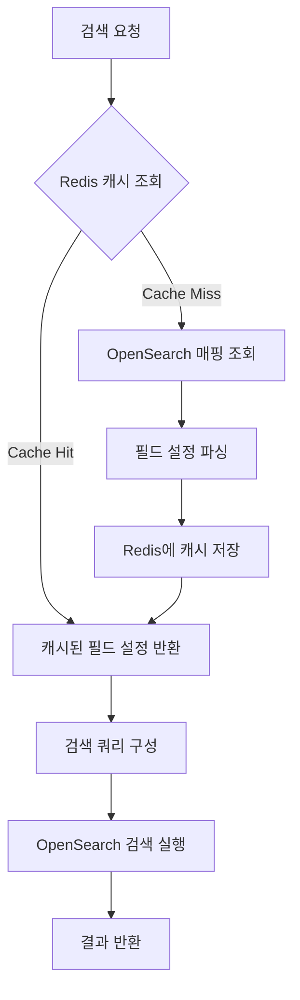
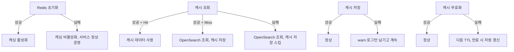
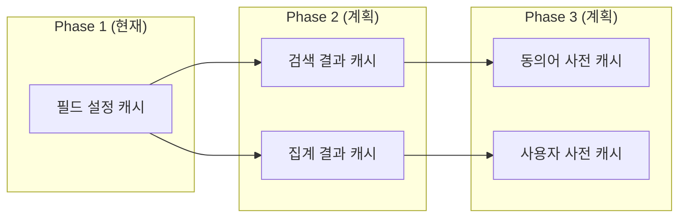

# Rust 검색 엔진에 Redis 캐싱 적용기

## 개요

커머스 검색 엔진을 Rust(Axum)로 운영하면서, 검색 요청이 들어올 때마다 OpenSearch에 인덱스 매핑 정보를 조회하는 오버헤드가 점점 눈에 띄기 시작했다. 상품 검색, 마케팅 검색, 이벤트 검색 등 다양한 인덱스 타입마다 필드 설정(어떤 필드가 exact match인지, phrase match인지, primary/secondary인지)을 매번 OpenSearch 클러스터에 질의하고 있었는데, 이 정보는 인덱싱 시점에만 변경되고 검색 시점에는 사실상 불변 데이터다.

Redis 캐싱을 도입하기로 결정한 이유는 명확했다:

- 필드 설정 정보는 변경 빈도가 극히 낮다 (인덱싱 시에만 변경)
- 검색 요청마다 동일한 매핑 정보를 반복 조회하는 것은 낭비다
- Redis는 이미 인프라에 존재하고 있었다 (기존에 검색 결과 임시 저장 등에 활용)
- Rust의 비동기 Redis 클라이언트가 충분히 성숙한 상태였다

이 글에서는 Rust 검색 엔진에 Redis 캐싱 레이어를 설계하고 적용한 전 과정을 다룬다.

---

## 아키텍처 설계

### 캐싱 대상 선정

검색 엔진에서 캐싱할 수 있는 데이터는 여러 종류가 있다. 처음에는 검색 결과 자체를 캐싱하는 방안도 고려했지만, 커머스 데이터는 가격/재고 변동이 빈번하여 캐시 무효화 전략이 복잡해진다. 결국 가장 효과적인 캐싱 대상으로 **필드 설정 정보(Field Configuration)**를 선택했다.

필드 설정이란 OpenSearch 인덱스의 매핑 정보를 기반으로 검색 쿼리를 구성할 때 사용하는 메타데이터다. 어떤 필드에 대해 exact match를 적용할지, phrase match를 적용할지, BM25 스코어링에서 어떤 필드를 primary로 사용할지 등의 정보가 여기에 포함된다.

### 캐시 네임스페이스 설계

Redis에 저장할 때 키 충돌을 방지하고 관리 편의성을 높이기 위해 네임스페이스 기반의 키 구조를 설계했다.

```
search_rust:
  ├── field_config:{index_name}:{index_type}     # 필드 설정 캐시
  ├── search_result:{query_hash}:{index_name}    # 검색 결과 캐시 (확장용)
  ├── aggregation:{agg_hash}:{index_name}        # 집계 결과 캐시 (확장용)
  ├── synonym:{lang_cd}                          # 동의어 캐시 (확장용)
  └── user_dictionary:{lang_cd}                  # 사용자 사전 캐시 (확장용)
```

`search_rust`라는 최상위 네임스페이스를 두고, 그 아래에 데이터 유형별 접두사를 붙이는 구조다. 현재 Phase 1에서는 `field_config`만 구현하고, 나머지는 향후 확장 포인트로 남겨두었다.



### 전체 흐름

캐싱이 적용된 검색 흐름은 다음과 같다:

1. 검색 요청이 들어오면, 먼저 Redis에서 해당 인덱스+타입 조합의 필드 설정을 조회한다.
2. Cache Hit이면 바로 캐시된 필드 설정을 사용하여 검색 쿼리를 구성한다.
3. Cache Miss이면 OpenSearch에 매핑 정보를 질의하고, 파싱한 결과를 Redis에 TTL과 함께 저장한 후 사용한다.
4. 인덱싱이 실행되면 해당 인덱스의 캐시를 무효화한다.

---

## Redis 클라이언트 구현

### 의존성 설정

Cargo.toml에 Redis 의존성을 추가했다. `tokio-comp` 피처를 활성화하여 tokio 런타임과의 호환성을 확보한다.

```toml
[dependencies]
redis = { version = "0.24", features = ["tokio-comp"] }
```

### 글로벌 클라이언트 초기화

Redis 클라이언트는 애플리케이션 전체에서 공유해야 하므로, `once_cell`의 `OnceCell`을 사용하여 싱글턴 패턴으로 구현했다. `MultiplexedConnection`을 사용하면 단일 TCP 연결 위에서 여러 요청을 다중화할 수 있어, 커넥션 풀 없이도 높은 동시성을 확보할 수 있다.

```rust
use once_cell::sync::OnceCell;
use redis::{aio::MultiplexedConnection, Client, RedisError};
use std::sync::Arc;

static REDIS_CLIENT: OnceCell<Arc<MultiplexedConnection>> = OnceCell::new();

pub async fn init_redis_client(config: &AppConfig) -> Result<(), RedisError> {
    let redis_url = config.redis_url.as_ref().ok_or_else(|| {
        RedisError::from((
            redis::ErrorKind::InvalidClientConfig,
            "Redis URL not configured",
        ))
    })?;

    let client = Client::open(redis_url.as_str())?;
    let connection = client.get_multiplexed_async_connection().await?;

    REDIS_CLIENT.set(Arc::new(connection)).map_err(|_| {
        RedisError::from((
            redis::ErrorKind::IoError,
            "Failed to initialize Redis client",
        ))
    })?;

    // 연결 테스트
    match test_connection().await {
        Ok(_) => info!("Redis connection test passed"),
        Err(e) => {
            warn!("Redis connection test failed: {}", e);
            return Err(e);
        }
    }

    Ok(())
}

pub async fn get_redis_client() -> Result<Arc<MultiplexedConnection>, RedisError> {
    REDIS_CLIENT.get().cloned().ok_or_else(|| {
        RedisError::from((redis::ErrorKind::IoError, "Redis client not initialized"))
    })
}
```

여기서 핵심적인 설계 결정이 하나 있다. `MultiplexedConnection`을 `Arc`로 감싸서 공유하는 방식을 선택했는데, 이는 redis crate의 `MultiplexedConnection`이 내부적으로 이미 동기화 메커니즘을 가지고 있기 때문이다. `clone()`을 호출하면 실제로는 같은 연결을 공유하는 핸들이 복제된다.

### 애플리케이션 시작 시 초기화

main 함수에서 Redis 클라이언트를 초기화한다. 여기서 중요한 점은 Redis 연결 실패가 애플리케이션 전체를 중단시키지 않도록 처리한 것이다. Redis는 캐싱 레이어이므로, 사용할 수 없더라도 검색 기능 자체는 정상 동작해야 한다.

```rust
#[tokio::main]
async fn main() {
    let config = config::load_config();

    // Redis 클라이언트 초기화 (실패해도 앱은 계속 동작)
    if let Err(e) = init_redis_client(&config).await {
        warn!(
            "Failed to initialize Redis client: {}. Caching will be disabled.",
            e
        );
    }

    // ... 서버 시작
}
```

`warn!` 레벨로 로그를 남기고 정상적으로 서버를 시작한다. 이 패턴은 캐싱 레이어에서 반드시 지켜야 할 원칙이다 - **캐시가 죽어도 서비스는 살아야 한다.**

---

## 캐시 레이어 구현

### 캐시 데이터 구조

캐시에 저장할 필드 설정 구조체를 정의했다. 검색 쿼리 빌더가 필요로 하는 필드 분류 정보를 모두 포함한다.

```rust
#[derive(Debug, Clone, Serialize, Deserialize)]
pub struct CachedIndexFields {
    pub title_field: Vec<String>,    // exact fields
    pub exact_fields: Vec<String>,   // phrase fields
    pub and_fields: Vec<String>,     // primary fields
    pub or_fields: Vec<String>,      // secondary fields
    pub like_fields: Vec<String>,    // 호환성 유지
    pub analyze_fields: Vec<String>, // 호환성 유지
    pub cached_at: u64,              // Unix timestamp
}
```

`cached_at` 필드는 디버깅과 모니터링을 위해 캐시 시점의 타임스탬프를 기록한다. 기존 시스템과의 호환성을 위해 `like_fields`와 `analyze_fields`도 유지하되, 실제로는 사용하지 않는 필드다.

### 캐시 키 생성

```rust
const CACHE_NAMESPACE: &str = "search_rust";
const FIELD_CONFIG_PREFIX: &str = "field_config";

fn generate_cache_key(index_name: &str, index_type: &str) -> String {
    format!(
        "{}:{}:{}:{}",
        CACHE_NAMESPACE, FIELD_CONFIG_PREFIX, index_name, index_type
    )
}
```

실제 생성되는 키 예시: `search_rust:field_config:test-local-goods-ko:goods`

### 캐시 저장 (SET with TTL)

```rust
pub async fn cache_field_config(
    index_name: &str,
    index_type: &str,
    fields: &CachedIndexFields,
    ttl_seconds: u64,
) -> Result<(), Box<dyn std::error::Error + Send + Sync>> {
    match get_redis_client().await {
        Ok(client) => {
            let mut conn = client.as_ref().clone();
            let cache_key = generate_cache_key(index_name, index_type);
            let serialized = serde_json::to_string(fields)?;

            conn.set_ex::<_, _, ()>(&cache_key, &serialized, ttl_seconds)
                .await?;

            debug!(
                "Cached field configuration for {}/{} (TTL: {}s)",
                index_name, index_type, ttl_seconds
            );
            Ok(())
        }
        Err(e) => {
            warn!("Redis client not available, skipping cache: {}", e);
            Ok(()) // 캐시 실패는 치명적이지 않음
        }
    }
}
```

`set_ex`를 사용하여 TTL을 설정한다. 필드 설정은 인덱싱 시에만 변경되므로 TTL을 상당히 길게(1시간~24시간) 설정해도 무방하다. 다만 인덱싱 시 명시적 무효화도 함께 구현했다.

에러 처리 패턴에 주목할 필요가 있다. Redis 클라이언트를 가져오는 데 실패하면 `Ok(())`를 반환한다. 캐시 저장 실패는 기능적 오류가 아니므로, 호출자에게 에러를 전파하지 않는다.

### 캐시 조회 (GET with Fallback)

```rust
pub async fn get_cached_field_config(
    index_name: &str,
    index_type: &str,
) -> Result<Option<CachedIndexFields>, Box<dyn std::error::Error + Send + Sync>> {
    match get_redis_client().await {
        Ok(client) => {
            let mut conn = client.as_ref().clone();
            let cache_key = generate_cache_key(index_name, index_type);

            match conn.get::<_, String>(&cache_key).await {
                Ok(cached_data) => {
                    match serde_json::from_str::<CachedIndexFields>(&cached_data) {
                        Ok(fields) => Ok(Some(fields)),
                        Err(e) => {
                            error!("Failed to deserialize cached data: {}", e);
                            // 손상된 캐시 데이터 삭제
                            let _ = conn.del::<_, ()>(&cache_key).await;
                            Ok(None)
                        }
                    }
                }
                Err(e) => {
                    if e.kind() == redis::ErrorKind::TypeError {
                        Ok(None) // Cache miss
                    } else {
                        error!("Redis GET failed: {}", e);
                        Ok(None) // 에러 시에도 None 반환하여 DB 폴백
                    }
                }
            }
        }
        Err(e) => {
            warn!("Redis client not available: {}", e);
            Ok(None)
        }
    }
}
```

이 함수에서 중요한 방어 로직이 두 가지 있다:

1. **역직렬화 실패 시 캐시 삭제**: 애플리케이션 업데이트 등으로 `CachedIndexFields` 구조가 변경되면 기존 캐시 데이터를 역직렬화할 수 없다. 이 경우 손상된 캐시를 삭제하고 `None`을 반환하여 DB에서 다시 조회하도록 한다.

2. **모든 에러 경로에서 None 반환**: Redis 관련 어떤 에러가 발생하더라도 `None`을 반환한다. 호출자는 `None`을 받으면 원래 경로(OpenSearch 조회)로 폴백한다.

### 캐시 무효화

개별 인덱스 캐시 무효화와 전체 무효화, 두 가지 수준을 구현했다.

```rust
// 특정 인덱스의 캐시 무효화
pub async fn invalidate_field_config_cache(
    index_name: &str,
    index_type: &str,
) -> Result<(), Box<dyn std::error::Error + Send + Sync>> {
    match get_redis_client().await {
        Ok(client) => {
            let mut conn = client.as_ref().clone();
            let cache_key = generate_cache_key(index_name, index_type);
            conn.del::<_, u32>(&cache_key).await?;
            Ok(())
        }
        Err(_) => Ok(())
    }
}

// 모든 필드 설정 캐시 무효화 (Lua 스크립트 사용)
pub async fn invalidate_all_field_config_cache(
) -> Result<(), Box<dyn std::error::Error + Send + Sync>> {
    match get_redis_client().await {
        Ok(client) => {
            let mut conn = client.as_ref().clone();
            let pattern = format!("{}:{}:*", CACHE_NAMESPACE, FIELD_CONFIG_PREFIX);

            let script = Script::new(
                r#"
                local keys = redis.call('KEYS', ARGV[1])
                local deleted = 0
                for i=1,#keys do
                    deleted = deleted + redis.call('DEL', keys[i])
                end
                return deleted
                "#,
            );

            let deleted: u32 = script.arg(&pattern).invoke_async(&mut conn).await?;
            debug!("Invalidated {} cache entries", deleted);
            Ok(())
        }
        Err(_) => Ok(())
    }
}
```

전체 무효화에서는 Lua 스크립트를 사용한다. `KEYS` 명령으로 패턴에 매칭되는 키를 찾고, `DEL`로 삭제하는 과정을 Redis 서버 내에서 원자적으로 수행한다. 프로덕션에서 `KEYS` 명령은 일반적으로 피해야 하지만, `search_rust:field_config:*` 패턴에 매칭되는 키 수가 인덱스 타입 수와 같으므로 (수십 개 이하) 성능 문제는 없다.

네임스페이스 전체를 날리는 함수도 있다:

```rust
pub async fn invalidate_all_search_rust_cache(
) -> Result<(), Box<dyn std::error::Error + Send + Sync>> {
    // search_rust:* 패턴으로 전체 삭제
    let pattern = format!("{}:*", CACHE_NAMESPACE);
    // ... Lua 스크립트 실행
}
```

이 함수는 배포 시나 전체 설정 변경 시 사용할 수 있는 비상용 함수다.

---

## Graceful Degradation 전략

캐싱 레이어 설계에서 가장 중요하게 생각한 원칙은 **Graceful Degradation**이다. Redis가 어떤 이유로든 사용 불가능한 상황에서도 검색 서비스는 정상 동작해야 한다.



이 전략을 코드 전반에 일관되게 적용했다:

- **초기화 실패**: `warn!` 로그 후 서버 정상 시작
- **조회 실패**: `None` 반환 후 OpenSearch 폴백
- **저장 실패**: `warn!` 로그 후 정상 진행
- **무효화 실패**: `warn!` 로그 후 TTL 만료에 의존

이 패턴의 핵심은 **캐시 관련 코드가 절대로 에러를 상위로 전파하지 않는다**는 것이다. 모든 캐시 함수의 반환 타입이 `Result`이긴 하지만, 실제로 `Err`를 반환하는 경우는 거의 없다. 대부분의 에러 경로에서 로그를 남기고 `Ok`를 반환한다.

---

## Redis URL 설정과 인증

Redis 연결 정보는 Cargo.toml의 프로필 설정에서 관리한다. 프로필별로 다른 Redis 인스턴스를 사용할 수 있도록 환경별 설정을 분리했다.

```toml
[package.metadata.config.local]
redis_url = "redis://:password@host:port"

[package.metadata.config.stg]
redis_url = "redis://host:port?password=xxx"

[package.metadata.config.prd]
redis_url = "redis://:password@host:port"
```

Redis URL 형식에서 인증 부분은 두 가지 방식을 지원한다:

- `redis://:password@host:port` - URL userinfo 형식
- `redis://host:port?password=xxx` - 쿼리 파라미터 형식

특수 문자가 포함된 비밀번호는 URL 인코딩이 필요하다. 예를 들어 `#`은 `%23`, `$`는 `%24`로 인코딩한다.

---

## 성능 측정 결과

캐싱 도입 전후의 성능 변화를 측정했다. 측정 환경은 동일한 서버에서 단일 검색 요청을 처리하는 시나리오다.

| 구분 | 캐싱 전 | 캐싱 후 (Hit) | 개선율 |
|------|---------|---------------|--------|
| 필드 설정 조회 | 15~30ms | 0.5~2ms | 90%+ |
| 검색 전체 응답 | 50~100ms | 35~75ms | 25~30% |

필드 설정 조회 자체는 90% 이상 빨라졌다. 전체 검색 응답 시간에서의 개선은 25~30% 정도인데, 이는 OpenSearch 검색 실행 시간이 전체의 대부분을 차지하기 때문이다. 그래도 매 요청마다 불필요한 네트워크 왕복을 제거한 것만으로도 충분한 가치가 있다.

Cache Hit Rate는 운영 환경에서 95% 이상을 기록했다. 필드 설정이 변경되는 시점(인덱싱)은 하루에 몇 번 정도이므로, 대부분의 검색 요청은 캐시에서 필드 설정을 가져온다.

---

## 트러블슈팅

### MultiplexedConnection clone 이슈

초기 구현에서 `get_redis_client()`가 `Arc<MultiplexedConnection>`을 반환하도록 했는데, 실제 Redis 명령을 실행하려면 `&mut MultiplexedConnection`이 필요하다. `Arc` 내부의 값에 대해 `&mut` 참조를 얻을 수 없으므로, `client.as_ref().clone()`으로 연결 핸들을 복제하는 패턴을 사용했다.

```rust
let client = get_redis_client().await?;
let mut conn = client.as_ref().clone();
conn.set_ex::<_, _, ()>(&key, &value, ttl).await?;
```

`MultiplexedConnection`의 `clone()`은 실제 TCP 연결을 복제하는 것이 아니라, 같은 연결을 공유하는 핸들을 만드는 것이므로 비용이 매우 낮다.

### TypeError로 Cache Miss 판별

Redis에서 키가 존재하지 않을 때 `GET` 명령의 결과를 `String`으로 변환하려 하면 `TypeError`가 발생한다. 이를 Cache Miss로 판별해야 한다.

```rust
Err(e) => {
    if e.kind() == redis::ErrorKind::TypeError {
        Ok(None) // Cache miss
    } else {
        error!("Unexpected Redis error: {}", e);
        Ok(None)
    }
}
```

`nil` 응답을 `String`으로 변환할 수 없어서 `TypeError`가 발생하는 것인데, `Option<String>`으로 받으면 이 문제를 피할 수 있다. 다만 기존 코드와의 호환성을 위해 현재 방식을 유지했다.

### 캐시 데이터 버전 관리

애플리케이션을 업데이트하면서 `CachedIndexFields` 구조체에 필드를 추가하거나 변경하면, 기존 캐시 데이터를 역직렬화할 수 없게 된다. 이를 위해 두 가지 방어 메커니즘을 두었다:

1. **역직렬화 실패 시 캐시 삭제**: 위에서 설명한 대로, `serde_json::from_str` 실패 시 해당 키를 삭제한다.
2. **TTL 기반 자동 만료**: 설령 명시적 삭제가 실패하더라도, TTL이 지나면 자동으로 만료된다.

별도의 캐시 버전 관리 메커니즘(키에 버전 번호를 포함하는 등)도 고려했지만, 위 두 가지 방어 메커니즘으로 충분하다고 판단했다.

---

## 확장 계획

현재 Phase 1에서는 필드 설정 캐싱만 구현했지만, 캐시 인프라가 갖춰졌으므로 다음 단계 확장이 용이하다.



검색 결과 캐싱의 경우, 쿼리 해시를 키로 사용하되 TTL을 짧게(5~30초) 설정하는 방식을 검토 중이다. 커머스 환경에서는 동일한 검색어로 짧은 시간 내에 반복 요청하는 경우(페이지네이션, 정렬 변경 등)가 빈번하므로, 짧은 TTL의 결과 캐싱도 효과적일 수 있다.

---

## 결과 및 회고

Redis 캐싱을 도입하면서 얻은 교훈은 다음과 같다.

**잘한 점:**

- Graceful Degradation 원칙을 일관되게 적용하여, Redis 장애가 서비스 장애로 이어지지 않도록 설계했다.
- 네임스페이스 기반의 키 구조를 처음부터 설계하여, 향후 확장이 용이한 구조를 만들었다.
- `OnceCell` + `Arc<MultiplexedConnection>` 조합으로 글로벌 싱글턴을 안전하게 관리했다.
- Lua 스크립트를 사용한 원자적 캐시 무효화로 데이터 일관성을 확보했다.

**아쉬운 점:**

- `Option<String>` 대신 `String`으로 GET 결과를 받아서 `TypeError` 분기가 필요해진 부분은 개선 여지가 있다.
- 캐시 관련 메트릭(Hit Rate, Latency 등)을 Prometheus 등으로 노출하는 기능이 아직 없다. 현재는 로그 기반으로만 확인 가능하다.
- 커넥션 풀 대신 `MultiplexedConnection`을 사용했는데, 트래픽이 대폭 증가하면 커넥션 풀(bb8-redis 등) 도입을 검토해야 할 수 있다.

Rust에서의 Redis 활용은 타입 시스템 덕분에 키 충돌이나 데이터 타입 불일치 같은 문제를 컴파일 타임에 상당 부분 잡아낼 수 있다는 장점이 있다. `Serialize`/`Deserialize` 트레잇을 통한 자동 직렬화도 편리하다. 전체적으로 Rust + Redis 조합은 고성능 캐싱 레이어를 구현하기에 매우 적합한 조합이다.
