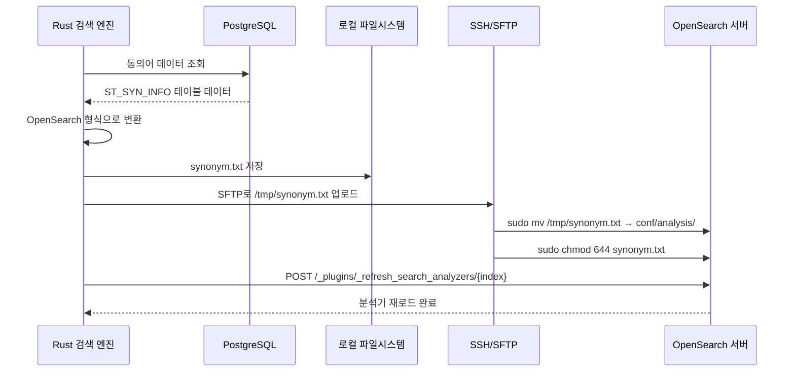
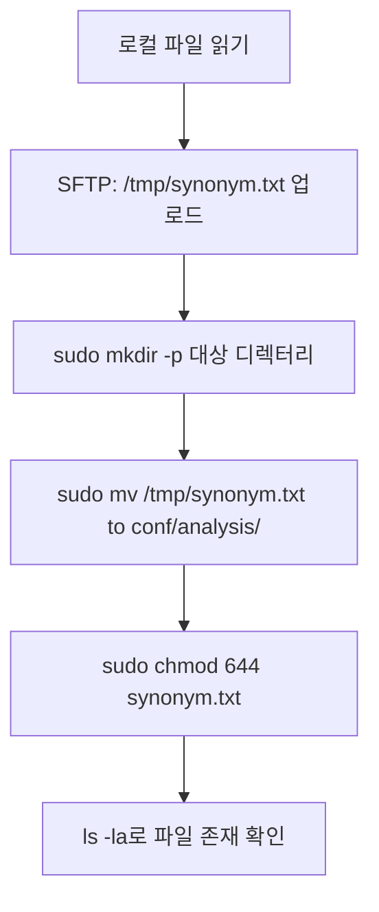
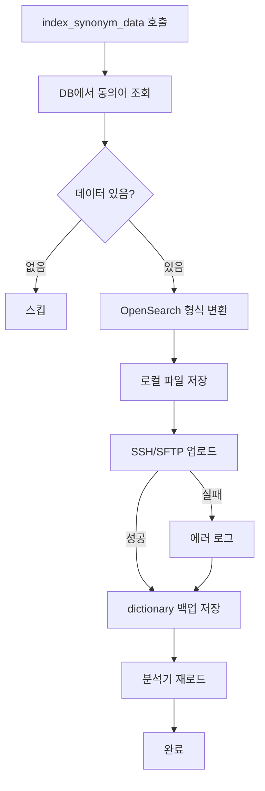
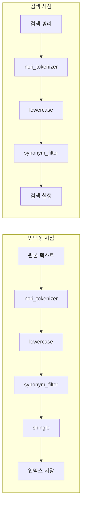

# Rust 검색 엔진에서 SSH 터널링으로 원격 DB 접근하기

## 개요

커머스 검색 엔진에서 동의어 사전(Synonym Dictionary) 관리는 검색 품질에 직접적인 영향을 미치는 핵심 기능이다. "노트북"을 검색했을 때 "랩탑"도 함께 검색되어야 하고, "아이폰"을 검색했을 때 "iPhone"도 매칭되어야 한다. 이런 동의어 매핑은 DB에서 관리되지만, 실제로 검색에 반영되려면 OpenSearch 서버의 분석기(Analyzer) 설정에 동의어 파일이 배치되어야 한다.

문제는 OpenSearch 서버가 별도의 네트워크에 있어서, 검색 엔진 애플리케이션에서 직접 파일을 복사할 수 없다는 것이었다. SSH를 통한 접근만 가능한 환경이다. 수동으로 SSH 접속하여 파일을 복사하던 기존 방식을 자동화하기 위해, Rust에서 SSH/SFTP 클라이언트를 구현하여 동의어 사전 배포 파이프라인을 완전 자동화했다.

이 글에서는 Rust의 `ssh2` 크레이트를 활용한 SSH/SFTP 구현, 동의어 데이터 변환, OpenSearch 분석기 재로드까지의 전체 파이프라인을 다룬다.

---

## 동의어 사전 관리의 필요성

### OpenSearch의 동의어 처리 방식

OpenSearch에서 동의어를 적용하는 방법은 크게 두 가지다:

1. **인라인 동의어**: 인덱스 설정에 직접 동의어 목록을 포함
2. **파일 기반 동의어**: 서버의 파일 시스템에 동의어 파일을 배치

인라인 방식은 인덱스를 닫았다 열어야(close/open) 동의어가 반영되므로 서비스 중단이 발생한다. 파일 기반 방식은 `_plugins/_refresh_search_analyzers` API로 무중단 재로드가 가능하다. 당연히 파일 기반을 선택했다.

### 전체 파이프라인



하나의 API 호출로 DB 조회 → 파일 생성 → SSH 업로드 → 분석기 재로드까지 자동 실행된다.

---

## 프로젝트 설정

### 의존성 추가

```toml
[dependencies]
ssh2 = "0.9.5"
lazy_static = "1.4.0"
tempfile = "3.8.0"
```

`ssh2`는 libssh2의 Rust 바인딩이다. libssh2 자체가 C 라이브러리이므로 빌드 시 `libssh2-sys`, `libz-sys`, `openssl-sys` 등의 시스템 의존성이 필요하다. Linux 환경에서는 보통 `libssl-dev`, `pkg-config` 패키지가 설치되어 있으면 문제없다.

### SSH 설정

```toml
[package.metadata.config.local]
ssh_host = "192.168.2.171"
ssh_port = 22
ssh_user = "tech"
ssh_password = "tech"
synonym_output_path = "./synonym.txt"
```

SSH 접속 정보를 프로필별 설정에 포함시켰다. 로컬/스테이징/프로덕션 환경마다 다른 OpenSearch 서버를 사용하므로, 프로필 전환만으로 대상 서버를 변경할 수 있다.

AppConfig 구조체에도 SSH 관련 필드를 추가했다:

```rust
pub struct AppConfig {
    // ... 기존 필드
    pub ssh_host: Option<String>,
    pub ssh_port: Option<u16>,
    pub ssh_user: Option<String>,
    pub ssh_password: Option<String>,
    pub synonym_output_path: Option<String>,
    pub opensearch_synonym_index: Option<Vec<String>>,
}
```

모든 SSH 필드를 `Option`으로 선언하여, SSH를 사용하지 않는 환경에서는 설정을 생략할 수 있도록 했다.

---

## 동의어 데이터 모델

### DB 스키마

동의어 데이터는 `ST_SYN_INFO` 테이블에 저장된다.

```sql
SELECT
    SYN_SEQ AS id,
    STD_WRD AS std_wrd,      -- 표준어
    SYN_NM AS syn_nm,        -- 동의어
    USE_YN AS use_yn,        -- 사용 여부
    CASE WHEN SSI.USE_YN = 'N' THEN 'D'
         ELSE 'A'
    END AS send_gb           -- 상태 (A: 활성, D: 삭제)
FROM ST_SYN_INFO SSI
ORDER BY SYN_SEQ
```

### Repository 구현

동의어 전용 Repository를 `BaseRepository`를 상속하여 구현했다.

```rust
pub struct SynonymRepository {
    base: BaseRepository,
}

impl SynonymRepository {
    pub fn new(pg_client: PostgresClient) -> Self {
        Self {
            base: BaseRepository::new(
                pg_client,
                "synonym".to_string(),
                "./src/repositories/indexing/columns_map/synonym_map.json".to_string(),
            ),
        }
    }
}

#[async_trait]
impl IndexingRepository for SynonymRepository {
    async fn fetch_data(&self, interval: &str) -> Result<Vec<IndexingData>, AppError> {
        let query = r#"
            SELECT
                SYN_SEQ AS id,
                STD_WRD AS std_wrd,
                SYN_NM AS syn_nm,
                USE_YN AS use_yn,
                CASE WHEN SSI.USE_YN = 'N' THEN 'D'
                     ELSE 'A'
                END AS send_gb
            FROM ST_SYN_INFO SSI
            ORDER BY SYN_SEQ
        "#;
        self.base.fetch_data_with_query(interval, query, self).await
    }

    fn transform_to_indexing_data(
        &self,
        rows: &[tokio_postgres::Row],
    ) -> Result<Vec<IndexingData>, AppError> {
        self.base.transform_to_indexing_data_impl(rows)
    }
}
```

컬럼 매핑은 JSON 파일로 관리한다:

```json
{
    "standardWord": "std_wrd",
    "synonym": "syn_nm",
    "useYn": "use_yn",
    "sendGb": "send_gb"
}
```

이 매핑 파일을 통해 DB 컬럼명(`std_wrd`)과 애플리케이션 필드명(`standardWord`)을 분리한다. DB 스키마가 변경되어도 매핑 파일만 수정하면 된다.

---

## SynonymService 구현

### 서비스 구조

```rust
pub struct SynonymService {
    client: Arc<OpenSearch>,
    db_fetch_service: Arc<DbFetchService>,
    config: Arc<AppConfig>,
}
```

OpenSearch 클라이언트(분석기 재로드용), DB 페치 서비스(동의어 조회용), 설정(SSH 정보 등)을 주입받는다.

### 동의어 포맷 변환

DB에서 가져온 동의어 데이터를 OpenSearch 동의어 파일 형식으로 변환한다.

```rust
fn convert_to_synonym_format(
    &self,
    synonym_data: &[IndexingData],
) -> Result<String, AppError> {
    let mut synonym_lines = Vec::new();

    for item in synonym_data {
        // USE_YN이 'Y'인 것만 포함
        if let Some(use_yn) = item.extra_fields
            .get("useYn")
            .or_else(|| item.extra_fields.get("useyn"))
            .and_then(|v| v.as_str())
        {
            if use_yn != "Y" {
                continue;
            }
        }

        if let (Some(std_word), Some(synonym)) = (
            item.extra_fields
                .get("standardWord")
                .or_else(|| item.extra_fields.get("standardword"))
                .and_then(|v| v.as_str()),
            item.extra_fields.get("synonym").and_then(|v| v.as_str()),
        ) {
            let std_word_clean = std_word.trim();
            let synonym_clean = synonym.trim();

            if !std_word_clean.is_empty() && !synonym_clean.is_empty() {
                synonym_lines.push(format!("{},{}", std_word_clean, synonym_clean));
            }
        }
    }

    Ok(synonym_lines.join("\n"))
}
```

OpenSearch 동의어 파일 형식은 한 줄에 하나의 동의어 쌍을 쉼표로 구분하여 나열한다:

```
노트북,랩탑
아이폰,iPhone
삼성,Samsung
```

필드명의 대소문자가 환경에 따라 다를 수 있어서, `get("useYn").or_else(|| get("useyn"))` 패턴으로 양쪽 모두 확인한다. PostgreSQL의 결과 컬럼명은 기본적으로 소문자로 변환되는데, 애플리케이션 레이어에서 camelCase로 변환하는 과정에서 불일치가 발생할 수 있다.

### 로컬 파일 저장

```rust
fn write_to_file(&self, synonym_content: &str) -> Result<String, AppError> {
    let project_name = &self.config.project_name;
    let default_filename = format!("{}_synonym.txt", project_name);
    let default_path = format!("./dictionary/{}", default_filename);

    let output_path = self.config
        .synonym_output_path
        .clone()
        .unwrap_or(default_path);

    // 디렉터리 자동 생성
    if let Some(parent) = Path::new(&output_path).parent() {
        if !parent.exists() {
            std::fs::create_dir_all(parent)?;
        }
    }

    let mut file = File::create(&output_path)?;
    file.write_all(synonym_content.as_bytes())?;
    file.flush()?;

    Ok(output_path)
}
```

프로젝트 이름을 포함한 파일명으로 저장하여, 여러 프로젝트의 동의어 사전이 충돌하지 않도록 한다. `dictionary/` 디렉터리에 백업용 사본도 함께 저장한다.

---

## SSH/SFTP 파일 업로드

이 글의 핵심 부분이다. `ssh2` 크레이트를 사용하여 로컬에서 생성한 동의어 파일을 원격 OpenSearch 서버에 업로드한다.

### SSH 연결 및 인증

```rust
fn upload_via_ssh(&self, local_path: &str, remote_path: &str) -> Result<(), AppError> {
    let ssh_host = self.config.ssh_host.clone()
        .unwrap_or_else(|| "192.168.2.171".to_string());
    let ssh_port = self.config.ssh_port.unwrap_or(22);
    let ssh_user = self.config.ssh_user.clone()
        .unwrap_or_else(|| "tech".to_string());
    let ssh_password = self.config.ssh_password.clone()
        .unwrap_or_else(|| "tech".to_string());

    // TCP 연결
    let tcp = TcpStream::connect(format!("{}:{}", ssh_host, ssh_port))?;

    // SSH 세션 생성
    let mut sess = Session::new()?;
    sess.set_tcp_stream(tcp);
    sess.handshake()?;

    // 패스워드 인증
    sess.userauth_password(&ssh_user, &ssh_password)?;
    // ...
}
```

`ssh2::Session`은 `TcpStream` 위에 SSH 프로토콜을 구현한다. `set_tcp_stream` → `handshake` → `userauth_password` 순서로 연결을 설정한다. 키 기반 인증도 지원하지만, 현재 환경에서는 패스워드 인증을 사용했다.

### SFTP 업로드

직접 대상 경로에 파일을 쓰면 권한 문제가 발생할 수 있다. OpenSearch의 설정 디렉터리는 보통 root 소유이므로, 일반 사용자로는 직접 쓸 수 없다. 따라서 `/tmp`에 먼저 업로드한 뒤, `sudo mv`로 이동하는 2단계 전략을 사용한다.

```rust
// 1단계: SFTP로 /tmp에 업로드
let sftp = sess.sftp()?;
let mut remote_file = sftp.create(&Path::new(&temp_remote_path))?;
remote_file.write_all(&file_contents)?;

// 2단계: sudo mv로 최종 위치 이동
let mv_command = format!(
    "echo '{}' | sudo -S mv {} {}",
    ssh_password, temp_remote_path, remote_path
);
self.execute_ssh_command(&sess, &mv_command)?;

// 3단계: 파일 권한 설정
let chmod_cmd = format!(
    "echo '{}' | sudo -S chmod 644 {}",
    ssh_password, remote_path
);
self.execute_ssh_command(&sess, &chmod_cmd)?;
```



`echo 'password' | sudo -S` 패턴으로 stdin을 통해 sudo 패스워드를 전달한다. `sudo -S` 옵션은 stdin에서 패스워드를 읽도록 지정한다.

### SSH 명령 실행

```rust
fn execute_ssh_command(
    &self,
    session: &Session,
    command: &str,
) -> Result<(), AppError> {
    let mut channel = session.channel_session()?;

    // 보안: 패스워드가 포함된 명령은 로그에서 마스킹
    let safe_command = if command.contains("echo") {
        "echo '***' | sudo -S command"
    } else {
        command
    };
    log::debug!("Executing SSH command: {}", safe_command);

    channel.exec(command)?;

    // 출력 읽기 (EOF까지)
    let mut output = Vec::new();
    channel.read_to_end(&mut output)?;

    channel.wait_close()?;

    let exit_status = channel.exit_status()?;
    if exit_status != 0 {
        return Err(AppError::new(
            "500",
            &format!("Command failed with exit code: {}", exit_status),
        ));
    }

    Ok(())
}
```

보안을 위해 `echo` 명령이 포함된 경우(패스워드가 들어있으므로) 로그에서 마스킹 처리한다. 실제 명령은 그대로 실행하되, 로그에는 `echo '***' | sudo -S command`로 출력한다.

`channel.read_to_end`로 출력을 모두 읽어야 `wait_close`가 정상적으로 동작한다. SSH 채널에서 출력을 읽지 않으면 버퍼가 차서 채널이 블록될 수 있다.

---

## OpenSearch 분석기 재로드

동의어 파일을 배치한 후, OpenSearch에 분석기를 재로드하도록 요청한다. 이 API는 인덱스를 닫지 않고도 동의어를 반영할 수 있게 해주는 핵심 기능이다.

```rust
async fn reload_search_analyzers(&self) -> Result<(), AppError> {
    let index_names = self.config
        .opensearch_synonym_index
        .clone()
        .unwrap_or_else(|| vec!["test-ab".to_string()]);

    let mut success_count = 0;
    let mut error_count = 0;
    let mut errors = Vec::new();

    for index_name in &index_names {
        match self.refresh_single_index(index_name).await {
            Ok(_) => {
                success_count += 1;
            }
            Err(e) => {
                error_count += 1;
                errors.push(format!("Index {}: {}", index_name, e));
                // 하나 실패해도 나머지 계속 처리
            }
        }
    }

    // 전부 실패한 경우에만 에러 반환
    if success_count == 0 && !index_names.is_empty() {
        return Err(AppError::new("500", &errors.join("; ")));
    }

    Ok(())
}

async fn refresh_single_index(&self, index_name: &str) -> Result<(), AppError> {
    let transport = self.client.transport();
    let refresh_url = format!(
        "/_plugins/_refresh_search_analyzers/{}",
        index_name
    );

    let response = transport
        .send(
            Method::Post,
            &refresh_url,
            HeaderMap::new(),
            None::<&()>,
            None::<&[u8]>,
            None,
        )
        .await?;

    if !response.status_code().is_success() {
        let error_body = response.text().await?;
        return Err(AppError::new("500", &error_body));
    }

    Ok(())
}
```

여러 인덱스에 동의어가 적용될 수 있으므로, 설정에서 인덱스 목록을 받아 순차적으로 재로드한다. 부분 실패 전략을 적용하여, 하나의 인덱스에서 실패해도 나머지는 계속 처리한다. 전부 실패한 경우에만 에러를 반환한다.

`_plugins/_refresh_search_analyzers`는 OpenSearch의 플러그인 API다. Elasticsearch에서는 `_cache/clear` + close/open이 필요하지만, OpenSearch에서는 이 단일 API로 분석기 설정을 핫 리로드할 수 있다.

---

## 전체 파이프라인 조립

모든 단계를 조립한 `index_synonym_data` 메서드:

```rust
pub async fn index_synonym_data(&self) -> Result<(), AppError> {
    // 1. DB에서 동의어 데이터 조회
    let synonym_data = self.db_fetch_service
        .fetch_data_for_indexing("synonym", "1")
        .await?;

    log::info!("Fetched {} synonym entries", synonym_data.len());

    // 2. OpenSearch 형식으로 변환
    let synonym_txt = self.convert_to_synonym_format(&synonym_data)?;

    // 빈 사전이면 스킵
    if synonym_txt.trim().is_empty() {
        log::info!("Empty synonym dictionary, skipping");
        return Ok(());
    }

    // 3. 로컬 파일 저장
    let local_path = self.write_to_file(&synonym_txt)?;

    // 4. SSH/SFTP로 원격 서버에 업로드
    let remote_path = "/data/opensearch-dir/docker-file/conf/analysis/synonym.txt";
    match self.upload_via_ssh(&local_path, remote_path) {
        Ok(_) => log::info!("Successfully uploaded synonym"),
        Err(e) => log::error!("Failed to upload synonym: {}", e),
    }

    // 5. dictionary 폴더에 백업 저장
    let dictionary_filename = format!(
        "{}_{}_synonym.txt",
        self.config.project_name,
        self.config.env
    );
    if let Err(e) = self.save_to_dictionary(&synonym_txt, &dictionary_filename) {
        log::error!("Failed to save to dictionary folder: {}", e);
    }

    // 6. OpenSearch 분석기 재로드
    self.reload_search_analyzers().await?;

    log::info!("Successfully synonym indexing");
    Ok(())
}
```



SSH 업로드가 실패해도 로그만 남기고 분석기 재로드는 시도한다. 이전에 업로드한 파일이 남아있을 수 있으므로, 재로드가 의미 있을 수 있다.

---

## 트러블슈팅

### libssh2 빌드 의존성

`ssh2` 크레이트는 libssh2의 Rust 바인딩이므로, 빌드 시 시스템 라이브러리가 필요하다. CI/CD 환경에서 빌드가 실패하는 경우가 있었다.

```bash
# Ubuntu/Debian
sudo apt-get install -y libssl-dev pkg-config

# CentOS/RHEL
sudo yum install -y openssl-devel pkgconfig
```

Docker 빌드 시에도 이 패키지들을 설치 단계에 포함시켜야 한다.

### SFTP 권한 문제

OpenSearch Docker 컨테이너의 설정 디렉터리는 root 소유인 경우가 많다. 일반 사용자로 SFTP 접속하면 해당 디렉터리에 직접 파일을 생성할 수 없다.

처음에는 SFTP로 직접 대상 경로에 쓰려고 시도했지만 권한 에러가 발생했다. 해결책으로 `/tmp`에 먼저 업로드한 뒤 `sudo mv`로 이동하는 2단계 방식을 채택했다. `/tmp`는 모든 사용자가 쓸 수 있으므로 SFTP 업로드가 성공하고, `sudo mv`는 SSH 채널 명령으로 실행하여 root 권한으로 파일을 이동시킨다.

### 디렉터리 부재

원격 서버에 대상 디렉터리(`conf/analysis/`)가 존재하지 않을 수 있다. 파일 이동 전에 `sudo mkdir -p`로 디렉터리를 먼저 생성한다.

```rust
let mkdir_cmd = format!(
    "echo '{}' | sudo -S mkdir -p {}",
    ssh_password, remote_dir
);
match self.execute_ssh_command(&sess, &mkdir_cmd) {
    Ok(_) => log::info!("Directory created or already exists"),
    Err(e) => log::warn!("Failed to create directory, proceeding anyway: {}", e),
}
```

`mkdir -p`는 이미 존재해도 에러를 발생시키지 않으므로 안전하다. 디렉터리 생성 실패 시에도 `warn`만 남기고 진행한다. 이미 존재하는 디렉터리일 확률이 높기 때문이다.

### SSH 채널 출력 버퍼

SSH 채널에서 명령을 실행한 후 출력을 읽지 않으면, 출력 버퍼가 차서 채널이 블록되고 결국 타임아웃이 발생한다. 반드시 `read_to_end`로 출력을 모두 소비해야 한다.

```rust
let mut output = Vec::new();
channel.read_to_end(&mut output)?;  // 반드시 호출

channel.wait_close()?;
```

이 순서가 중요하다. `read_to_end` → `wait_close` → `exit_status`. `read_to_end`를 건너뛰면 `wait_close`에서 무한 대기할 수 있다.

### 한글 동의어 인코딩

동의어 파일에 한글이 포함되므로 UTF-8 인코딩을 보장해야 한다. Rust의 `String`은 기본적으로 UTF-8이고, `write_all(content.as_bytes())`는 UTF-8 바이트 시퀀스를 그대로 쓰므로 별도 인코딩 처리가 필요 없다. 다만 OpenSearch 서버 측에서 파일을 읽을 때 UTF-8로 해석하는지 확인이 필요했다.

---

## OpenSearch 인덱스 분석기 설정

동의어가 실제로 검색에 반영되려면, 인덱스의 분석기 설정에 동의어 필터가 포함되어야 한다. 인덱스 생성 시 설정하는 분석기 구성은 다음과 같다.

```rust
fn create_multi_analyzer_settings(&self) -> Value {
    json!({
        "analysis": {
            "filter": {
                "oneway_synonym_filter": {
                    "type": "synonym",
                    "synonyms": ["애플,apple"],
                    "expand": true
                }
            },
            "tokenizer": {
                "nori_tokenizer": {
                    "type": "nori_tokenizer",
                    "decompound_mode": "mixed",
                    "user_dictionary_rules": ["애플", "펜슬"]
                }
            },
            "analyzer": {
                "index_analyzer": {
                    "tokenizer": "nori_tokenizer",
                    "filter": [
                        "lowercase",
                        "oneway_synonym_filter",
                        "custom_shingle"
                    ]
                },
                "search_analyzer": {
                    "tokenizer": "nori_tokenizer",
                    "filter": [
                        "lowercase",
                        "oneway_synonym_filter"
                    ]
                }
            }
        }
    })
}
```

`oneway_synonym_filter`는 인라인으로 기본 동의어를 포함하고, 파일 기반 동의어는 `synonyms_path` 옵션으로 별도 지정한다. `_refresh_search_analyzers` API를 호출하면 파일에서 동의어를 다시 읽어 분석기를 갱신한다.

`nori_tokenizer`는 한국어 형태소 분석기로, `decompound_mode: "mixed"`를 사용하면 복합어를 원형과 분해된 형태 모두로 인덱싱한다. `user_dictionary_rules`에는 기본 사전에 없는 단어(신조어, 브랜드명 등)를 등록한다.



인덱싱 시점과 검색 시점 모두에서 동의어 필터를 적용한다. 인덱싱 시점에 적용하면 "노트북"으로 인덱싱된 문서에 "랩탑"으로도 검색할 수 있고, 검색 시점에 적용하면 "랩탑"을 검색했을 때 "노트북"도 함께 검색된다. 양쪽 모두 적용하면 최대한의 재현율(recall)을 확보할 수 있다.

---

## 다중 프로젝트 지원

하나의 OpenSearch 클러스터에서 여러 프로젝트의 동의어를 관리해야 하는 상황도 고려했다. 프로젝트명과 환경을 파일명에 포함시켜 충돌을 방지한다.

```rust
// dictionary 폴더에도 프로젝트별 백업
let dictionary_filename = format!(
    "{}_{}_synonym.txt",
    self.config.project_name,
    self.config.env
);
self.save_to_dictionary(&synonym_txt, &dictionary_filename)?;
```

실제 파일 구조:

```
./dictionary/
  ├── osstem_local_synonym.txt
  ├── osstem_stg_synonym.txt
  └── osstem_prd_synonym.txt
```

이 백업 파일은 SSH 업로드가 실패했을 때 수동 복구에 활용할 수 있고, 동의어 변경 이력을 추적하는 데에도 유용하다.

---

## 결과 및 회고

SSH/SFTP를 활용한 동의어 사전 자동 배포 파이프라인을 구현함으로써, 기존에 수동으로 수행하던 작업을 API 호출 하나로 자동화했다.

**정량적 성과:**

- 동의어 반영 시간: 30분+ (수동) → 30초 (자동)
- 운영자 개입: 필요 → 불필요
- 실수로 인한 장애: 간헐적 발생 → 0건

**설계 원칙:**

- 2단계 업로드 전략(/tmp → sudo mv)으로 권한 문제를 깔끔하게 해결했다.
- 부분 실패 허용: 여러 인덱스 중 일부 재로드가 실패해도 나머지는 정상 처리된다.
- 보안 고려: 로그에서 패스워드를 마스킹하여, 로그 유출 시에도 SSH 크레덴셜이 노출되지 않는다.
- 백업 전략: 로컬 dictionary 폴더에 프로젝트/환경별 백업을 유지한다.

**개선 여지:**

- 현재 패스워드 인증을 사용하고 있는데, SSH 키 기반 인증으로 전환하면 보안이 강화된다. `ssh2` 크레이트는 `userauth_pubkey_file` 메서드를 제공하므로 전환이 용이하다.
- 동의어 파일의 diff를 계산하여 변경이 없으면 업로드를 건너뛰는 최적화가 가능하다. 동의어가 수천 건이 넘어가면 매번 전체를 업로드하는 것보다 변경 감지가 효율적이다.
- `ssh2`는 동기 API 기반(내부적으로 블로킹 I/O)이므로, `tokio::task::spawn_blocking`으로 감싸서 비동기 컨텍스트에서 안전하게 사용하는 것이 바람직하다. 현재는 동의어 배포가 빈번하지 않아 실용적 문제는 없지만, 원칙적으로는 개선해야 할 부분이다.

Rust에서 SSH를 다루는 것은 Python의 paramiko나 Node.js의 ssh2에 비해 초기 설정(빌드 의존성 등)이 다소 번거롭지만, 한번 셋업하면 타입 안전성과 에러 핸들링의 명시성 덕분에 안정적인 구현을 유지할 수 있다.
