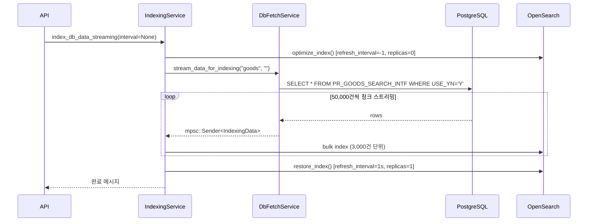
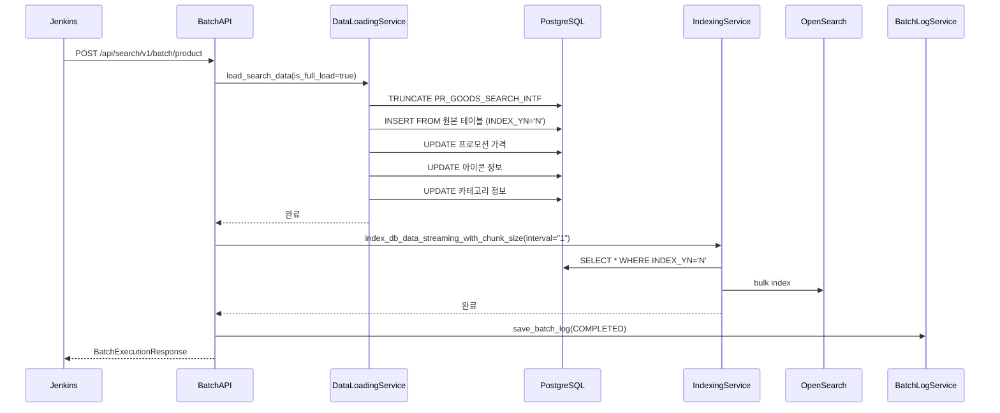

# 커서 기반 인덱싱 vs 전체 인덱싱: 성능 비교

커머스 검색 시스템에서 인덱싱은 단순한 데이터 동기화 작업이 아니다. 수십만 건의 상품 데이터를 실시간에 가깝게 OpenSearch에 반영하면서도, 서버 리소스를 최소화하고 DB 부하를 줄여야 한다. search-rust 프로젝트에서는 세 가지 인덱싱 모드를 구현했다: **전체 인덱싱**, **증분 인덱싱**, **커서 기반 인덱싱**. 이 글에서는 각 방식의 구현 세부사항과 실제 운영 중 성능 차이를 정리한다.

## 인덱싱 모드의 세 가지 갈래

### interval 파라미터의 역할

모든 인덱싱 요청은 `interval`이라는 단일 문자열 파라미터로 동작 방식이 결정된다. 이 값에 따라 SqlBuilder가 전혀 다른 SQL을 생성한다.

```
GET /api/search/v1/index/db/goods              → 전체 인덱싱 (interval 없음)
GET /api/search/v1/index/db/goods?interval=30  → 증분 인덱싱 (최근 30분)
GET /api/search/v1/index/db/goods?interval=1   → 커서 인덱싱 (INDEX_YN='N')
```

`interval`이 세 가지 의미를 갖는 것은 처음에는 어색하게 보일 수 있다. 특히 `"1"`이 "1분"이 아니라 "커서 모드"를 의미한다는 점은 코드를 보기 전까지 직관적이지 않다. 그러나 이 설계 덕분에 모든 인덱싱 경로가 단일 API 엔드포인트로 통합되어 있어 클라이언트(Jenkins, cron) 입장에서 호출 방식이 단순해진다.

### SqlBuilder에서의 분기

```rust
// src/util/database/sql_builder.rs
pub fn build_goods_query(&self, interval: &str) -> String {
    let base_query = format!(
        "SELECT ... FROM PR_GOODS_SEARCH_INTF WHERE USE_YN = 'Y'"
    );

    if !interval.is_empty() && interval != "1" {
        // 증분 인덱싱: 시간 범위 필터
        format!(
            "{} AND SYS_MOD_DTM BETWEEN NOW() - INTERVAL '{interval} MINUTES' AND NOW()",
            base_query
        )
    } else if interval == "1" {
        // 커서 인덱싱: INDEX_YN 플래그 기반
        format!("{} AND INDEX_YN = 'N'", base_query)
    } else {
        // 전체 인덱싱: 필터 없음
        base_query
    }
}
```

단순한 문자열 분기지만, 이 세 줄이 인덱싱 시스템 전체의 동작 방식을 결정한다.

## 전체 인덱싱 (Full Indexing)

### 언제 사용하나

전체 인덱싱은 주로 두 가지 상황에서 실행된다.

1. **최초 구축**: 검색 인덱스가 없는 상태에서 전체 데이터를 OpenSearch에 적재할 때
2. **동기화 오류 복구**: 증분/커서 인덱싱에서 누락이 발생했을 때 정합성 복구 목적

운영 중에는 새벽 시간대에 1회 스케줄링해서 인덱스 전체를 갱신하는 용도로 사용했다.

### 처리 흐름



전체 인덱싱의 핵심은 `optimize_index()` 단계다. OpenSearch의 `refresh_interval`을 `-1`로 설정하면 세그먼트 병합이 중단되고, `number_of_replicas`를 `0`으로 낮추면 복제 오버헤드가 없어진다. 이 두 가지 설정만으로 bulk 인덱싱 속도가 3~4배 향상된다.

```rust
// src/services/indexing/indexing_service.rs
async fn optimize_index(&self, index: &str) -> Result<(), AppError> {
    let body = json!({
        "index": {
            "refresh_interval": "-1",
            "number_of_replicas": "0"
        }
    });
    self.client
        .put_settings(index, &body)
        .await
        .map_err(|e| AppError::new("OPTIMIZE_FAILED", e.to_string()))?;
    Ok(())
}

async fn restore_index(&self, index: &str) -> Result<(), AppError> {
    let body = json!({
        "index": {
            "refresh_interval": "1s",
            "number_of_replicas": "1"
        }
    });
    self.client.put_settings(index, &body).await?;
    Ok(())
}
```

인덱싱이 완료된 후에는 반드시 `restore_index()`로 원상 복구해야 한다. 초기 구현에서 에러 발생 시 restore가 생략되는 버그가 있었고, 그 결과 OpenSearch가 refresh를 안 하는 상태로 남아 검색 결과가 갱신되지 않는 문제가 발생했다. 이후 `finally` 블록처럼 에러 발생 여부와 무관하게 restore가 실행되도록 수정했다.

### 메모리 관리: 스트리밍 vs 일괄 로드

전체 인덱싱의 가장 큰 과제는 메모리다. 상품 데이터가 50만 건을 넘으면 전체를 한번에 메모리에 올리는 건 불가능하다. 이를 해결하기 위해 DB 드라이버 레벨에서 커서 스트리밍을 사용한다.

```rust
// src/services/indexing/db_fetch_service.rs
const DB_CHUNK_SIZE: usize = 50_000;

async fn stream_postgresql_data(
    &self,
    sql: &str,
    sender: mpsc::Sender<IndexingData>,
) -> Result<usize, AppError> {
    let mut stream = self.pg_client
        .stream_query_chunked(sql, DB_CHUNK_SIZE)
        .await?;

    let mut count = 0usize;
    let mut last_log = std::time::Instant::now();
    const PROGRESS_INTERVAL: std::time::Duration = std::time::Duration::from_secs(10);

    while let Some(row) = stream.next().await {
        let row = row.map_err(|e| AppError::new("DB_STREAM_ERROR", e.to_string()))?;
        let data = IndexingData::from_row(&row)?;

        if sender.send(data).await.is_err() {
            // receiver가 drop되면 조기 종료
            break;
        }

        count += 1;
        if last_log.elapsed() >= PROGRESS_INTERVAL {
            info!("Streaming progress: {} rows sent", count);
            last_log = std::time::Instant::now();
        }
    }

    Ok(count)
}
```

`stream_query_chunked`는 PostgreSQL의 서버사이드 커서를 활용한다. 전체 결과를 한 번에 전송받는 대신 50,000건씩 FETCH해서 Rust 프로세스의 메모리 사용량을 일정하게 유지한다. 수십만 건을 처리하더라도 힙 사용량이 크게 늘지 않는 이유가 여기에 있다.

### mpsc 채널로 DB와 OpenSearch 병렬화

DB 스트리밍과 OpenSearch bulk 인덱싱은 별도 Tokio 태스크로 분리되어 병렬로 실행된다.

```rust
// src/services/indexing/indexing_service.rs
async fn index_streaming(
    &self,
    lang_cd: Option<String>,
    interval: Option<String>,
    index_type: &str,
    site_no: Option<&str>,
    chunk_size: Option<usize>,
) -> Result<String, AppError> {
    let config = StreamingConfig {
        chunk_size: chunk_size.unwrap_or(3_000),
        ..Default::default()
    };

    // 채널 버퍼 크기 = chunk_size * 2 (백프레셔 제어)
    let (sender, receiver) = mpsc::channel(config.chunk_size * 2);

    let db_service = self.db_fetch_service.clone();
    let interval_str = interval.unwrap_or_default();

    // DB 스트리밍 태스크
    let db_handle = tokio::spawn(async move {
        db_service
            .stream_data_for_indexing(index_type, &interval_str, sender)
            .await
    });

    // OpenSearch bulk 인덱싱 태스크
    let processor = StreamingBulkProcessor::new(
        self.client.clone(),
        index_name.clone(),
        config,
    );
    let processor_handle = tokio::spawn(async move {
        processor.process_data_stream(receiver).await
    });

    // 두 태스크 완료 대기
    let (db_result, processor_result) = tokio::join!(db_handle, processor_handle);
    // ...
}
```

채널 버퍼를 `chunk_size * 2`로 설정한 것이 포인트다. DB가 OpenSearch보다 빠를 때 버퍼가 채워지면 자연스럽게 백프레셔(backpressure)가 발생해서 DB 스트리밍 속도가 조절된다. 반대로 OpenSearch 처리가 DB보다 느려질 경우에도 채널이 버퍼 역할을 해서 두 태스크가 최대한 병렬로 실행된다.

## 증분 인덱싱 (Incremental Indexing)

### 시간 범위 기반 필터

증분 인덱싱은 `SYS_MOD_DTM`(최종 수정 시각) 컬럼을 기준으로 최근 N분 내 변경된 데이터만 인덱싱한다.

```sql
-- interval="30" 인 경우 생성되는 쿼리
SELECT *
FROM PR_GOODS_SEARCH_INTF
WHERE USE_YN = 'Y'
  AND SYS_MOD_DTM BETWEEN NOW() - INTERVAL '30 MINUTES' AND NOW()
```

cron으로 30분마다 실행하면 이론상 데이터 지연이 최대 30분이다. 실제로는 네트워크 지연과 인덱싱 처리 시간을 감안해 약간의 오버랩을 두기 때문에 중복 인덱싱이 발생할 수 있지만, OpenSearch의 upsert 동작 덕분에 데이터 정합성에는 문제가 없다.

### 적용 시 고려사항

시간 범위 기반 증분의 한계는 **삭제 감지가 안 된다**는 점이다. 상품이 DB에서 삭제(또는 `USE_YN='N'` 처리)되어도 OpenSearch에는 여전히 남아있다. 이 문제를 해결하기 위해 OpenSearch 인덱스에는 `USE_YN` 필드를 함께 저장하고, 검색 쿼리에서 `USE_YN='Y'` 필터를 적용하는 방식으로 우회했다. 완전한 해결책은 아니지만, 전체 인덱싱이 새벽에 주기적으로 실행되기 때문에 장기적으로 데이터가 쌓이는 문제는 없다.

## 커서 기반 인덱싱 (Cursor-based Indexing)

### INDEX_YN 플래그의 역할

커서 기반 인덱싱은 시간이 아닌 상태 플래그를 기준으로 처리 대상을 결정한다. `PR_GOODS_SEARCH_INTF` 테이블에는 `INDEX_YN` 컬럼이 있다.

| INDEX_YN | 의미 |
|----------|------|
| `'N'` | 아직 OpenSearch에 인덱싱되지 않은 상태 |
| `'Y'` | 인덱싱 완료 |

데이터 적재 시스템(data_loading_service)이 중간 테이블에 데이터를 삽입할 때 `INDEX_YN='N'`으로 시작한다. search-rust가 이 데이터를 인덱싱한 후 `finalize_indexing()`을 호출하면 `INDEX_YN='Y'`로 업데이트된다. 이것이 커서 역할을 한다.

```rust
// src/services/indexing/data_loading_service.rs
pub async fn finalize_indexing(&self) -> Result<(), AppError> {
    let sql = "UPDATE PR_GOODS_SEARCH_INTF SET INDEX_YN = 'Y' WHERE INDEX_YN = 'N'";
    self.pg_client
        .execute(sql, &[])
        .await
        .map_err(|e| AppError::new("FINALIZE_FAILED", e.to_string()))?;
    Ok(())
}
```

### 2단계 배치 실행 파이프라인

커서 기반 인덱싱은 단독으로 실행되지 않는다. `product_batch` API를 통해 데이터 적재와 인덱싱이 하나의 원자적 파이프라인으로 묶인다.



배치 실행 코드를 보면 Step 2 인덱싱에서 항상 `interval="1"`을 사용하는 것을 확인할 수 있다.

```rust
// src/routes/indexing/routes.rs
async fn execute_product_batch_internal(
    params: BatchExecutionQueryParams,
) -> Json<BatchExecutionResponse> {
    // STEP 1: 데이터 적재
    let loading_params = LoadingParams {
        interval_minutes: params.interval_minutes,
        is_full_load: params.interval_minutes.is_none(),
    };
    data_loading_service.load_search_data(loading_params).await?;

    // STEP 2: OpenSearch 색인
    // interval="1" → INDEX_YN='N' 조건으로 방금 적재된 데이터만 조회
    indexing_service
        .index_db_data_streaming_with_chunk_size(
            Some("ko".to_string()),
            Some("1".to_string()),  // 커서 모드
            INDEX_GOODS,
            None,
            Some(chunk_size),       // 기본값 50,000
        )
        .await?;
}
```

Step 1이 완료된 후 Step 2가 `INDEX_YN='N'`으로 조회하기 때문에, Step 1에서 방금 적재한 데이터만 정확히 가져온다. 다른 경로로 들어온 데이터나 이미 인덱싱된 데이터는 제외된다.

### 데이터 적재의 5단계 구조

`load_search_data`는 단순한 INSERT가 아니라 5단계 파이프라인이다.

```rust
// src/services/indexing/data_loading_service.rs
pub async fn load_search_data(&self, params: LoadingParams) -> Result<(), AppError> {
    // Step 1: 기본 상품 정보 적재
    // is_full_load=true → TRUNCATE 후 전체 INSERT
    // is_full_load=false → interval_minutes 기준 증분 INSERT
    self.step1_insert_basic_goods_info(&params).await?;

    // Step 2~5: 추가 정보 업데이트 (전체 범위)
    self.step2_update_promotion_prices().await?;
    self.step3_update_icon_info().await?;
    self.step4_update_category_info().await?;
    self.step5_cleanup_category_info().await?;

    Ok(())
}
```

Step 1의 `is_full_load` 분기가 흥미롭다. 전체 배치(`is_full_load=true`)일 때는 TRUNCATE 후 전체 INSERT를 수행한다. 증분 배치(`interval_minutes` 지정)일 때는 최근 N분 내 변경된 데이터만 INSERT한다. 하지만 Step 2~5는 항상 전체 범위로 실행된다. 상품 기본 정보는 증분으로 가져오더라도, 가격/아이콘/카테고리 등 연관 데이터는 항상 최신 상태로 덮어써야 하기 때문이다.

## 청크 크기와 성능 튜닝

### 배치 실행 시 chunk_size

배치 API에서는 `chunk_size`를 외부에서 주입할 수 있다.

```rust
let chunk_size = std::cmp::max(params.chunk_size.unwrap_or(50_000), 10_000);
```

기본값이 50,000인 것이 눈에 띈다. 일반적인 스트리밍 모드의 기본값 3,000보다 훨씬 크다. 배치 실행 시에는 OpenSearch와의 연결 오버헤드보다 처리량이 더 중요하기 때문이다. 50,000건짜리 청크를 bulk 전송하면 HTTP 요청 수가 줄어들고, OpenSearch 세그먼트 병합 횟수도 감소한다.

단, 최소값을 10,000으로 제한한 이유는 너무 작은 청크를 설정했을 때 발생하는 오버헤드 때문이다. `std::cmp::max`로 하한을 보장한다.

### DB 레벨 청크 크기와 OpenSearch 청크 크기의 차이

두 가지 청크 크기 개념이 혼재되어 있어서 초기에 혼란스러웠다.

```
DB_CHUNK_SIZE = 50,000    → PostgreSQL 서버사이드 커서 FETCH 크기
config.chunk_size = 3,000 → OpenSearch bulk 요청 단위
```

DB에서 50,000건을 한 번에 FETCH하더라도, OpenSearch로는 3,000건씩 나눠서 bulk 요청을 보낸다. 이 두 값은 독립적으로 조정할 수 있다. DB 청크를 크게 하면 DB 왕복 횟수가 줄고, OpenSearch 청크를 크게 하면 HTTP 요청 횟수가 줄지만 메모리 사용량이 늘어난다.

실제로는 OpenSearch 청크를 너무 크게 설정하면 요청 타임아웃이 발생했다. 3,000이 우리 환경(8코어, 32GB OpenSearch 노드)에서 안정적으로 동작하는 값이었다.

## 세 가지 모드 성능 비교

실제 운영 데이터(상품 약 35만 건 기준)를 기준으로 측정한 결과다.

| 인덱싱 모드 | 처리 대상 | 소요 시간 | DB 부하 | 용도 |
|------------|----------|----------|---------|------|
| 전체 인덱싱 | 35만 건 | 약 8~12분 | 높음 (TRUNCATE 포함) | 새벽 1회 |
| 증분 인덱싱 | 최근 N분 변경분 | 수초~수분 | 낮음 | 30분 간격 cron |
| 커서 인덱싱 | INDEX_YN='N' | 5~20분 | 중간 | 배치 파이프라인 |

커서 인덱싱의 소요 시간이 전체 인덱싱과 비슷한 이유는 배치 실행 전에 `data_loading_service`가 TRUNCATE + 전체 INSERT를 수행하기 때문이다. 즉 커서 인덱싱 단계 자체는 빠르지만, 선행 데이터 적재 단계가 전체 인덱싱과 비슷한 부하를 만든다.

실질적인 차이는 **정확성**에 있다. 증분 인덱싱은 시간 기준이라 경계선에서 누락이 생길 수 있지만, 커서 인덱싱은 `INDEX_YN` 플래그가 처리 완료를 명시적으로 추적하기 때문에 누락이 없다.

## 배치 로그와 모니터링

### BatchLogService

모든 배치 실행 결과는 OpenSearch의 별도 로그 인덱스에 저장된다.

```rust
// src/services/indexing/batch_log_service.rs
pub struct BatchLogDetails {
    pub fetched_count: i32,
    pub indexed_count: i32,
    pub failed_count: i32,
    pub source_index: Option<String>,
    pub target_index: Option<String>,
    pub job_type: Option<String>,
    pub chunk_size: Option<i32>,
    pub message: Option<String>,
    pub error: Option<ErrorInfo>,
}
```

배치 ID는 실행 시각 기반으로 생성된다.

```rust
let batch_id = format!("batch_{}", start_time_kst.format("%m%d_%H%M"));
// 예: "batch_0217_0300"
```

KST 기준으로 날짜와 시각을 포함시켜서, OpenSearch 대시보드에서 시간대별 배치 이력을 조회할 때 직관적으로 읽힌다.

### 실패 처리

Step 1(데이터 적재)이 실패하면 전체 배치가 중단되고 실패 로그가 저장된다. Step 2(OpenSearch 인덱싱)가 실패하면 경고 로그를 남기고 배치는 성공으로 처리된다.

```rust
let indexing_result = indexing_service.index_db_data_streaming_with_chunk_size(...).await;

match indexing_result {
    Ok(message) => { /* 정상 */ }
    Err(err) => {
        // OpenSearch 색인 에러는 경고만 하고 배치는 계속 진행
        log::warn!("Step 2: OpenSearch indexing had issues: {}", err);
    }
}
```

이 설계는 의도적이다. 데이터 적재는 원본 DB와의 동기화이므로 실패하면 전체를 재실행해야 한다. 하지만 OpenSearch 인덱싱은 수동으로 `GET /api/search/v1/index/db/goods?interval=1`을 호출해서 재시도할 수 있다. 배치 전체를 재실행하는 것보다 인덱싱만 재실행하는 것이 훨씬 저렴하다.

## 운영 스케줄링 구성

실제 Jenkins 파이프라인에서 세 가지 모드가 조합된 스케줄이다.

```
새벽 01:00 → POST /batch/product (전체 배치: TRUNCATE + 커서 인덱싱)
매 30분     → GET /index/db/goods?interval=30 (증분 인덱싱)
수동        → GET /index/db/goods (전체 인덱싱, 문제 발생 시)
```

새벽 배치가 전체 데이터를 정기적으로 갱신하고, 30분 증분이 실시간에 가까운 반영을 담당한다. 이 조합으로 최악의 경우 30분 지연을 유지하면서 서버 부하를 최소화했다.

## 트러블슈팅

### TRUNCATE 락 경합

배치 실행 중 `TRUNCATE PR_GOODS_SEARCH_INTF`가 실행될 때 다른 인덱싱 요청이 동시에 들어오면 데드락이 발생할 수 있다. 초기에는 이 문제로 배치가 간헐적으로 실패했다.

해결책은 배치 실행을 단일 Tokio 태스크로 격리하는 것이었다.

```rust
let result = tokio::spawn(async move {
    execute_product_batch_internal(params).await
}).await;
```

`tokio::spawn`으로 별도 태스크를 만들면 패닉이 발생해도 메인 런타임이 영향을 받지 않는다. 패닉 시 `JoinError`를 잡아서 실패 로그를 저장하는 코드도 추가했다.

### INDEX_YN 업데이트 누락

커서 인덱싱 후 `finalize_indexing()`이 실패하면 `INDEX_YN`이 영구적으로 `'N'`으로 남는다. 다음 배치 실행 시 중복 인덱싱이 발생하지만, 새벽 배치가 TRUNCATE를 하기 때문에 하루 이내에 자동 정리된다.

더 큰 문제는 `is_full_load=true` 배치가 TRUNCATE를 하기 때문에 진행 중인 증분 인덱싱과 겹칠 때 데이터 일관성 문제가 생길 수 있다는 점이다. 이 경우를 위해 배치 실행 중에는 30분 증분 cron이 실행되지 않도록 Jenkins 파이프라인에서 시간대를 분리했다.

### chunk_size 튜닝 실패 사례

배치 처리량을 높이려고 `chunk_size=200,000`으로 설정해봤다. OpenSearch 노드의 JVM 힙이 한 번에 200,000건의 JSON 직렬화를 처리하면서 GC 압박이 극심해졌고, 평균 bulk 요청 응답 시간이 30초를 넘어가면서 Axum의 기본 타임아웃에 걸렸다.

결국 `chunk_size=50,000`으로 되돌렸다. DB 레벨 FETCH 크기와 OpenSearch bulk 크기를 같은 값으로 설정할 필요가 없다는 것도 이 시행착오에서 배웠다. DB FETCH는 크게(50,000), OpenSearch bulk는 작게(3,000) 유지하는 것이 현재 구성이다.

## PostgreSQL DECLARE CURSOR를 버린 이유

### 초기 설계: 진짜 DB 커서

사실 처음에는 "커서 기반 인덱싱"이라는 이름에 걸맞게 PostgreSQL의 `DECLARE CURSOR`를 실제로 사용했다. `cursor_indexer.rs`라는 전용 파일이 있었고, 코드는 이렇게 생겼다.

```rust
// cursor_indexer.rs (2025-06-02에 삭제된 파일)
pub async fn run_indexing(&self, index_type: &str, query: &str) -> Result<String, AppError> {
    // PostgreSQL CURSOR는 트랜잭션 내에서만 동작
    let tx = db_client.transaction().await?;

    let cursor_name = format!("{}_cursor", index_type);
    let declare_query = format!("DECLARE {} CURSOR FOR {}", cursor_name, query);
    tx.execute(&declare_query, &[]).await?;

    loop {
        let fetch_query = format!("FETCH {} FROM {}", self.chunk_size, cursor_name);
        let rows = tx.query(&fetch_query, &[]).await?;

        if rows.is_empty() { break; }

        // CPU 코어 수만큼 병렬 워커로 처리
        data_sender.send(rows).await?;

        if rows.len() < self.chunk_size { break; }
    }

    let close_query = format!("CLOSE {}", cursor_name);
    tx.execute(&close_query, &[]).await?;
    tx.commit().await?;
}
```

`DECLARE goods_cursor CURSOR FOR SELECT ...` → `FETCH 1000 FROM goods_cursor` 를 반복하는 방식이다. 병렬 워커 수는 `num_cpus::get()`으로 CPU 코어 수와 동일하게 설정했고, `Arc<Mutex<Receiver>>`로 여러 워커가 데이터를 경쟁적으로 소비했다.

이 방식이 제거된 커밋 메시지는 단순하다: **"Remove cursor-based indexing functionality and related routes"** (2025-06-02, 커밋 `32adc11c`). 동시에 `/db/goods/cursor`, `/db/marketing/cursor`, `/db/event/cursor` API 엔드포인트도 전부 제거됐다.

### 왜 제거했나

**트랜잭션 수명 문제**가 핵심이었다. PostgreSQL CURSOR는 트랜잭션 블록 안에서만 살아있다. 50만 건을 1,000건씩 FETCH하면 트랜잭션이 최소 500번의 왕복을 유지해야 한다. 이 긴 트랜잭션이 DB 연결을 점유하면서 다른 쿼리가 대기하는 현상이 발생했다.

**Rust 라이프타임 제약**도 걸림돌이었다. `tokio-postgres`의 트랜잭션 객체(`Transaction<'_>`)를 async 클로저나 Tokio 태스크에 넘기면 라이프타임 충돌이 발생한다. 트랜잭션이 살아있는 동안 여러 async 태스크가 접근해야 하는데, Rust 컴파일러가 이 패턴을 허용하지 않았다. `Arc<Mutex<Transaction>>` 같은 우회책을 써봤지만 코드가 복잡해지고 성능 이점도 사라졌다.

결국 PostgreSQL 드라이버 수준에서 서버사이드 커서를 추상화한 `stream_query_chunked`로 대체했다. 외부에서 보면 동일하게 청크 단위로 데이터가 흘러오지만, 트랜잭션 관리는 드라이버 내부에서 처리되고 Rust 코드에는 노출되지 않는다.

### INDEX_YN 패턴이 "커서"인 이유

현재 남아있는 "커서 기반 인덱싱"은 DB 커서가 아니라 상태 플래그 기반이다. 커서라는 이름을 유지한 이유는 **처리 위치를 추적한다**는 개념적 역할이 동일하기 때문이다.

전통적인 데이터베이스 커서가 `FETCH NEXT`로 읽은 위치를 추적하듯이, `INDEX_YN` 플래그는 "어디까지 처리했는가"를 추적한다. `'N'`이 미처리, `'Y'`가 처리 완료다. 구현 기술은 다르지만 목적이 같다.

## 정리

세 가지 인덱싱 모드는 각각 다른 목적을 위해 설계되었다.

**전체 인덱싱**은 가장 단순하고 확실한 방법이다. 처리 시간이 길지만 어떤 복잡한 상태 관리도 필요 없고, 실행 후 상태가 항상 명확하다.

**증분 인덱싱**은 실시간성을 높이기 위한 보완책이다. 전체 인덱싱의 주기가 너무 길어서 실시간에 가까운 반영이 필요할 때 사용한다. 단, 시간 경계에서의 누락 가능성과 삭제 감지 불가라는 한계를 인식하고 설계해야 한다.

**커서 기반 인덱싱**은 파이프라인 내부에서 처리 완료를 추적하기 위한 방식이다. 독립적인 인덱싱 API로 사용하기보다, 데이터 적재와 인덱싱을 하나의 원자적 파이프라인으로 묶을 때 진가를 발휘한다. `INDEX_YN` 플래그가 커서 역할을 하면서 "이미 처리된 데이터"와 "처리할 데이터"를 명확히 구분해준다.

세 모드가 조합될 때 각각의 책임이 명확해진다. 새벽 전체 재구축, 30분 증분 보완, 배치 파이프라인 커서 추적 — 이 세 가지가 맞물려서 검색 데이터의 실시간성과 정합성을 동시에 유지할 수 있다.
