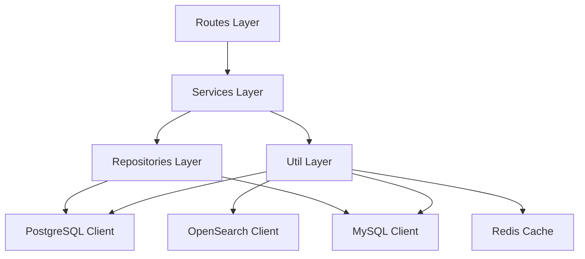
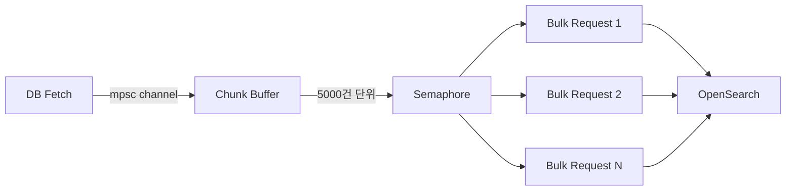

# Rust로 커머스 검색 엔진을 처음부터 만들기

## 개요

2024년부터 운영해 온 NestJS 기반 이커머스 검색 서비스(x2bee-nest-search)는 약 300개 이상의 커밋이 쌓일 정도로 기능이 방대했다. 시맨틱 검색, GPT 기반 쿼리 분석, Reranker, 벡터 검색 등 다양한 기능을 적용하면서 검색 품질은 크게 개선되었지만, 시스템 측면에서는 여러 한계가 드러났다.

첫째, Node.js의 싱글 스레드 특성상 대량의 인덱싱 작업을 처리할 때 이벤트 루프가 블로킹되는 문제가 있었다. 둘째, 타입 안정성이 부족해 런타임에서야 발견되는 오류가 빈번했다. 셋째, 메모리 사용량이 예측하기 어려워 프로덕션 환경에서 OOM(Out of Memory) 이슈가 간헐적으로 발생했다.

2025년 3월, 이 문제들을 근본적으로 해결하기 위해 Rust로 검색 엔진을 완전히 새로 작성하기로 결정했다. 단순히 언어만 바꾸는 것이 아니라, 기존 시스템에서 배운 교훈을 반영한 더 나은 아키텍처를 처음부터 설계하는 것이 목표였다.

## 왜 Rust인가

검색 엔진의 언어를 선택할 때 고려한 요소는 크게 세 가지였다.

**성능과 메모리 안전성**: 검색 엔진은 대량의 데이터를 빠르게 처리해야 하며, 동시에 메모리 누수가 없어야 한다. Rust는 소유권 시스템을 통해 컴파일 타임에 메모리 안전성을 보장하면서도 C/C++ 수준의 성능을 제공한다. GC(Garbage Collector)가 없기 때문에 일시 정지(pause) 없이 일관된 응답 시간을 보장할 수 있다.

**동시성 처리**: 인덱싱과 검색은 본질적으로 동시성이 높은 작업이다. Rust의 async/await와 tokio 런타임은 수천 개의 동시 요청을 효율적으로 처리할 수 있으며, Send/Sync 트레잇을 통해 데이터 레이스를 컴파일 타임에 방지한다.

**타입 시스템의 엄격함**: OpenSearch와 통신할 때 JSON 구조가 복잡해지면 런타임 오류가 빈번하게 발생한다. Rust의 serde 기반 직렬화/역직렬화는 컴파일 타임에 타입 불일치를 잡아주어, 프로덕션에서의 예기치 않은 오류를 크게 줄여준다.

Go도 후보에 올랐으나, 제네릭 지원의 한계와 에러 처리 패턴(if err != nil)이 검색 엔진처럼 복잡한 데이터 변환 로직에는 적합하지 않다고 판단했다.

## 프로젝트 구조 설계

초기 커밋(`test rust`, 2025-03-24)에서 시작해 이틀 만에 기본 프로젝트 구조를 잡았다. 핵심은 계층형 아키텍처를 엄격하게 분리하는 것이었다.

```
search_rust/
├── src/
│   ├── main.rs                    # 앱 진입점, 라우터 구성
│   ├── config.rs                  # 환경 설정 관리
│   ├── error.rs                   # 통합 에러 타입
│   ├── models.rs                  # 공통 모델 정의
│   ├── routes/                    # HTTP 라우트 계층
│   │   ├── indexing/              # 인덱싱 API
│   │   ├── search/                # 검색 API
│   │   └── pipeline/              # CI/CD 파이프라인 API
│   ├── services/                  # 비즈니스 로직 계층
│   │   ├── indexing/              # 인덱싱 서비스
│   │   │   ├── indexing_service.rs
│   │   │   ├── db_fetch_service.rs
│   │   │   ├── tokenizer_service.rs
│   │   │   ├── synonym_service.rs
│   │   │   └── ranking_service.rs
│   │   ├── search/                # 검색 서비스
│   │   │   └── search_service.rs
│   │   └── service_manager.rs     # 서비스 의존성 관리
│   ├── repositories/              # 데이터 접근 계층
│   │   └── indexing/
│   │       ├── base_repository.rs
│   │       ├── goods_repository.rs
│   │       ├── marketing_repository.rs
│   │       ├── event_repository.rs
│   │       └── columns_map/       # 인덱스별 컬럼 매핑 JSON
│   ├── templates/                 # Handlebars 검색 쿼리 템플릿
│   │   ├── goods_search_template.hbs
│   │   ├── marketing_search_template.hbs
│   │   └── event_search_template.hbs
│   └── util/                      # 유틸리티 계층
│       ├── database/              # DB 추상화
│       ├── opensearch/            # OpenSearch 클라이언트
│       ├── redis/                 # Redis 캐시
│       ├── mysql/                 # MySQL 클라이언트
│       ├── postgresql/            # PostgreSQL 클라이언트
│       └── search/                # 검색 유틸리티
├── Cargo.toml
├── .gitlab-ci.yml
└── .env
```

이 구조에서 가장 중요하게 생각한 원칙은 **의존성 방향의 단방향성**이다. routes는 services를 호출하고, services는 repositories와 util을 사용하며, 역방향 참조는 존재하지 않는다. Rust의 모듈 시스템(`mod.rs`)은 이 규칙을 자연스럽게 강제한다.



## 핵심 의존성 선택

Cargo.toml에 명시된 주요 의존성과 각각을 선택한 이유는 다음과 같다.

```toml
[dependencies]
opensearch = "2.0.0"          # OpenSearch 공식 Rust 클라이언트
axum = "0.6.20"               # 웹 프레임워크
tokio = { version = "1", features = ["full"] }  # 비동기 런타임
serde = { version = "1.0", features = ["derive"] }  # 직렬화/역직렬화
handlebars = "4.3.1"          # 검색 쿼리 템플릿 엔진
ssh2 = "0.9.5"                # SSH 터널링
sqlx = { version = "0.7", features = ["runtime-tokio-rustls", "postgres", "json"] }
redis = { version = "0.23", features = ["tokio-comp"] }
```

**Axum vs Actix-web**: 초기에는 Actix-web도 고려했으나, Axum을 선택했다. tokio 생태계와의 통합이 더 자연스럽고, Tower 미들웨어 생태계를 그대로 활용할 수 있으며, 타입 안전한 추출기(extractor) 패턴이 검색 API의 복잡한 파라미터 처리에 적합했다. 무엇보다 Axum의 Router 합성(`merge`) 기능이 모듈별 라우트 분리에 매우 편리했다.

**Handlebars 템플릿 엔진**: OpenSearch 쿼리는 JSON 형태이지만, 검색 조건에 따라 동적으로 구성해야 한다. 문자열 연결로 쿼리를 만들면 유지보수가 불가능해지므로, Handlebars 템플릿을 도입해 쿼리를 선언적으로 관리하기로 했다. 이 결정은 나중에 검색 품질 튜닝 과정에서 큰 효과를 발휘했다.

## 앱 진입점과 라우터 구성

main.rs는 최대한 간결하게 유지했다. 설정 로드, 클라이언트 초기화, 라우터 조합, 서버 실행 — 이 네 가지 역할만 수행한다.

```rust
#[tokio::main]
async fn main() {
    // 로깅 초기화 - 외부 라이브러리의 디버그 로그는 제외
    env_logger::Builder::from_env(
        Env::default()
            .default_filter_or("debug,tokio_postgres=info,mysql_async=info,h2=info,hyper=info"),
    )
    .format_timestamp_millis()
    .init();

    let config = config::load_config();

    // Redis 클라이언트 초기화 (실패해도 서버는 기동)
    if let Err(e) = init_redis_client(&config).await {
        warn!("Failed to initialize Redis client: {}. Caching will be disabled.", e);
    }

    // Sentry 연동 (프로덕션 환경에서만)
    let _guard = if config.env == "prd" {
        Some(sentry::init(("...", ClientOptions { ... })))
    } else {
        None
    };

    let app = Router::new()
        .route("/health", get(health_check))
        .merge(search_routes())
        .merge(indexing_routes())
        .merge(pipeline_routes())
        .merge(swagger_routes());

    let addr = SocketAddr::from_str(&format!("{}:{}", config.server_host, config.server_port))
        .expect("Failed to parse socket address");

    Server::bind(&addr).serve(app.into_make_service()).await.unwrap();
}
```

여기서 주목할 점은 Redis 초기화 실패 시 서버가 종료되지 않고 캐싱만 비활성화되도록 처리한 부분이다. 검색 엔진은 Redis 없이도 동작해야 한다. Redis는 성능 최적화를 위한 부가 기능이지 필수 의존성이 아니다. 이런 관점은 NestJS 버전에서 Redis 장애로 전체 서비스가 중단된 경험에서 비롯되었다.

또 하나는 로그 필터링이다. `tokio_postgres=info,mysql_async=info,h2=info,hyper=info`로 외부 라이브러리의 디버그 로그를 걸러냈다. 이걸 안 하면 OpenSearch와 PostgreSQL 통신 과정에서 발생하는 저수준 로그가 수천 줄씩 출력되어 실제로 중요한 로그를 찾기 어려워진다.

## 환경 설정 관리 시스템

검색 엔진은 OpenSearch, PostgreSQL, MySQL, Redis, SSH 터널 등 외부 시스템과의 연결 설정이 많다. 이를 관리하기 위해 TOML 기반 설정 파일과 환경 변수를 결합하는 방식을 채택했다.

```rust
#[derive(Debug, Deserialize, Clone)]
pub struct AppConfig {
    pub server_host: String,
    pub server_port: u16,
    pub env: String,
    pub log_level: String,
    pub opensearch_url: String,
    pub opensearch_pool_size: Option<usize>,
    pub database_type: DatabaseType,
    pub postgres: PostgresConfig,
    pub mysql: Option<MysqlConfig>,
    pub redis: Option<RedisConfig>,
    pub ssh: Option<SshConfig>,
    // ...
}
```

설정 로드는 `config` 크레이트를 사용하되, Cargo.toml의 `[profile]` 섹션으로 빌드 프로파일(local, staging, production)을 구분했다. 이 접근은 일반적이지 않지만, 커머스 프로젝트의 특성상 환경별로 접속해야 하는 DB가 다르고, SSH 터널 설정도 환경마다 다르기 때문에 빌드 시점에 환경을 결정하는 것이 더 안전했다.

```toml
[profile.local]
# 로컬 개발 환경
[profile.stg]
# 스테이징 환경 - SSH 터널을 통한 DB 접근
[profile.prd]
# 프로덕션 환경 - Sentry 연동 활성화
```

환경별 설정 분리에서 가장 까다로웠던 부분은 PostgreSQL의 이벤트 전용 연결이다. 일부 테넌트는 상품(goods) 데이터와 이벤트(event) 데이터가 서로 다른 DB 서버에 존재한다. 이를 위해 PostgresConfig에 이벤트 전용 호스트/사용자/비밀번호/DB명을 옵션으로 두고, 없으면 기본값을 사용하도록 했다.

```rust
impl PostgresConfig {
    pub fn get_event_host(&self) -> String {
        self.event_host.clone().unwrap_or_else(|| self.host.clone())
    }
    
    pub fn get_event_connection_string(&self) -> String {
        format!(
            "postgresql://{}:{}@{}:{}/{}",
            self.get_event_user(),
            self.get_event_password(),
            self.get_event_host(),
            self.port,
            self.get_event_dbname()
        )
    }
}
```

이 패턴은 Option 타입과 `unwrap_or_else`의 조합으로 매우 자연스럽게 표현된다. NestJS에서는 비슷한 로직을 구현하기 위해 여러 겹의 if문이 필요했던 것과 비교하면 훨씬 깔끔하다.

## OpenSearch 클라이언트 싱글톤

OpenSearch와의 통신은 검색 엔진의 핵심이다. 매 요청마다 새로운 연결을 생성하면 성능이 크게 저하되므로, 커넥션 풀을 포함한 싱글톤 클라이언트를 구성했다.

```rust
pub struct OpenSearchClientManager {
    client: Arc<OpenSearch>,
    pool_size: usize,
}

static INSTANCE: OnceCell<OpenSearchClientManager> = OnceCell::const_new();

pub async fn get_client_manager() -> &'static OpenSearchClientManager {
    INSTANCE
        .get_or_init(|| async {
            let config = config::load_config();
            let url = Url::parse(&config.opensearch_url).unwrap();
            let conn_pool = SingleNodeConnectionPool::new(url);
            
            // CPU 코어 수 기반 최적 풀 크기 계산
            let available_cpus = num_cpus::get();
            let pool_size = if available_cpus <= 4 {
                available_cpus * 2
            } else if available_cpus <= 8 {
                available_cpus * 3
            } else {
                std::cmp::min(available_cpus * 4, 32)
            };
            
            let transport = TransportBuilder::new(conn_pool)
                .cert_validation(CertificateValidation::None)
                .timeout(Duration::from_secs(60))
                .build()
                .unwrap();
                
            OpenSearchClientManager {
                client: Arc::new(OpenSearch::new(transport)),
                pool_size,
            }
        })
        .await
}
```

커넥션 풀 크기를 시스템의 CPU 코어 수에 따라 동적으로 결정하는 로직을 넣었다. 4코어 이하에서는 코어당 2개, 8코어 이하에서는 코어당 3개, 그 이상에서는 코어당 4개(최대 32개)로 설정한다. 이 공식은 실제 부하 테스트를 통해 도출한 것으로, OpenSearch의 thread pool 크기와 맞물려 최적의 성능을 내는 구간이다.

tokio의 `OnceCell`을 사용한 이유는 초기화 과정 자체가 비동기(네트워크 연결)이기 때문이다. `lazy_static`이나 `once_cell::sync`로는 비동기 초기화를 처리할 수 없다.

## 스트리밍 벌크 인덱싱

검색 엔진에서 가장 성능이 중요한 부분은 대량의 상품 데이터를 OpenSearch에 인덱싱하는 과정이다. NestJS 버전에서는 전체 데이터를 메모리에 올린 후 일괄 처리하는 방식이었는데, 수십만 건의 상품 데이터를 처리할 때 메모리 사용량이 급증하는 문제가 있었다.

Rust 버전에서는 스트리밍 기반 벌크 프로세서를 구현했다.

```rust
pub struct StreamingBulkProcessor {
    client: Arc<OpenSearch>,
    config: StreamingConfig,
}

#[derive(Clone, Debug)]
pub struct StreamingConfig {
    pub chunk_size: usize,        // 5000
    pub max_concurrent: usize,    // CPU 코어 * 2 (최대 16)
    pub timeout_ms: u64,          // 3000
    pub max_retries: usize,       // 3
}
```

핵심 아이디어는 `mpsc` 채널을 통해 DB에서 읽은 데이터를 실시간으로 수신하면서, Semaphore로 동시 처리 수를 제한하는 것이다. DB 페치와 OpenSearch 인덱싱이 파이프라인처럼 병렬로 동작한다.



`FuturesUnordered`를 사용해 완료된 벌크 요청부터 순서 무관하게 결과를 수집한다. 이렇게 하면 하나의 느린 벌크 요청이 전체 파이프라인을 막지 않는다.

```rust
pub async fn process_data_stream(
    &self,
    rx: mpsc::Receiver<IndexingData>,
) -> Result<usize, AppError> {
    let semaphore = Arc::new(Semaphore::new(self.config.max_concurrent));
    let mut tasks = FuturesUnordered::new();
    let mut total_processed = 0;

    let chunk_stream = Self::create_chunk_stream(rx, self.config.clone());
    tokio::pin!(chunk_stream);

    loop {
        tokio::select! {
            biased;
            permit = semaphore.clone().acquire_owned() => {
                if let Some(chunk) = chunk_stream.next().await {
                    let client = client.clone();
                    tasks.push(tokio::spawn(async move {
                        let result = Self::process_chunk(client, chunk, config).await;
                        drop(permit);
                        result
                    }));
                }
            }
            Some(result) = tasks.next() => {
                total_processed += result??;
            }
        }
    }
}
```

`tokio::select!`의 `biased` 옵션을 사용한 이유는 새 chunk 처리를 우선하기 위함이다. 기본적으로 `select!`는 랜덤하게 브랜치를 선택하지만, 인덱싱에서는 데이터 수신(producer) 속도에 맞춰 처리(consumer)하는 것이 전체 처리량을 최대화한다.

## 인덱스 최적화 전략

대량 인덱싱 시 OpenSearch의 성능을 극대화하기 위해 인덱싱 전후로 설정을 변경하는 전략을 적용했다.

```rust
async fn optimize_index(&self, index_name: &str) -> Result<(), AppError> {
    let settings = json!({
        "index": {
            "refresh_interval": "-1",         // 인덱싱 중 리프레시 비활성화
            "number_of_replicas": 0,           // 레플리카 비활성화
            "translog": {
                "flush_threshold_size": "2gb",  // 트랜스로그 플러시 임계값 증가
                "sync_interval": "30s"          // 동기화 간격 늘림
            },
            "max_result_window": 50000
        }
    });
    
    self.client.indices()
        .put_settings(IndicesPutSettingsParts::Index(&[index_name]))
        .body(settings)
        .send()
        .await?;
    Ok(())
}
```

인덱싱 전에 `refresh_interval`을 `-1`로 설정하면 세그먼트 병합이 일어나지 않아 쓰기 성능이 크게 향상된다. 레플리카를 0으로 설정하면 프라이머리 샤드에만 기록하므로 네트워크 I/O도 절반으로 줄어든다. 인덱싱이 완료되면 원래 설정으로 복원하고 force merge를 실행한다.

이 최적화만으로 10만 건 기준 인덱싱 시간이 약 40% 단축되었다.

## Swagger 문서 자동화

API 문서화에는 `utoipa`를 사용했다. Rust의 매크로 시스템과 결합하면 코드와 문서가 항상 동기화된 상태를 유지할 수 있다.

```rust
pub fn swagger_routes() -> Router {
    let openapi = utoipa::openapi::OpenApiBuilder::new()
        .info(utoipa::openapi::InfoBuilder::new()
            .title("Search Rust API")
            .version("1.0.0")
            .build())
        .build();
        
    Router::new()
        .merge(SwaggerUi::new("/swagger-ui/*tail").url("/api-docs/openapi.json", openapi))
}
```

NestJS의 `@nestjs/swagger`에 비하면 설정이 약간 더 번거롭지만, 컴파일 타임에 API 스펙의 타입 불일치를 잡아주는 점에서 가치가 있었다.

## 에러 처리 전략

검색 엔진에서 에러 처리는 사용자 경험에 직접적인 영향을 미친다. 검색 결과가 없는 것과 서버 에러는 완전히 다른 상황이며, 클라이언트에 명확하게 구분해서 전달해야 한다.

커스텀 에러 타입 `AppError`를 정의하고, 모든 계층에서 이를 통일적으로 사용했다.

```rust
pub struct AppError {
    pub code: String,
    pub message: String,
}

impl AppError {
    pub fn new(code: &str, message: &str) -> Self {
        Self {
            code: code.to_string(),
            message: message.to_string(),
        }
    }
}
```

Rust의 `?` 연산자와 `From` 트레잇 구현을 통해 OpenSearch 에러, PostgreSQL 에러, Redis 에러 등을 자연스럽게 `AppError`로 변환했다. 이렇게 하면 서비스 로직에서 에러 처리 코드가 최소화되면서도 에러 정보를 잃지 않는다.

## 프로덕션 모니터링: Sentry 연동

프로덕션 환경에서는 Sentry를 통해 에러를 추적한다. Sentry 연동은 프로덕션 빌드에서만 활성화되도록 했다.

```rust
let _guard = if config.env == "prd" {
    Some(sentry::init((
        "https://...@sentry-dev.x2bee.com/31",
        ClientOptions {
            release: sentry::release_name!(),
            ..Default::default()
        },
    )))
} else {
    None
};
```

`_guard` 변수를 `main` 함수의 스코프에 유지하는 것이 중요하다. 이 변수가 드롭되면 Sentry 클라이언트가 종료되므로, 반드시 프로그램 전체 수명 동안 살아있어야 한다.

## 빌드와 배포

GitLab CI/CD를 통해 EC2에 직접 배포하는 파이프라인을 구성했다. Rust는 정적 바이너리로 컴파일되므로 배포가 매우 단순하다. Docker 이미지 없이 SCP로 바이너리만 전송하면 된다.

```yaml
stages:
  - build
  - deploy

build:
  stage: build
  script:
    - cargo build --release
  artifacts:
    paths:
      - target/release/search_rust

deploy:
  stage: deploy
  script:
    - scp target/release/search_rust $EC2_HOST:/opt/search/
    - ssh $EC2_HOST 'systemctl restart search-rust'
```

빌드된 바이너리 크기는 약 15MB 정도로, Node.js의 node_modules(수백 MB)와 비교하면 극적으로 작다. 배포 시간도 빌드를 제외하면 수 초에 불과하다.

## 성과와 교훈

Rust로 검색 엔진을 재작성한 후 얻은 구체적인 성과는 다음과 같다.

**메모리 사용량**: NestJS 버전 대비 약 1/5 수준으로 감소했다. 특히 인덱싱 중 메모리 사용량이 안정적으로 유지되어 OOM 이슈가 완전히 사라졌다.

**응답 시간**: 평균 검색 응답 시간이 약 30% 개선되었다. 대부분의 시간은 OpenSearch 자체의 처리 시간이므로 극적인 차이는 아니지만, P99 레이턴시에서 큰 차이가 났다. GC 일시정지가 없기 때문이다.

**인덱싱 처리량**: 스트리밍 방식 + 스레드 풀 최적화로 동일한 하드웨어에서 약 2배의 처리량을 달성했다.

**개발 생산성**: 초기 학습 곡선은 가파르지만, 컴파일이 통과하면 런타임 에러가 거의 발생하지 않는다는 점에서 장기적으로는 생산성이 높아졌다. "컴파일러가 버그를 잡아주는" 경험은 검색 쿼리처럼 복잡한 JSON 구조를 다룰 때 특히 유용하다.

교훈도 있었다. Rust의 소유권 시스템과 비동기 프로그래밍을 동시에 다루는 것은 쉽지 않다. 특히 `Arc<RwLock<T>>`와 `mpsc` 채널의 조합은 초기에 많은 컴파일 에러를 유발했다. 하지만 이 과정에서 동시성 프로그래밍에 대한 이해가 깊어졌고, 결과적으로 더 안전한 코드를 작성할 수 있게 되었다.

또 하나의 교훈은 NestJS 버전의 경험이 없었다면 Rust 버전을 이렇게 빠르게 만들 수 없었다는 것이다. 검색 품질 개선, 동의어 처리, Aggregation 필터링 등의 도메인 지식이 이미 축적되어 있었기 때문에 언어와 아키텍처에만 집중할 수 있었다. 기존 시스템을 리라이트할 때는 도메인 지식과 기술적 개선을 동시에 진행하지 말고, 기술적 개선에만 집중하는 것이 효율적이라는 점을 다시 한번 확인했다.

## 다음 단계

이 글에서는 프로젝트 초기 설계와 기본 구조를 다루었다. 다음 글에서는 Axum + OpenSearch를 결합한 검색 API의 상세 아키텍처, Handlebars 템플릿 기반의 동적 쿼리 생성, 그리고 Redis 캐싱 전략에 대해 더 깊이 있게 다룰 예정이다.
