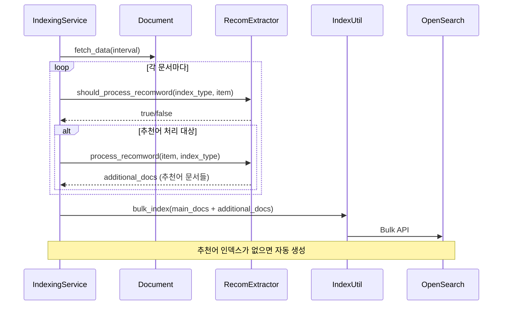
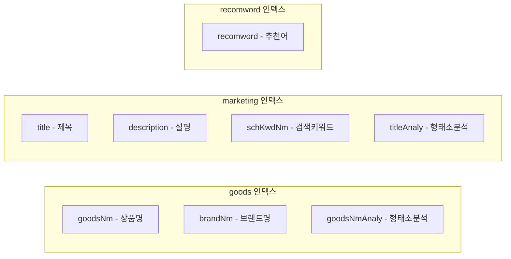

# 커머스 상품 추천 검색 API 설계 (goods + marketing)

## 개요

커머스 검색에서 "추천 검색어"는 사용자가 검색어를 입력하는 도중에 관련 키워드를 제안하는 기능이다. "원피"까지 입력하면 "원피스", "원피스 여름", "원피스 세일" 같은 추천어를 보여준다. 단순한 자동완성처럼 보이지만, 상품 데이터와 마케팅 데이터를 기반으로 추천어를 생성하고, 검색 빈도와 연관도를 반영해야 한다는 점에서 꽤 복잡한 문제다.

이 글에서는 Rust 검색 엔진에 추천 검색어 시스템을 구축한 과정을 다룬다. 상품(goods), 마케팅(marketing), 이벤트(event) 세 가지 도메인별로 별도 인덱스를 설계하고, 인덱싱 파이프라인에서 추천어를 자동 추출하는 구조를 만들었다.

## 아키텍처 설계

### 추천 검색어 시스템 전체 구조

```mermaid
graph TD
    subgraph "인덱싱 파이프라인"
        DB[(PostgreSQL)] --> FetchService[DB Fetch Service]
        FetchService --> Processor[Document Processor]
        Processor --> RecomExtractor[Recomword Extractor]
        RecomExtractor --> MainIndex["메인 인덱스<br/>goods-ko, marketing-ko"]
        RecomExtractor --> RecomIndex["추천어 인덱스<br/>goods-recomword-ko<br/>marketing-recomword-ko"]
    end
    
    subgraph "검색 API"
        Client[클라이언트] --> GoodsRecom[/goods-recomword]
        Client --> MarketingRecom[/marketing-recomword]
        Client --> EventRecom[/event-recomword]
        
        GoodsRecom --> QueryBuilder[쿼리 빌더]
        MarketingRecom --> QueryBuilder
        EventRecom --> QueryBuilder
        
        QueryBuilder --> Template[recomword_search_template.hbs]
        Template --> OS[(OpenSearch)]
        OS --> AggProcessor[Terms Agg 후처리]
        AggProcessor --> Response[추천어 응답]
    end
```

핵심 설계 결정은 추천 검색어를 별도 인덱스에 저장하는 것이었다. 메인 상품 인덱스에서 직접 추천어를 검색할 수도 있지만, 두 가지 이유로 분리했다.

첫째, 성능이다. 메인 인덱스는 수십만~수백만 건의 상품 문서를 가지고 있다. 자동완성을 위해 매번 이 인덱스를 쿼리하면 응답 시간이 길어진다. 추천어 인덱스는 고유 키워드만 저장하므로 문서 수가 훨씬 적고, 쿼리도 단순하다.

둘째, 독립적인 데이터 관리다. 추천어에 가중치를 부여하거나, 금칙어를 필터링하거나, 인기 검색어를 별도로 관리할 때 분리된 인덱스가 유리하다.

### 인덱스 네이밍 규칙

```rust
const INDEX_GOODS: &str = "goods";
const INDEX_MARKETING: &str = "marketing";
const INDEX_EVENT: &str = "event";
const INDEX_GOODS_RECOMWORD: &str = "goods-recomword";
const INDEX_MARKETING_RECOMWORD: &str = "marketing-recomword";
const INDEX_EVENT_RECOMWORD: &str = "event-recomword";
```

다국어를 지원하기 위해 언어 코드를 인덱스명에 붙인다. `goods-recomword-ko`, `goods-recomword-en` 식이다. 검색 API에서 `lang_cd` 파라미터를 받아 해당 언어의 인덱스를 조회한다.

## 인덱싱 파이프라인

### Event에서 Marketing으로의 전환

초기에는 이벤트(event) 데이터를 별도로 인덱싱했다. `EventRepository`가 이벤트 테이블에서 데이터를 가져와 `event-ko` 인덱스에 저장하는 구조였다. 그런데 실제 데이터를 분석해보니, "이벤트"라고 분류된 데이터의 대부분이 마케팅 프로모션이었다. 기획전, 할인 이벤트, 시즌 세일 등 마케팅 성격의 데이터였다.

도메인 용어를 "event"에서 "marketing"으로 변경했다. 단순한 네이밍 변경이 아니라 데이터 모델도 함께 수정했다.

```rust
pub struct MarketingRepository {
    base: BaseRepository,
}

impl MarketingRepository {
    pub fn new(pg_client: PostgresClient) -> Self {
        Self {
            base: BaseRepository::new(
                pg_client,
                "marketing".to_string(),
                "./src/repositories/indexing/columns_map/marketing_map.json".to_string(),
            ),
        }
    }
}
```

`EventRepository`를 `MarketingRepository`로 변경하면서 컬럼 매핑 파일도 `event_map.json`에서 `marketing_map.json`으로 교체했다. 마케팅 데이터에는 `title`, `description`, `schKwdNm`(검색 키워드명) 같은 필드가 있어, 상품 데이터와는 다른 매핑이 필요하다.

팩토리 패턴으로 레포지토리를 생성하고 있었기 때문에, 팩토리만 수정하면 되었다.

```rust
pub fn create_repository(
    index_type: &str,
    pg_client: PostgresClient,
) -> Result<Box<dyn IndexingRepository>, AppError> {
    match index_type {
        "goods" => Ok(Box::new(GoodsRepository::new(pg_client))),
        "ranking" => Ok(Box::new(RankingRepository::new(pg_client))),
        "marketing" => Ok(Box::new(MarketingRepository::new(pg_client))),
        _ => Err(AppError::new("404", &format!("Unknown index type: {}", index_type))),
    }
}
```

### 추천 검색어 자동 추출

인덱싱 과정에서 각 문서로부터 추천 검색어를 자동으로 추출한다. 상품 문서에서는 상품명, 브랜드명, 검색 키워드에서 추천어를 뽑아내고, 마케팅 문서에서는 타이틀과 검색 키워드에서 추출한다.



`should_process_recomword` 함수는 해당 인덱스 타입이 추천어 처리 대상인지 확인한다. 모든 인덱스에 추천어가 필요한 것은 아니다. `IndexUtil::MULTI_RECOMWORD_USE_INDEX` 상수에 정의된 인덱스만 추천어를 생성한다.

`process_recomword` 함수는 문서의 특정 필드에서 키워드를 추출하고, 추천어 전용 문서를 생성한다. 이 문서들은 `additional_docs` 벡터에 추가되어, 메인 문서와 함께 Bulk API로 인덱싱된다.

### 추천어 인덱스 자동 생성

추천어 인덱스가 존재하지 않으면 자동으로 생성한다. 매핑을 코드에서 정의하고 있어, 인덱스 구조가 버전 관리된다.

```rust
pub async fn ensure_recomword_index_exists(
    &self,
    index_type: &str,
    lang_cd: &str,
) -> Result<(), AppError> {
    let recomword_index = format!("{}-recomword-{}", index_type, lang_cd);

    let exists_response = self
        .client
        .indices()
        .exists(IndicesExistsParts::Index(&[&recomword_index]))
        .send()
        .await?;

    if !exists_response.status_code().is_success() {
        let settings = json!({
            "number_of_shards": 1,
            "number_of_replicas": 0
        });

        let mappings = json!({
            "properties": {
                "recomword": {
                    "type": "text",
                    "fields": {
                        "keyword": {
                            "type": "keyword",
                            "ignore_above": 256
                        }
                    }
                }
            }
        });

        let request_body = json!({
            "settings": settings,
            "mappings": mappings
        });

        self.client
            .indices()
            .create(IndicesCreateParts::Index(&recomword_index))
            .body(request_body)
            .send()
            .await?;
    }

    Ok(())
}
```

`recomword` 필드는 `text` 타입과 `keyword` 서브필드를 동시에 가진다. `text` 타입은 와일드카드 검색(`*원피*`)에 사용하고, `keyword` 서브필드는 Terms Aggregation에서 정확한 문자열을 기준으로 집계할 때 사용한다. `ignore_above: 256`으로 비정상적으로 긴 문자열은 keyword 인덱싱에서 제외한다.

샤드 수를 1로, 레플리카를 0으로 설정한 이유는 추천어 인덱스의 크기가 작기 때문이다. 수만 건 수준의 추천어는 단일 샤드로 충분하고, 개발/스테이징 환경에서는 레플리카가 필요 없다. 운영 환경에서는 별도로 레플리카를 추가한다.

## 마케팅 인덱스 매핑

### 필드 설계

마케팅 데이터는 상품 데이터와 다른 필드 구조를 가진다. OpenSearch에서 검색 품질을 높이기 위해 각 필드에 맞는 분석기를 설정했다.

```json
{
    "title": {
        "type": "text",
        "similarity": "scripted_no_idf",
        "norms": false
    },
    "description": {
        "type": "text",
        "similarity": "scripted_no_idf",
        "norms": false
    },
    "schKwdNm": {
        "type": "text",
        "similarity": "scripted_no_idf",
        "norms": false
    },
    "titleAnaly": {
        "type": "text",
        "similarity": "scripted_no_idf",
        "norms": false,
        "analyzer": "nori_custom"
    },
    "descriptionAnaly": {
        "type": "text",
        "similarity": "scripted_no_idf",
        "norms": false,
        "analyzer": "nori_custom"
    },
    "schKwdNmAnaly": {
        "type": "text",
        "similarity": "scripted_no_idf",
        "norms": false,
        "analyzer": "nori_custom"
    }
}
```

각 텍스트 필드는 원본 필드와 분석 필드(`*Analy`)를 쌍으로 가진다. 원본 필드는 `text` 타입의 기본 분석기(standard)를 사용하고, 분석 필드는 `nori_custom` 분석기를 사용한다. Nori는 한국어 형태소 분석기로, "원피스 여름 신상"을 "원피스", "여름", "신상"으로 분리한다.

`similarity: "scripted_no_idf"`를 설정한 이유가 있다. 일반적인 BM25 스코어링에서 IDF(Inverse Document Frequency)는 "드문 단어일수록 높은 점수"를 부여한다. 하지만 마케팅 데이터에서는 "세일", "할인" 같은 고빈도 단어가 오히려 중요하다. IDF를 비활성화해서 단어 빈도에 관계없이 일관된 스코어링을 적용한다.

`norms: false`는 필드 길이 정규화를 비활성화한다. 긴 문서일수록 점수가 낮아지는 효과를 제거해서, 짧은 타이틀과 긴 설명문이 공정하게 경쟁하도록 한다.

### 검색 쿼리 필드 매핑

인덱스 유형에 따라 검색 대상 필드가 달라진다. `get_index_fields` 함수에서 인덱스별 필드 구성을 반환한다.



## 추천 검색어 API 구현

### 검색 엔드포인트

세 가지 도메인에 대해 각각 추천 검색어 엔드포인트를 제공한다.

```rust
/// 상품 추천 검색 API
#[utoipa::path(
    get,
    path = "/api/search/v1/search/goods-recomword",
    params(
        ("search_word" = Option<String>, Query, description = "검색어"),
        ("from" = Option<u32>, Query, description = "검색 시작 위치"),
        ("size" = Option<u32>, Query, description = "결과 개수"),
        ("lang_cd" = Option<String>, Query, description = "언어 코드")
    ),
    responses(
        (status = 200, description = "상품 추천 검색 결과를 성공적으로 반환", body = SearchResponse)
    ),
    tag = "search"
)]
async fn goods_recomword(params: Query<SearchRequest>) -> Json<ApiResponse> {
    let lang_cd = params.0.get_lang_cd();
    let search_params = params
        .0
        .to_search_params(false, format!("{}-{}", INDEX_GOODS_RECOMWORD, lang_cd));

    execute_search(search_params).await
}
```

`utoipa` 매크로로 Swagger 문서를 자동 생성한다. 프론트엔드 개발자가 API 문서를 보고 바로 연동할 수 있다. `lang_cd`를 통해 `goods-recomword-ko`, `goods-recomword-en` 등 언어별 인덱스를 선택한다.

마케팅과 이벤트도 동일한 패턴이다.

```rust
async fn marketing_recomword(params: Query<SearchRequest>) -> Json<ApiResponse> {
    let lang_cd = params.0.get_lang_cd();
    let search_params = params
        .0
        .to_search_params(false, format!("{}-{}", INDEX_MARKETING_RECOMWORD, lang_cd));
    execute_search(search_params).await
}

async fn event_recomword(params: Query<SearchRequest>) -> Json<ApiResponse> {
    let lang_cd = params.0.get_lang_cd();
    let search_params = params
        .0
        .to_search_params(false, format!("{}-{}", INDEX_EVENT_RECOMWORD, lang_cd));
    execute_search(search_params).await
}
```

### 추천어 검색 쿼리 템플릿

추천 검색어 쿼리는 일반 검색과 다른 템플릿을 사용한다.

```json
{
    "from": {{from}},
    "size": {{size}},
    "track_total_hits": true,
    "query": {
        "bool": {
            "should": [
                {
                    "query_string": {
                        "fields": ["recomword"],
                        "query": "*{{search_word}}*"
                    }
                }
            ]
        }
    },
    "aggs": {
        "terms_agg": {
            "terms": {
                "field": "recomword.keyword",
                "size": {{size}}
            },
            "aggs": {
                "avg_length": {
                    "avg": {
                        "script": {
                            "source": "doc['recomword.keyword'].value.length()"
                        }
                    }
                },
                "bucket_sort": {
                    "bucket_sort": {
                        "sort": [
                            {
                                "avg_length": {
                                    "order": "asc"
                                }
                            }
                        ]
                    }
                }
            }
        }
    }
}
```

이 쿼리에는 세 가지 핵심 설계가 담겨 있다.

**와일드카드 검색**: `*{{search_word}}*`로 부분 문자열 매칭을 한다. "원피"를 입력하면 "원피스", "원피스 여름", "미니 원피스" 등 "원피"가 포함된 모든 추천어를 찾는다. `query_string`의 와일드카드는 `text` 필드의 분석된 토큰에 대해 적용된다.

**Terms Aggregation으로 중복 제거**: 같은 추천어가 여러 문서에서 추출될 수 있다. Terms Aggregation은 자동으로 고유한 키워드만 추출하고, 각 키워드의 문서 빈도(`doc_count`)도 함께 제공한다. 빈도가 높은 추천어가 상위에 노출된다.

**문자열 길이 기반 정렬**: `avg_length` 스크립트로 각 추천어의 문자열 길이를 계산하고, `bucket_sort`로 짧은 것부터 정렬한다. "원피스"(3글자)가 "원피스 여름 신상품"(9글자)보다 먼저 나와야 한다. 사용자가 "원피"를 입력했을 때, 더 짧고 직관적인 추천어가 상위에 올라야 사용성이 좋다.

### 추천어 응답 후처리

추천어 검색 결과는 일반 검색과 다른 후처리를 거친다.

```rust
fn process_search_result(
    params: &SearchParams,
    search_result: &Value,
) -> Result<Value, Box<dyn Error + Send + Sync>> {
    if params.index_name.contains("recomword") {
        process_recomword_result(search_result)
    } else if params.aggregation {
        process_aggregation_data(search_result)
    } else {
        process_hits_result(search_result)
    }
}
```

`process_recomword_result`에서는 Terms Aggregation의 `buckets`를 순회하면서 추천어 목록을 추출한다. `doc_count`(빈도)는 이미 `bucket_sort`로 길이 기준 정렬이 되어 있으므로, 그 순서를 유지한다.

## 라우팅 통합

### 검색 라우터 구성

새로운 엔드포인트를 라우터에 등록한다.

```rust
pub fn search_routes() -> Router {
    let search_path = "/api/search/v1/search";
    
    Router::new()
        // 기본 검색
        .route(&format!("{}/goods", search_path), get(goods_search))
        .route(&format!("{}/marketing-search", search_path), get(marketing_search))
        // 집계 검색
        .route(&format!("{}/goods-aggregation", search_path), get(goods_aggregation))
        // 추천 검색
        .route(&format!("{}/goods-recomword", search_path), get(goods_recomword))
        .route(&format!("{}/marketing-recomword", search_path), get(marketing_recomword))
        .route(&format!("{}/event-recomword", search_path), get(event_recomword))
}
```

URL 패턴을 `{도메인}-recomword`로 통일해서, 클라이언트가 도메인 이름만 바꾸면 된다. Swagger에서도 `search` 태그로 묶여 있어 한눈에 확인 가능하다.

## 트러블슈팅

### 와일드카드 쿼리 성능 문제

`*원피*` 같은 양쪽 와일드카드 쿼리는 OpenSearch에서 성능이 좋지 않다. 인덱스의 모든 토큰을 순회해야 하기 때문이다. 추천어 인덱스의 문서 수가 적어서 현재는 괜찮지만, 문서 수가 증가하면 문제가 될 수 있다.

대안으로 `edge_ngram` 토크나이저를 고려했다. "원피스"를 인덱싱할 때 "원", "원피", "원피스"로 분할해서 저장하면 와일드카드 없이도 접두어 매칭이 가능하다. 하지만 중위 매칭("피스" → "원피스")은 지원하지 않으므로, 현재는 와일드카드를 유지하되 추천어 인덱스의 크기를 관리하는 방향으로 결정했다.

### recomword 문서 관리 이슈

초기 구현에서는 인덱싱 시마다 기존 추천어 문서를 삭제하고 새로 생성했다. `manage_recomword_documents` 함수로 기존 문서를 찾아 삭제하는 로직이 있었는데, 대량 인덱싱 시 삭제 오버헤드가 컸다.

리팩토링 후에는 삭제 로직을 제거하고, 추천어 추출 시 `additional_docs`에 추가하는 방식으로 변경했다. Terms Aggregation이 자동으로 중복을 제거하므로, 같은 추천어가 여러 번 인덱싱되어도 검색 결과에는 영향이 없다.

```rust
// 리팩토링 전: 매번 삭제 후 재생성
for item in data_to_index.iter_mut() {
    for key in item.extra_fields.keys().cloned().collect::<Vec<String>>() {
        if key == "id" {
            if let Some(id) = item.id.clone() {
                if let Some(id_str) = id.as_str() {
                    self.manage_recomword_documents(index_type, id_str).await?;
                }
            }
        }
    }
    // ... 추천어 처리
}

// 리팩토링 후: 추가만 수행
for item in data_to_index.iter_mut() {
    if self.should_process_recomword(index_type, item) {
        self.process_recomword(item, index_type, &mut additional_docs)?;
    }
}
```

불필요한 삭제 연산을 제거하면서 인덱싱 속도가 상당히 개선되었다. 추천어 인덱스의 문서 수가 시간이 지나면서 증가할 수 있지만, 주기적으로 인덱스를 재생성(reindex)하면 된다.

### 다국어 인덱스 네이밍 충돌

초기에는 추천어 인덱스에 언어 코드를 붙이지 않았다. `goods-recomword` 하나로 모든 언어의 추천어를 저장했더니, 한국어와 영어 추천어가 섞여서 나왔다. "원피스"를 검색했는데 "dress"가 함께 나오는 문제였다.

언어별로 인덱스를 분리하면서 해결했다. `ensure_recomword_index_exists` 함수에 `lang_cd` 파라미터를 추가하고, 인덱스명을 `{index_type}-recomword-{lang_cd}` 형식으로 변경했다.

## 결과 및 회고

### 성과

추천 검색어 API 도입 후 프론트엔드에서 검색 자동완성 기능을 구현할 수 있게 되었다. 상품, 마케팅, 이벤트 세 가지 도메인의 추천어를 독립적으로 제공하면서, 각 도메인의 특성에 맞는 추천을 할 수 있다.

Terms Aggregation + 문자열 길이 정렬 방식은 별도의 랭킹 모델 없이도 합리적인 추천 순서를 제공한다. 빈도가 높고 짧은 키워드가 상위에 노출되므로, 사용자 입장에서 직관적이다.

인덱싱 파이프라인에서 추천어를 자동 추출하는 구조 덕분에, 새로운 상품이나 마케팅 데이터가 추가되면 추천어도 자동으로 갱신된다. 별도의 추천어 관리 작업이 필요 없다.

### 배운 점

도메인 모델의 네이밍은 처음부터 신중하게 결정해야 한다. "event"에서 "marketing"으로 변경하면서 레포지토리, 라우트, 인덱스, 테스트까지 전부 수정해야 했다. 코드 자체의 변경량은 크지 않았지만, 팩토리 패턴 덕분에 영향 범위를 최소화할 수 있었다. 도메인 용어가 확정되지 않은 상태에서 코드를 작성할 때는, 팩토리 패턴이나 전략 패턴으로 변경 비용을 낮추는 것이 중요하다.

와일드카드 쿼리의 성능 한계는 인덱스 크기가 작을 때는 문제가 되지 않지만, 스케일이 커지면 반드시 대안을 고려해야 한다. `edge_ngram` 토크나이저, Completion Suggester, 또는 별도의 Trie 기반 자동완성 서버 등 선택지가 있다. 현재 규모에서는 과도한 최적화지만, 트래픽이 증가하면 전환할 준비를 해두었다.

인덱싱 파이프라인에서 부수 데이터(추천어)를 함께 생성하는 패턴은 데이터 일관성을 유지하는 데 효과적이다. 하지만 인덱싱 실패 시 메인 데이터와 추천어 데이터의 불일치가 발생할 수 있으므로, 주기적인 전체 재인덱싱 스케줄을 운영하는 것이 안전하다.
