# Agent Xgen Node: AI 에이전트를 워크플로우 노드로

## 개요

XGEN 2.0 워크플로우에서 가장 핵심적인 노드가 Agent Xgen Node다. 이 노드 하나로 LLM 호출, 도구(Tool) 사용, RAG 검색, 파일 처리, 멀티모달 입력까지 모두 처리한다. 워크플로우의 다른 노드 — 데이터 전처리, 벡터 검색, 결과 포맷팅 — 는 데이터를 준비하고 후처리하는 역할이고, 실제 "사고(reasoning)"는 이 에이전트 노드가 담당한다.

초기에는 단순한 LLM 호출 노드였지만, 프로젝트가 진행되면서 요구사항이 폭발적으로 늘어났다. OpenAI, Anthropic, Google, AWS Bedrock, 로컬 vLLM까지 5개 프로바이더 지원, 도구 바인딩을 통한 ReAct 스타일 반복 호출, 스트리밍과 논스트리밍 모드 통합, PII 마스킹, JSON 출력 스키마 강제 등. 코드가 1,000줄을 넘어가면서 `agent_core.py`로 핵심 로직을 분리하고, Preparer-Executor 패턴으로 리팩토링했다.

```
# 커밋: refactor: Consolidate Agent Xgen Node implementation and enhance maintainability
# 날짜: 2025-12-30 10:20
```

## 아키텍처

```mermaid
flowchart LR
    subgraph Inputs["입력 포트"]
        Text["text<br/>STREAM STR | STR"]
        Files["files<br/>FILE"]
        Images["images<br/>LIST (URL)"]
        Tools["tools<br/>TOOL"]
        Memory["memory<br/>OBJECT"]
        RAG["rag_context<br/>DocsContext"]
        Schema["args_schema<br/>OutputSchema"]
        Plan["plan<br/>PLAN"]
    end

    subgraph Core["agent_core.py"]
        Config["AgentExecutionConfig<br/>모델, 프로바이더, 설정"]
        Preparer["AgentPreparer<br/>11단계 전처리"]
        Context["AgentExecutionContext<br/>준비된 컨텍스트"]
        Executor["AgentExecutor<br/>Streaming/Non-Streaming"]
    end

    subgraph Providers["프로바이더"]
        OpenAI["OpenAI<br/>GPT-4.1, GPT-5"]
        Anthropic["Anthropic<br/>Claude Sonnet 4.5"]
        Google["Google<br/>Gemini 2.5"]
        Bedrock["AWS Bedrock"]
        vLLM["vLLM<br/>로컬 모델"]
    end

    subgraph Outputs["출력 포트"]
        Stream["stream<br/>STREAM STR"]
        Result["result<br/>STR"]
    end

    Inputs --> Config
    Config --> Preparer
    Preparer --> Context
    Context --> Executor
    Executor --> Providers
    Providers --> Outputs
```



## Preparer-Executor 패턴

에이전트 실행을 두 단계로 명확히 분리했다. `AgentPreparer`는 모든 전처리를 담당하고, `AgentExecutor`는 준비된 컨텍스트로 실행만 한다.

```python
# agent_core.py — 핵심 데이터 클래스

@dataclass
class AgentExecutionConfig:
    """Agent 실행 설정 — 불변 데이터 클래스"""
    model: str
    provider: str
    base_url: Optional[str] = None
    temperature: float = 1.0
    max_tokens: int = 8192
    max_iterations: int = 15
    streaming: bool = True
    return_intermediate_steps: bool = False
    strict_citation: bool = False
    use_guarder: bool = False
    default_prompt: str = "You are a helpful AI assistant."
    interaction_id: Optional[str] = None

@dataclass
class AgentExecutionContext:
    """전처리된 실행 컨텍스트"""
    config: AgentExecutionConfig
    processed_text: str = ""
    file_context: str = ""
    additional_rag_context: str = ""
    downloaded_files: List[Dict[str, Any]] = field(default_factory=list)
    llm: Any = None
    tools_list: List[Any] = field(default_factory=list)
    chat_history: List[Any] = field(default_factory=list)
    agent_graph: Any = None
    system_prompt: str = ""
    final_user_message: Union[str, List[Dict[str, Any]]] = ""
    graph_inputs: Dict[str, Any] = field(default_factory=dict)
    guarder_passed: bool = True
```

이 분리의 가장 큰 이점은 테스트 용이성이다. `AgentPreparer`의 전처리 결과를 `AgentExecutionContext`로 직렬화해서 검증할 수 있고, `AgentExecutor`에 모킹된 컨텍스트를 넣어서 실행 로직만 독립적으로 테스트할 수 있다.

## AgentPreparer: 11단계 전처리 파이프라인

Preparer는 원시 입력을 받아 실행 가능한 컨텍스트로 변환한다. 총 11단계를 거친다.

```python
class AgentPreparer:
    """
    전처리 파이프라인:
    1. 이미지/OCR 폴백 처리
    2. Generator 수집 (text가 Generator인 경우)
    3. PII 마스킹
    4. Guarder 검증
    5. LLM 컴포넌트 준비 (프로바이더별 클라이언트)
    6. RAG 컨텍스트 빌드
    7. 이미지 태그 OCR 처리
    8. JSON 출력 프롬프트 구성
    9. Agent 그래프 생성
    10. 멀티모달 메시지 생성
    11. 그래프 입력 구성
    """

    def prepare(self, text, tools, memory, rag_context,
                args_schema, plan, downloaded_files, file_context):
        context = AgentExecutionContext(config=self.config)

        # 1~4: 입력 정제
        self._process_input(context, text, downloaded_files, file_context)

        # 5: LLM 클라이언트 준비
        self._prepare_llm(context)

        # 6: RAG 컨텍스트
        self._build_rag_context(context, rag_context)

        # 7~8: 후처리
        self._post_process(context, args_schema)

        # 9: 에이전트 그래프 구성
        self._create_agent_graph(context)

        # 10~11: 최종 메시지 구성
        self._build_final_message(context)

        return context
```

### 5단계: 멀티 프로바이더 LLM 준비

5개 프로바이더를 단일 인터페이스로 추상화한다. `prepare_llm_components`가 프로바이더별로 적절한 LangChain 클라이언트를 생성한다.

```python
# provider별 모델 선택 — 파라미터 의존성으로 UI에서 자동 전환
parameters = [
    {"id": "provider", "name": "Provider", "type": "STR", "value": "openai",
     "options": [
         {"value": "openai", "label": "OpenAI"},
         {"value": "anthropic", "label": "Anthropic"},
         {"value": "google", "label": "Google"},
         {"value": "bedrock", "label": "AWS Bedrock"},
         {"value": "vllm", "label": "vLLM"},
     ]},
    {"id": "openai_model", "name": "OpenAI Model", "type": "STR",
     "value": "gpt-4.1",
     "dependency": "provider", "dependencyValue": "openai",
     "options": [
         {"value": "gpt-4o", "label": "GPT-4o"},
         {"value": "gpt-4.1", "label": "GPT-4.1"},
         {"value": "gpt-5", "label": "GPT-5"},
         {"value": "gpt-5.1", "label": "GPT-5.1"},
         # ...
     ]},
    {"id": "anthropic_model", "dependency": "provider",
     "dependencyValue": "anthropic",
     "options": [
         {"value": "claude-sonnet-4-5-20250929", "label": "Claude Sonnet 4.5"},
         {"value": "claude-opus-4-1-20250805", "label": "Claude Opus 4.1"},
         # ...
     ]},
]
```

`dependency`와 `dependencyValue` 필드가 핵심이다. 프론트엔드에서 Provider 드롭다운을 "OpenAI"로 선택하면 OpenAI Model 드롭다운만 보이고, "Anthropic"으로 바꾸면 Anthropic Model 드롭다운이 나타난다. 워크플로우 에디터의 파라미터 의존성 시스템(#116)과 연동되는 부분이다.

### 9단계: Agent 그래프 생성

LangChain의 `create_agent`와 `SummarizationMiddleware`를 사용해서 에이전트 그래프를 구성한다.

```python
def _create_agent_graph(self, context):
    agent_summarization_middleware = SummarizationMiddleware(
        model=context.llm,
        max_tokens_before_summary=25000,
        messages_to_keep=10,
    )

    if context.tools_list:
        context.agent_graph = create_agent(
            model=context.llm,
            tools=context.tools_list,
            system_prompt=context.system_prompt,
            middleware=[agent_summarization_middleware],
        )
    else:
        context.agent_graph = create_agent(
            model=context.llm,
            system_prompt=context.system_prompt,
            middleware=[agent_summarization_middleware],
        )
```

`SummarizationMiddleware`는 대화가 길어질 때 이전 메시지를 요약해서 토큰 수를 관리한다. `max_tokens_before_summary=25000`이면 약 25K 토큰을 넘어가는 시점에서 자동 요약이 발동한다. 최근 10개 메시지는 요약하지 않고 원본을 유지한다.

## 노드 정의: 입출력 포트 시스템

AgentXgenNode는 XGEN 워크플로우의 Node 베이스 클래스를 상속한다.

```python
class AgentXgenNode(Node):
    categoryId = "xgen"
    functionId = "agents"
    nodeId = "agents/xgen"
    nodeName = "Agent Xgen"
    description = "도구, 메모리 및 RAG 컨텍스트 등을 활용하여 채팅 응답을 생성하는 통합 Agent"
    tags = ["agent", "chat", "rag", "public_model", "stream", "xgen"]

    inputs = [
        {"id": "text", "name": "Text", "type": "STREAM STR|STR",
         "multi": True, "required": False},
        {"id": "files", "name": "Files", "type": "FILE",
         "multi": True, "required": False},
        {"id": "images", "name": "Images", "type": "LIST",
         "multi": True, "required": False},
        {"id": "tools", "name": "Tools", "type": "TOOL",
         "multi": True, "required": False},
        {"id": "memory", "name": "Memory", "type": "OBJECT"},
        {"id": "rag_context", "name": "RAG Context", "type": "DocsContext"},
        {"id": "args_schema", "name": "ArgsSchema", "type": "OutputSchema"},
        {"id": "plan", "name": "Plan", "type": "PLAN"},
    ]
    outputs = [
        {"id": "stream", "name": "Stream", "type": "STREAM STR",
         "stream": True,
         "dependency": "streaming", "dependencyValue": True},
        {"id": "result", "name": "Result", "type": "STR",
         "dependency": "streaming", "dependencyValue": False},
    ]
```

입력 포트의 `multi: True`는 여러 엣지를 받을 수 있다는 의미다. 예를 들어 `tools` 포트에 Brave Search, QdrantRetrievalTool, MCP Tool 노드를 동시에 연결할 수 있다.

출력 포트에서 `dependency: "streaming"`은 파라미터 값에 따라 활성화되는 포트가 달라진다. 스트리밍 모드면 `stream` 포트가, 아니면 `result` 포트가 활성화된다. 워크플로우 에디터에서 해당 포트만 연결 가능하게 제한한다.

## ReAct 에이전트: 반복적 도구 호출

기본 AgentXgenNode는 단일 LLM 호출이다. 도구를 사용하더라도 한 번의 호출에서 function calling으로 처리한다. 하지만 복잡한 작업에는 여러 번의 도구 호출과 중간 추론이 필요하다. 이를 위해 ReAct(Reasoning + Acting) 패턴의 별도 노드를 구현했다.

```
# 커밋: feat: Add ReAct-style agent node for iterative tool use
# 날짜: 2025-12-24 01:23
```

```python
REACT_DEFAULT_PROMPT = """You are a helpful AI assistant.
When tools are available, you may call them multiple times to solve the task.
Before each tool call, briefly state what you are about to do in one short sentence.
Do not reveal hidden chain-of-thought or internal reasoning.
After using tools, provide a clear final answer."""

class ReactAgentPreparer(AgentPreparer):
    """AgentPreparer 확장 — ReAct 그래프 빌드"""

    def _create_agent_graph(self, context) -> None:
        agent_summarization_middleware = SummarizationMiddleware(
            model=context.llm,
            max_tokens_before_summary=25000,
            messages_to_keep=10,
        )

        if context.tools_list:
            context.agent_graph = _build_react_agent_graph(
                model=context.llm,
                tools=context.tools_list,
                system_prompt=context.system_prompt,
                middleware=[agent_summarization_middleware],
            )
        else:
            context.agent_graph = create_agent(
                model=context.llm,
                system_prompt=context.system_prompt,
                middleware=[agent_summarization_middleware],
            )
```

`ReactAgentPreparer`는 `AgentPreparer`를 상속하면서 `_create_agent_graph` 메서드만 오버라이드한다. 11단계 전처리 중 9단계만 바꾸는 것이다. Preparer-Executor 패턴의 확장성이 여기서 빛난다.

### ReAct 그래프 빌드의 방어적 구현

LangGraph의 `create_react_agent` API가 버전마다 시그니처가 다른 문제가 있었다. 이를 방어적으로 처리했다.

```python
def _build_react_agent_graph(model, tools, system_prompt, middleware):
    try:
        from langgraph.prebuilt import create_react_agent
    except Exception:
        # LangGraph가 없으면 기본 agent로 폴백
        return create_agent(model=model, tools=tools,
                           system_prompt=system_prompt, middleware=middleware)

    # 시그니처 호환성을 위한 후보 kwargs
    candidate_kwargs = [
        {"model": model, "tools": tools,
         "system_prompt": system_prompt, "middleware": middleware},
        {"model": model, "tools": tools,
         "system_prompt": system_prompt},
        {"model": model, "tools": tools,
         "prompt": system_prompt},
        {"model": model, "tools": tools},
    ]

    for kwargs in candidate_kwargs:
        try:
            return create_react_agent(**kwargs)
        except TypeError:
            continue  # 다음 시그니처 시도

    # 모든 시그니처 실패 시 기본 agent로 폴백
    return create_agent(model=model, tools=tools,
                       system_prompt=system_prompt, middleware=middleware)
```

4가지 시그니처를 순서대로 시도하고, 전부 실패하면 `create_agent`로 폴백한다. LangGraph 업데이트에 즉시 대응하지 못하는 상황에서도 서비스가 중단되지 않는다.

```
# 커밋: feat: Implement ReAct style tool calling support and enhance tool description formatting
# 날짜: 2025-12-18 23:33
```

## 스트리밍 실행과 이벤트 태깅

에이전트의 스트리밍 출력에는 내부 이벤트 태그가 포함된다. 도구 호출, 도구 결과 등의 이벤트를 `[AGENT_EVENT]` 태그로 감싸서 프론트엔드에서 파싱할 수 있게 한다.

```python
# execute_agent_streaming_with_events에서 이벤트 태깅
def execute_agent_streaming_with_events(agent_graph, inputs, config):
    for event in agent_graph.stream(inputs, config):
        if "agent" in event:
            # 에이전트의 텍스트 출력
            yield event["agent"]["messages"][-1].content
        elif "tools" in event:
            # 도구 호출 결과 — 내부 태그로 감싸기
            tool_output = event["tools"]["messages"][-1]
            yield f"[AGENT_EVENT]tool_result:{tool_output.content}[/AGENT_EVENT]"
```

워크플로우 실행 결과를 사용자에게 전달할 때는 이 내부 태그를 필터링한다.

```
# 커밋: feat: Exclude internal agent event logs from workflow execution output
# 날짜: 2025-12-23 18:21
```

### GraphRecursionError 처리

ReAct 에이전트가 도구를 무한 반복 호출하는 상황을 방지하기 위해 `max_iterations`를 설정한다. LangGraph는 반복 횟수 초과 시 `GraphRecursionError`를 발생시킨다.

```python
try:
    result = agent_graph.invoke(inputs, config)
except GraphRecursionError:
    logger.warning("Agent reached maximum iterations (%d)", max_iterations)
    yield "[WARNING] 최대 반복 횟수에 도달했습니다. 현재까지의 결과를 반환합니다."
```

```
# 커밋: feat: Add graceful handling for GraphRecursionError in agent execution and streaming
# 날짜: 2025-12-20 08:22
```

## 파일 처리와 멀티모달 입력

Agent Xgen Node는 텍스트뿐 아니라 파일과 이미지도 입력으로 받는다. 파일은 MinIO에서 다운로드하고, 텍스트를 추출한 뒤 컨텍스트에 포함시킨다.

```python
FILE_DEFAULT_PROMPT = """Analyze the given content and provide a clear summary
of its main ideas and important details. Focus only on the content itself
and do not mention file names, formats, metadata, or how the content was provided."""

def _build_file_only_text(text, downloaded_files):
    """파일만 있고 텍스트가 없는 경우 기본 프롬프트를 구성한다."""
    cleaned_text = re.sub(r'__\[Path:\s*[^\]]+\]', '', text)
    file_patterns = re.findall(r'\[File:\s*[^\]]+\]', cleaned_text)

    if file_patterns:
        file_list = '\n'.join(file_patterns)
        return f"{FILE_DEFAULT_PROMPT}\n\n{file_list}"
    return FILE_DEFAULT_PROMPT
```

사용자가 파일만 업로드하고 텍스트를 입력하지 않았을 때, 파일 내용을 분석해서 요약해달라는 기본 프롬프트를 자동으로 구성한다. 입력 형식에서 `__[Path: ...]` 부분은 내부 경로 정보이므로 제거하고, `[File: filename.pdf]` 패턴만 추출한다.

이미지 입력은 Vision 기능이 있는 모델(GPT-4o, Claude Sonnet 4.5 등)에서만 활성화된다. `_check_vision_capability`로 모델의 Vision 지원 여부를 확인하고, `create_multimodal_message`로 이미지 URL을 포함한 멀티모달 메시지를 구성한다.

## AgentXgenReActNode: 상속 기반 확장

ReAct 노드는 기본 AgentXgenNode를 상속해서 최소한의 변경으로 구현한다.

```python
class AgentXgenReActNode(AgentXgenNode):
    nodeId = "agents/xgen_react"
    nodeName = "(Beta)Agent Xgen (ReAct)"
    description = "ReAct-style agent that iteratively calls tools"
    tags = AgentXgenNode.tags + ["react"]
    disable = True  # 베타 — 관리자만 활성화 가능

    parameters = _clone_parameters_with_prompt(
        AgentXgenNode.parameters,
        REACT_DEFAULT_PROMPT,
    )

    def execute(self, text, files, tools, memory, rag_context, ...):
        # 파일 다운로드, 컨텍스트 추출 등은 부모와 동일
        config = AgentExecutionConfig(
            model=model, provider=provider, streaming=streaming,
            default_prompt=default_prompt, max_iterations=max_iterations,
        )
        return execute_react_agent(text, config, tools, memory, ...)
```

`_clone_parameters_with_prompt`로 부모의 파라미터 정의를 복사하면서 기본 프롬프트만 ReAct용으로 교체한다. `return_intermediate_steps` 파라미터는 ReAct에서 불필요하므로 제거한다.

```
# 커밋: refactor: Replace deprecated AgentXgenNode251216 with AgentXgenNode in ReAct agent
# 날짜: 2026-01-16 02:36
```

## 트러블슈팅

### 프로바이더별 Temperature 범위

AWS Bedrock의 경우 Temperature 범위가 0.0~1.0인데, OpenAI는 0.0~2.0이다. 프론트엔드에서 1.5를 입력한 상태로 프로바이더를 Bedrock으로 바꾸면 API 에러가 발생했다. `prepare_llm_components`에서 프로바이더별 범위 검증을 추가했다.

```
# 커밋: feat: Add temperature range validation for Bedrock provider in LLM component preparation
# 날짜: 2026-01-07 02:27
```

### 에이전트 이벤트 태그 누출

`[AGENT_EVENT]` 태그가 불완전하게 잘린 채 사용자에게 노출되는 버그가 있었다. 스트리밍 청크 경계에서 태그가 중간에 끊기면 필터링이 되지 않았다. 불완전한 태그를 버퍼링해서 다음 청크와 합쳐 처리하는 로직을 추가했다.

```
# 커밋: fix: Enhance handling of incomplete [AGENT_EVENT] tags in workflow execution
# 날짜: 2026-01-26 11:30
```

### SummarizationMiddleware 토큰 제한

긴 대화에서 SummarizationMiddleware가 요약을 생성할 때, 요약 자체가 컨텍스트 윈도우를 초과하는 경우가 있었다. `get_max_context_chars`로 모델별 최대 컨텍스트를 확인하고, 요약 시 포함할 메시지 수를 동적으로 조정했다.

## 결과 및 회고

Agent Xgen Node는 XGEN 2.0에서 가장 많이 사용되는 노드다. 단일 노드로 5개 프로바이더의 LLM을 지원하고, 도구 호출, RAG, 파일 처리, 스트리밍까지 통합한다. Preparer-Executor 패턴으로 리팩토링한 것이 유지보수에 결정적이었다. 새로운 프로바이더를 추가할 때 Preparer의 5단계만 수정하면 되고, ReAct 노드를 만들 때도 9단계만 오버라이드했다.

가장 까다로운 부분은 LangChain/LangGraph의 API 호환성이다. 라이브러리 버전 업데이트마다 시그니처가 바뀌어서, 방어적 코딩이 필수였다. `_build_react_agent_graph`의 후보 kwargs 패턴은 이런 상황에서 실용적인 해결책이었다.

`disable = True`로 ReAct 노드를 베타 상태로 유지한 것도 의도적이다. ReAct 패턴은 도구를 여러 번 호출하므로 비용과 지연 시간이 기본 노드보다 크다. 충분한 검증 없이 전체 사용자에게 공개하면 예상치 못한 비용이 발생할 수 있다.
