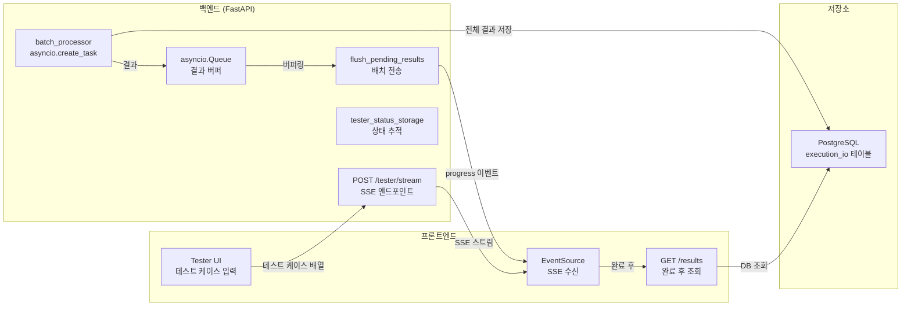
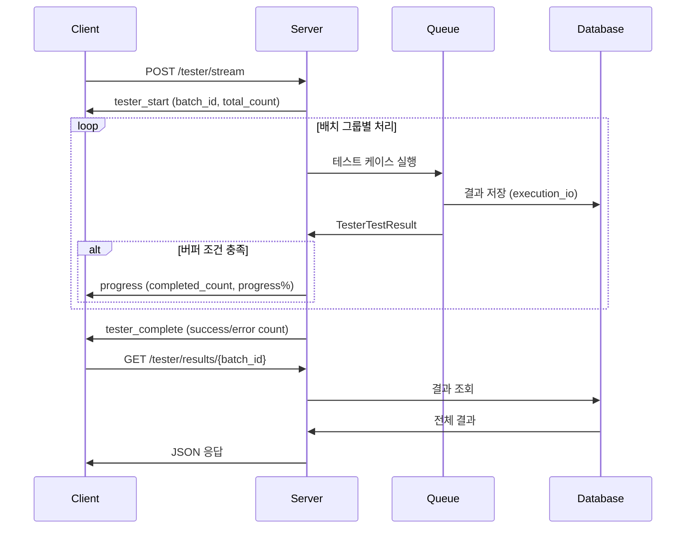

# SSE 기반 워크플로우 테스터: 실시간 실행 결과 스트리밍

## 개요

XGEN 2.0 워크플로우 테스터는 AI 워크플로우의 품질을 검증하는 도구다. 수십~수백 개의 테스트 케이스를 입력하면, 각각을 워크플로우에 통과시키고 기대 출력과 비교한다. 단순히 전체 결과를 한 번에 응답하면 몇 분간 아무 피드백 없이 기다려야 하고, 브라우저 타임아웃에 걸릴 수도 있다.

SSE(Server-Sent Events)로 실시간 스트리밍하되, 테스트 케이스마다 이벤트를 보내면 프론트엔드가 과부하에 걸린다. 수백 개의 결과가 초 단위로 쏟아지면 React 리렌더링이 감당을 못한다. 결국 배치 버퍼링 + DB 분리 전략으로 SSE 트래픽을 최소화하고, 서버 메모리도 절약하는 구조를 만들었다. 9번의 최적화 반복(v1~v9)을 거친 결과물이다.

```
# 커밋: feat: Optimize workflow tester streaming for batch processing
# 날짜: 2025-12-23 23:46
```

## 전체 아키텍처



## SSE 이벤트 흐름

테스터 실행의 전체 SSE 이벤트 시퀀스다.



## 배치 버퍼링 전략

SSE 스트리밍에서 가장 중요한 설계 결정은 "얼마나 자주, 무엇을 보낼 것인가"다. 최적화 과정에서 여러 전략을 시도했다.

### v1~v3: 개별 결과 전송 (실패)

초기에는 테스트 케이스 하나가 완료될 때마다 결과 전체를 SSE로 전송했다.

```python
# v1 — 개별 전송 (문제 많음)
async for result in execute_tests():
    yield f"data: {json.dumps(result.to_dict())}\\n\\n"
```

100개 이상의 테스트 케이스에서 프론트엔드가 버벅였다. React가 매 이벤트마다 상태를 업데이트하고 리렌더링하니 당연한 결과였다.

### v5: 진행률만 전송, 결과는 DB에서 조회

결정적 전환점이었다. SSE로는 진행률(completed_count, progress%)만 보내고, 실제 결과 데이터는 DB에서 별도 API로 조회하도록 분리했다.

```python
# v5 — 진행률만 전송
SSE_BATCH_INTERVAL = 3.0   # 3초마다 배치 전송
SSE_BATCH_MAX_SIZE = 10    # 한 번에 최대 10개 결과까지 버퍼링
SSE_OUTPUT_TRUNCATE_LENGTH = 3000  # SSE 전송 시 3KB로 truncate

async def flush_pending_results():
    """결과는 DB에 이미 저장됨 — SSE로는 진행률만 전송"""
    if not pending_results:
        return None

    completed_count += len(pending_results)
    progress = (completed_count / total_count) * 100

    progress_message = {
        "type": "progress",
        "batch_id": batch_id,
        "completed_count": completed_count,
        "total_count": total_count,
        "progress": round(progress, 2),
        "elapsed_time": int((time.time() - start_time) * 1000)
    }
    pending_results = []
    return f"data: {json.dumps(progress_message)}\\n\\n"
```

프론트엔드는 진행률 바만 업데이트하면 되니 리렌더링 부담이 거의 없다. 전체 결과가 필요한 시점(완료 후)에 `GET /tester/results/{batch_id}`를 한 번 호출한다.

### 배치 전송 타이밍

```python
while True:
    try:
        result = await asyncio.wait_for(
            result_queue.get(), timeout=SSE_BATCH_INTERVAL
        )

        if isinstance(result, TesterTestResult):
            pending_results.append(result)

            # 두 가지 조건 중 하나 충족 시 전송
            should_flush = (
                len(pending_results) >= SSE_BATCH_MAX_SIZE or
                (time.time() - last_send_time) >= SSE_BATCH_INTERVAL
            )
            if should_flush:
                flush_data = await flush_pending_results()
                if flush_data:
                    yield flush_data

    except asyncio.TimeoutError:
        # 타임아웃이면 버퍼에 쌓인 것 전송
        flush_data = await flush_pending_results()
        if flush_data:
            yield flush_data
        else:
            # 버퍼가 비면 ping 전송 (60초에 한 번)
            if (time.time() - last_send_time) >= 60.0:
                yield f"data: {json.dumps({'type': 'ping'})}\\n\\n"
```

전송 타이밍은 두 가지 조건의 OR로 결정된다.

1. 버퍼에 결과가 10개 이상 쌓였을 때 (빠른 테스트에서 유리)
2. 마지막 전송 후 3초가 지났을 때 (느린 테스트에서 유리)

`asyncio.wait_for`의 timeout을 `SSE_BATCH_INTERVAL`로 설정해서, 결과가 없어도 3초마다 루프가 돌아간다. 이 timeout은 배치 전송 간격과 연결 유지 핑의 타이밍을 모두 제어한다.

## 배치 프로세서: asyncio.Task 기반 병렬 실행

테스트 케이스 실행은 별도의 asyncio Task로 분리된다. 메인 루프는 SSE 전송만 담당하고, 실제 워크플로우 실행은 `batch_processor`가 맡는다.

```python
async def batch_processor():
    for i in range(0, len(test_cases), batch_size):
        # 취소 요청 확인 — 새 배치 그룹 시작 전에 체크
        if is_cancelled(batch_id):
            await result_queue.put("TESTER_CANCELLED")
            return

        batch_group = test_cases[i:i + batch_size]

        await process_batch_group(
            user_id=user_id,
            workflow_name=workflow_name,
            test_cases=batch_group,
            batch_id=batch_id,
            app_db=app_db,
            individual_result_callback=individual_completion_callback,
        )

        # 배치 그룹 간 0.5초 대기 (서버 부하 분산)
        if i + batch_size < len(test_cases):
            await asyncio.sleep(0.5)

    await result_queue.put("TESTER_COMPLETE")

batch_task = asyncio.create_task(batch_processor())
```

`process_batch_group`은 배치 그룹 내의 테스트 케이스를 순차 실행한다. 각 케이스가 완료되면 `individual_completion_callback`을 호출해서 `asyncio.Queue`에 결과를 넣는다. 메인 루프는 큐에서 결과를 꺼내 버퍼에 쌓고, 조건이 맞으면 SSE로 전송한다.

배치 그룹 간 `asyncio.sleep(0.5)` 대기는 서버 부하를 분산시키는 역할이다. LLM 호출이 동시에 몰리면 GPU 메모리 부족이 발생할 수 있어서, 그룹 단위로 호흡을 준다.

## 메모리 최적화 v9

테스트 케이스가 수백 개일 때 모든 결과를 메모리에 유지하면 서버 메모리가 급격히 증가한다. 특히 LLM 출력은 하나에 수 KB씩 되므로 500개 테스트면 수 MB의 결과 데이터가 서버 메모리에 상주한다.

v9에서는 결과 리스트를 완전히 제거하고 카운트만 유지하도록 변경했다.

```python
# [최적화 v9] 메모리 사용 최소화 — 카운트만 유지
success_count = 0
error_count = 0

async def individual_completion_callback(result: TesterTestResult):
    nonlocal success_count, error_count
    if result.status == "success":
        success_count += 1
    else:
        error_count += 1
    await result_queue.put(result)
```

결과 데이터 자체는 `process_batch_group` 내부에서 DB에 즉시 저장하고 메모리에서 해제한다. 콜백은 카운트 업데이트와 큐 전송만 한다. 큐에서도 flush 이후 `pending_results = []`로 즉시 비우기 때문에, 동시에 메모리에 존재하는 결과는 최대 `SSE_BATCH_MAX_SIZE`(10개)뿐이다.

```
# 커밋: feat: Optimize memory usage and result handling in workflow tester execution
# 날짜: 2025-12-24 18:04
```

## 결과 조회 API

SSE 스트리밍이 완료된 후, 프론트엔드는 별도 API로 전체 결과를 조회한다.

```python
@router.get("/results/{batch_id}")
async def get_tester_results(request: Request, batch_id: str):
    """
    SSE 스트리밍 중에는 진행률만 전송하고,
    완료 후 이 API로 전체 결과를 한 번에 조회한다.
    """
    results = app_db.execute_query(
        """
        SELECT id, interaction_id, input_data, output_data,
               expected_output, llm_eval_score, created_at
        FROM execution_io
        WHERE interaction_id LIKE %s
        ORDER BY id ASC
        """,
        (f"%____{batch_id}____%",)
    )

    formatted_results = []
    for row in results:
        # interaction_id에서 test_id 추출
        parts = row[1].split("____")
        test_id = int(parts[-1]) if parts else 0

        formatted_results.append({
            "id": test_id,
            "input": parse_json(row[4]),
            "expected_output": row[5],
            "actual_output": parse_json(row[6]),
            "llm_eval_score": row[7],
            "status": "success" if row[6] else "error"
        })

    return {"batch_id": batch_id, "results": formatted_results}
```

`interaction_id`의 구조는 `{interaction_id}____{workflow_name}____{batch_id}____{test_id}`다. `____`를 구분자로 사용해서 SQL LIKE 쿼리로 batch_id에 해당하는 모든 결과를 조회한다. 이 설계 덕분에 별도의 결과 테이블 없이 기존 `execution_io` 테이블을 그대로 활용한다.

```
# 커밋: feat: Optimize result transmission and add results retrieval endpoint for tester execution
# 날짜: 2025-12-24 16:53
```

## LLM 평가 스트리밍

테스터는 선택적으로 LLM 기반 평가를 지원한다. 워크플로우 출력과 기대 출력을 LLM에게 보내서 정확도 점수를 받는다.

```python
if tester_request.llm_eval_enabled and success_count > 0:
    yield f"data: {json.dumps({'type': 'eval_start'})}\\n\\n"

    eval_completed = 0
    for test_case in tester_request.test_cases:
        # DB에서 해당 테스트 결과 조회 (메모리 절약)
        db_result = app_db.execute_query(
            "SELECT output_data FROM execution_io WHERE interaction_id = %s LIMIT 1",
            (unique_interaction_id,)
        )

        llm_score = await evaluate_with_llm(
            input_data=test_case.input,
            expected_output=test_case.expected_output,
            actual_output=actual_output,
            llm_eval_model=tester_request.llm_eval_model,
            app_db=app_db
        )
        eval_completed += 1

    yield f"data: {json.dumps({'type': 'eval_complete', 'message': f'LLM 평가 완료 ({eval_completed}개)'})}\\n\\n"
```

LLM 평가도 v7에서 메모리 최적화를 거쳤다. 이전에는 모든 결과를 `all_results` 리스트에 담아 놓고 평가했지만, DB에서 한 건씩 조회하는 방식으로 변경해서 메모리 사용을 최소화했다.

## 상태 추적과 모니터링

테스터 실행 상태는 인메모리 딕셔너리로 관리한다.

```python
tester_status_storage[batch_id] = {
    "status": "running",        # running | completed | cancelled | error
    "total_count": len(test_cases),
    "completed_count": 0,
    "progress": 0.0,
    "start_time": start_time
}
```

`GET /tester/status/{batch_id}` API로 상태를 조회할 수 있고, 프론트엔드가 SSE 연결이 끊어졌을 때 폴백으로 사용한다. 오래된 상태 데이터는 `cleanup_old_tester_status()`에서 주기적으로 정리한다.

## 트러블슈팅

### 프론트엔드 과부하

v1~v3에서 겪은 가장 큰 문제였다. 100개 테스트 케이스의 결과를 초 단위로 전송하니 React 리렌더링이 감당을 못했다. 해결책은 결과 데이터를 SSE에서 완전히 분리한 것이다. SSE는 숫자(진행률)만 보내고, 결과는 DB에서 한 번에 조회한다.

### asyncio.Queue 백프레셔

테스트 실행 속도가 SSE 전송 속도보다 빠르면 큐에 결과가 쌓인다. asyncio.Queue에 maxsize를 설정하면 `batch_processor`가 블록될 수 있어서, 무제한 큐를 사용하되 `flush_pending_results`에서 빠르게 비우는 전략을 택했다. v9에서 결과 데이터 자체를 메모리에 유지하지 않기 때문에, 큐에 쌓이는 것은 경량 TesterTestResult 객체뿐이라 메모리 압박이 크지 않다.

### SSE 연결 타임아웃

LLM 워크플로우 실행이 오래 걸리면 SSE 연결이 타임아웃될 수 있다. 60초마다 `ping` 이벤트를 보내서 연결을 유지한다. nginx나 로드밸런서의 proxy_read_timeout 설정도 함께 조정해야 했다.

## 결과 및 회고

9번의 최적화 반복을 거쳐 완성된 테스터 스트리밍 시스템은 수백 개의 테스트 케이스를 안정적으로 처리한다. 핵심 교훈은 SSE 스트리밍에서 "무엇을 보내지 않을 것인가"가 "무엇을 보낼 것인가"보다 중요하다는 점이다. 결과 데이터를 SSE에서 분리하고 DB를 경유하는 설계가 프론트엔드 성능과 서버 메모리 모두를 해결했다.

`asyncio.Queue`로 생산자(batch_processor)와 소비자(SSE 전송)를 분리한 구조도 잘 작동했다. 생산 속도와 소비 속도가 다를 때, 큐가 자연스럽게 버퍼 역할을 한다. 이 패턴은 다른 스트리밍 시나리오에도 그대로 적용 가능하다.
