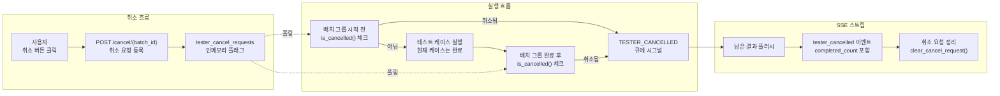
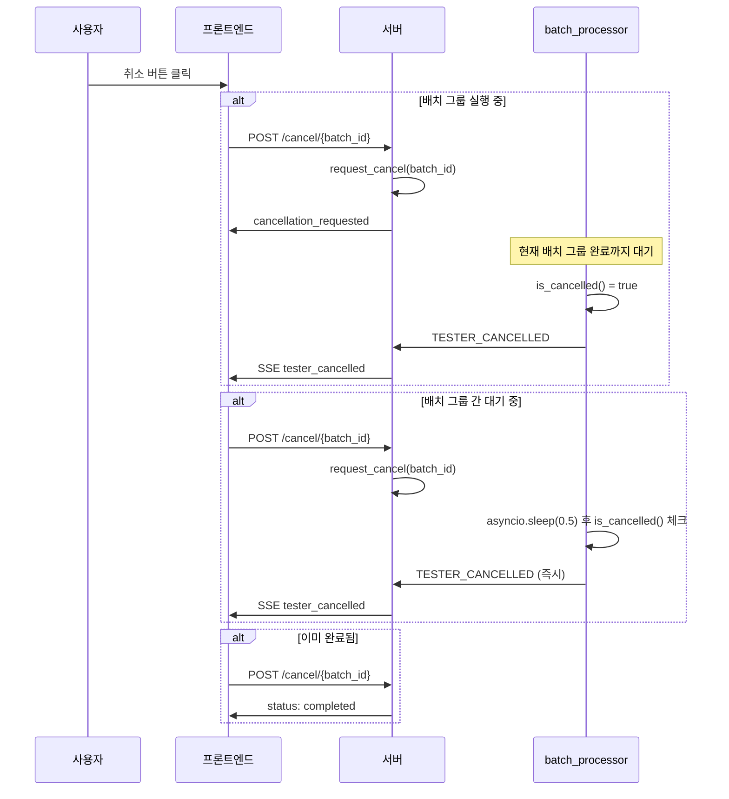

# 워크플로우 실행 취소(Cancellation) 메커니즘 구현

## 개요

워크플로우 테스터에서 수백 개의 테스트 케이스를 실행할 때, 중간에 문제를 발견하면 전체 실행을 취소하고 싶은 경우가 빈번하다. 잘못된 입력을 넣었거나, 워크플로우 설정을 수정해야 할 때, 남은 수십 분의 실행을 기다릴 필요가 없다.

취소 자체는 단순해 보이지만, 비동기 스트리밍 환경에서는 여러 난제가 있다. 현재 실행 중인 LLM 호출은 즉시 중단할 수 없고, DB에 이미 저장된 결과는 보존해야 하며, SSE 스트림은 정상적으로 종료되어야 한다. asyncio.Task.cancel()로 강제 중단하면 데이터 무결성이 깨질 수 있어서, 협조적(cooperative) 취소 패턴을 구현했다.

```
# 커밋: feat: Implement cancellation functionality for tester execution
# 날짜: 2025-12-24 15:57
```

## 취소 메커니즘 설계



## 인메모리 취소 플래그

취소 상태는 인메모리 딕셔너리로 관리한다. Redis나 DB를 사용하지 않는 이유는 취소 판정이 같은 프로세스 내에서 이루어지기 때문이다. 단일 Pod 내에서 `batch_processor` Task와 취소 API 핸들러가 같은 메모리 공간을 공유한다.

```python
# 취소 요청 저장소
tester_cancel_requests: dict[str, bool] = {}

def request_cancel(batch_id: str):
    """취소 요청 등록"""
    tester_cancel_requests[batch_id] = True

def is_cancelled(batch_id: str) -> bool:
    """취소 상태 확인"""
    return tester_cancel_requests.get(batch_id, False)

def clear_cancel_request(batch_id: str):
    """취소 요청 정리"""
    tester_cancel_requests.pop(batch_id, None)
```

간단한 bool 딕셔너리이지만, asyncio 환경에서 thread-safe가 보장되는 이유가 있다. Python의 GIL(Global Interpreter Lock)과 asyncio의 단일 이벤트 루프 특성상, 딕셔너리의 읽기/쓰기가 원자적으로 동작한다. `asyncio.Lock`이 필요하지 않다.

## 취소 API 엔드포인트

```python
@router.post("/cancel/{batch_id}")
async def cancel_tester_execution(request: Request, batch_id: str):
    """
    테스터 실행 취소 요청.
    진행 중인 테스트 케이스가 있다면 완료 후 중단된다.
    새로운 배치 그룹은 시작되지 않는다.
    """
    # 해당 batch_id가 존재하는지 확인
    if batch_id not in tester_status_storage:
        return JSONResponse(
            status_code=404,
            content={"status": "not_found", "message": "해당 테스터 배치를 찾을 수 없습니다."}
        )

    current_status = tester_status_storage[batch_id].get("status", "unknown")

    # 이미 완료/취소/에러 상태면 무시
    if current_status in ("completed", "cancelled", "error"):
        return JSONResponse(content={
            "status": current_status,
            "message": f"테스터가 이미 {current_status} 상태입니다."
        })

    # 취소 요청 등록
    request_cancel(batch_id)

    return JSONResponse(content={
        "status": "cancellation_requested",
        "message": "테스터 취소가 요청되었습니다. 진행 중인 테스트 케이스 완료 후 중단됩니다."
    })
```

API 응답에서 "진행 중인 테스트 케이스 완료 후 중단됩니다"라고 명시하는 것이 중요하다. 즉시 취소가 아니라 Graceful 취소라는 것을 사용자에게 알린다.

## 배치 프로세서의 취소 체크 포인트

`batch_processor`는 두 곳에서 취소 상태를 확인한다.

```python
async def batch_processor():
    for i in range(0, len(test_cases), batch_size):
        # [체크포인트 1] 새 배치 그룹 시작 전
        if is_cancelled(batch_id):
            logger.info(f"테스터 취소됨: batch_id={batch_id}, "
                       f"처리된 테스트={success_count + error_count}개")
            await result_queue.put("TESTER_CANCELLED")
            return

        batch_group = test_cases[i:i + batch_size]

        # 배치 그룹 내 테스트 케이스 실행
        await process_batch_group(
            test_cases=batch_group,
            batch_id=batch_id,
            individual_result_callback=callback,
        )

        # [체크포인트 2] 배치 그룹 완료 후
        if is_cancelled(batch_id):
            logger.info(f"테스터 취소됨 (배치 완료 후): batch_id={batch_id}, "
                       f"처리된 테스트={success_count + error_count}개")
            await result_queue.put("TESTER_CANCELLED")
            return

        # 배치 그룹 간 대기
        if i + batch_size < len(test_cases):
            await asyncio.sleep(0.5)

    await result_queue.put("TESTER_COMPLETE")
```

체크포인트가 두 곳인 이유가 있다.

- **체크포인트 1 (배치 시작 전)**: 새로운 배치 그룹을 아예 시작하지 않는다. 이미 완료된 결과는 DB에 보존된다.
- **체크포인트 2 (배치 완료 후)**: 현재 배치 그룹의 모든 케이스가 DB에 저장된 뒤에 취소한다. 이렇게 하면 중간에 결과가 빠지는 일이 없다.

두 체크포인트 사이에 있는 `process_batch_group` 호출은 중단되지 않는다. 이것이 "Graceful Cancellation"의 핵심이다. 실행 중인 LLM 호출을 강제 중단하면 API 요금은 나가면서 결과는 못 받는 최악의 상황이 된다.

## SSE 스트림의 취소 처리

메인 SSE 루프에서 `TESTER_CANCELLED` 시그널을 수신하면, 남은 결과를 플러시하고 취소 이벤트를 전송한다.

```python
while True:
    result = await asyncio.wait_for(result_queue.get(), timeout=interval)

    if result == "TESTER_CANCELLED":
        # 버퍼에 남은 결과 플러시
        flush_data = await flush_pending_results()
        if flush_data:
            yield flush_data

        # 상태 업데이트
        tester_status_storage[batch_id]["status"] = "cancelled"

        # 취소 요청 정리
        clear_cancel_request(batch_id)

        # 취소 이벤트 전송
        cancelled_message = {
            "type": "tester_cancelled",
            "batch_id": batch_id,
            "completed_count": completed_count,
            "total_count": total_count,
            "message": f"테스터가 취소되었습니다. {completed_count}개 테스트 완료."
        }
        yield f"data: {json.dumps(cancelled_message)}\\n\\n"
        return  # SSE 스트림 종료
```

`flush_pending_results()`를 먼저 호출하는 것이 핵심이다. 취소 직전까지 완료된 결과의 진행률을 정확히 전달해야 프론트엔드가 올바른 `completed_count`를 표시할 수 있다.

`clear_cancel_request(batch_id)`로 플래그를 정리하지 않으면, 같은 batch_id로 재실행할 때 즉시 취소되는 버그가 생긴다. UUID로 batch_id를 생성하므로 실제로는 충돌할 확률이 없지만, 메모리 누수 방지를 위해 정리한다.

## 상태 조회 API

프론트엔드가 취소 요청 후 상태를 확인할 수 있도록 별도 API를 제공한다.

```python
@router.get("/status/{batch_id}")
async def get_tester_status(request: Request, batch_id: str):
    status_data = tester_status_storage[batch_id]
    return JSONResponse(content={
        "batch_id": batch_id,
        "status": status_data.get("status", "unknown"),
        "total_count": status_data.get("total_count", 0),
        "completed_count": status_data.get("completed_count", 0),
        "progress": status_data.get("progress", 0.0),
        "is_cancel_requested": is_cancelled(batch_id)
    })
```

`is_cancel_requested` 필드를 별도로 제공한다. status가 아직 "running"이지만 취소가 요청된 상태를 프론트엔드가 구분할 수 있다. UI에서는 "취소 요청 중..." 같은 중간 상태를 보여줄 수 있다.

## 취소 시나리오별 동작



배치 그룹 간 `asyncio.sleep(0.5)` 대기 중에 취소가 들어오면 거의 즉시(0.5초 내) 반응한다. 배치 그룹 실행 중이면 현재 그룹이 끝날 때까지 기다려야 하므로 수십 초 걸릴 수 있다.

## 트러블슈팅

### asyncio.Task.cancel() 대신 플래그를 선택한 이유

asyncio Task에는 `cancel()` 메서드가 있다. 하지만 `cancel()`은 `CancelledError` 예외를 발생시켜서, 실행 중인 await 지점에서 즉시 중단된다. 이 경우:

1. DB 트랜잭션이 중간에 끊길 수 있다
2. LLM API 호출이 완료되지 않은 채 요금만 발생한다
3. `result_queue`에 잘못된 데이터가 들어갈 수 있다

플래그 기반 협조적 취소는 현재 실행 중인 작업을 안전하게 완료한 후 중단하므로 이런 문제가 없다.

### 멀티 Pod 환경에서의 한계

인메모리 플래그이므로, 취소 요청과 실행이 다른 Pod에 있으면 취소가 작동하지 않는다. 현재는 SSE 스트리밍이 sticky session으로 동일 Pod에서 처리되므로 문제가 없지만, 스케일 아웃 시에는 Redis pub/sub으로 전환해야 한다.

### 오래된 상태 데이터 누수

`tester_status_storage`와 `tester_cancel_requests`는 인메모리 딕셔너리이므로, 정리하지 않으면 메모리가 계속 증가한다. `cleanup_old_tester_status()`를 테스터 실행 시작 시점에 호출해서, 일정 시간이 지난 상태 데이터를 삭제한다.

## 결과 및 회고

협조적 취소 패턴은 구현이 단순하면서도 데이터 무결성을 완벽하게 보장한다. `asyncio.Task.cancel()` 같은 강제 중단이 아니라, 실행 흐름 자체가 취소 상태를 인식하고 자연스럽게 종료하는 방식이다.

가장 중요한 설계 원칙은 "취소된 테스트의 결과도 보존한다"는 것이다. 500개 중 200개를 실행한 후 취소하면, 200개의 결과는 DB에 온전히 남아 있다. 사용자는 부분 결과를 확인한 후 문제를 수정하고 나머지 300개만 다시 실행할 수 있다.

배치 그룹 경계에서만 체크하는 것이 취소 반응 속도와 데이터 무결성 사이의 적절한 균형점이었다. 개별 테스트 케이스 실행 중에 체크하면 반응은 빠르지만 구현이 복잡해지고, 오류 가능성이 높아진다.
