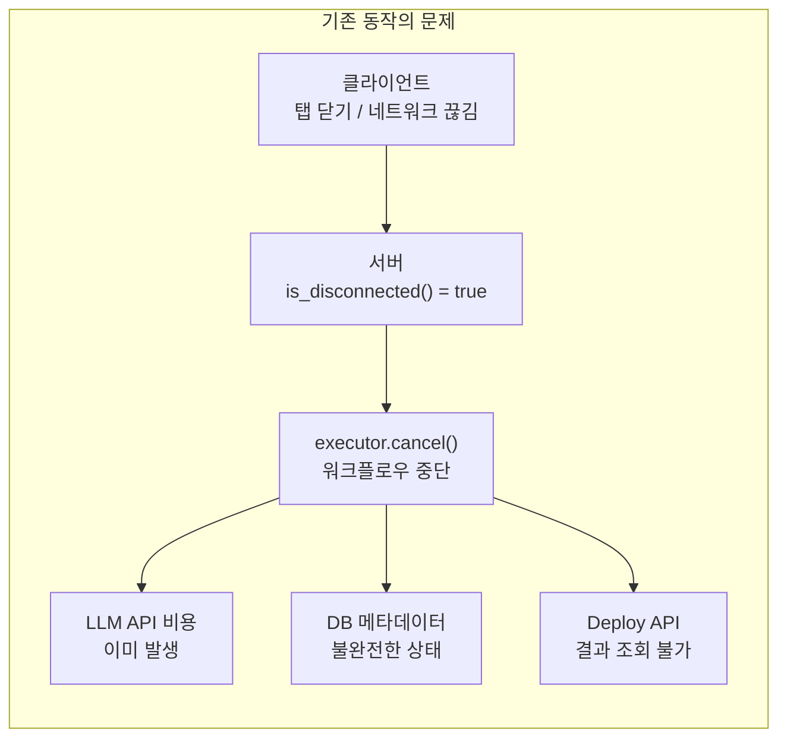
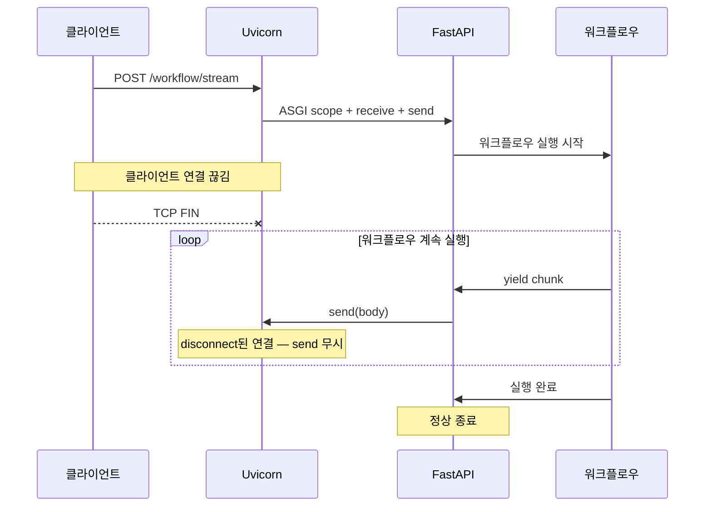
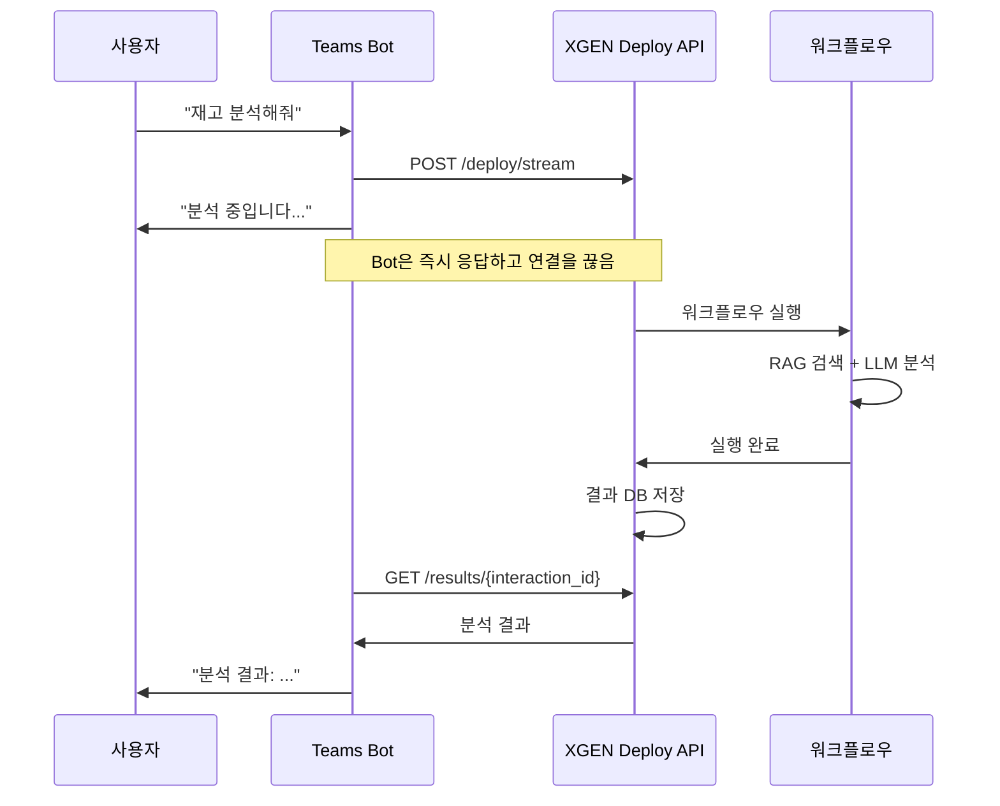

# 클라이언트 연결 끊김에도 워크플로우 실행 유지하기

## 개요

XGEN 2.0 워크플로우는 SSE(Server-Sent Events)로 실행 결과를 실시간 스트리밍한다. 사용자가 브라우저 탭을 닫거나, 네트워크가 일시적으로 끊기거나, Teams Bot이 응답을 먼저 보내고 연결을 종료하면 — 서버 입장에서는 클라이언트가 disconnect된 상태다.

초기 구현에서는 클라이언트 disconnect를 감지하면 워크플로우 실행을 즉시 취소했다. Starlette의 `request.is_disconnected()` API를 폴링하면서, disconnect가 감지되면 실행기의 `cancel()` 메서드를 호출했다. 이 방식은 일반적인 웹 요청에서는 합리적이다. 하지만 AI 워크플로우에는 치명적인 문제가 있었다.

LLM 호출 비용은 이미 발생했는데 결과를 버리게 되고, DB에 저장된 중간 결과와 메타데이터의 일관성이 깨진다. 무엇보다 Deploy API를 통한 외부 연동 — Teams Bot, Slack Bot, 임베디드 채팅 위젯 — 에서 요청을 보내고 연결을 끊은 뒤 결과를 별도 API로 가져가는 Proactive Messaging 패턴이 완전히 불가능했다.

```
# 커밋: feat: Update workflow execution to ignore client disconnection during streaming
# 날짜: 2025-12-26 15:11
```

## 문제 분석

### 기존 코드: disconnect 감지 후 즉시 취소

```python
# 변경 전 — execution.py
async for chunk in async_result_generator:
    if await request.is_disconnected():
        client_disconnected = True
        try:
            executor.cancel("client_disconnected")
        except Exception:
            pass
        break

    # 청크 처리 및 SSE 전송
    yield f"data: {json.dumps(chunk)}\\n\\n"
```

`request.is_disconnected()`는 Starlette가 제공하는 비동기 메서드로, 클라이언트의 TCP 연결 상태를 확인한다. 매 스트리밍 청크마다 이 체크를 수행해서, disconnect가 감지되면 `executor.cancel()`로 워크플로우 실행을 중단했다.

### 이 접근의 문제점



1. **LLM 비용 낭비**: GPT-4나 Claude 호출은 요청 시점에 비용이 발생한다. 응답을 중간에 버려도 비용은 돌아오지 않는다.

2. **DB 불일관성**: `execution_meta`에 실행 시작은 기록되었지만 완료는 기록되지 않는다. `execution_io`에 입력은 있지만 출력이 없다. 이후 테스터 결과 조회나 로그 분석에서 불완전한 데이터가 나온다.

3. **Deploy API 패턴 불가**: Teams Bot 같은 외부 시스템은 워크플로우 실행을 요청한 뒤, HTTP 연결을 끊고 나중에 결과를 가져간다. Proactive Messaging 패턴에서는 결과가 나오면 Bot이 사용자에게 먼저 메시지를 보내는 구조다. 이 패턴이 disconnect 취소와 양립할 수 없다.

## 해결: disconnect 무시

변경은 놀라울 정도로 간단했다. `request.is_disconnected()` 체크를 제거하고 워크플로우를 끝까지 실행하도록 했다.

```python
# 변경 후 — execution.py
async for chunk in async_result_generator:
    # 클라이언트 연결 끊김 무시 — 워크플로우 끝까지 실행
    # (Teams Bot 등 Proactive Messaging 패턴 지원)

    # 청크 처리 및 SSE 전송
    if isinstance(chunk, dict) and chunk.get('type') == 'log':
        yield f"event: log\\ndata: {json.dumps(chunk['data'])}\\n\\n"
    elif chunk_type == 'data':
        yield f"data: {json.dumps(response_chunk)}\\n\\n"
    # ...
```

`executor.cancel("client_disconnected")` 호출도 함께 제거했다. 이제 클라이언트가 연결을 끊어도:

1. 워크플로우 실행은 서버에서 끝까지 완료된다
2. 모든 노드 실행 결과가 DB에 정상 저장된다
3. `execution_meta`의 상태가 "completed"로 정확히 업데이트된다
4. SSE `yield`는 클라이언트가 없으면 단순히 무시된다 (에러 없음)

## SSE yield의 disconnect 안전성

핵심 의문은 "클라이언트가 없는데 `yield`를 해도 괜찮은가?"이다. FastAPI(Starlette)의 `StreamingResponse`는 ASGI 프로토콜 위에서 동작한다. `yield`는 ASGI send 호출로 변환되는데, 클라이언트가 disconnect된 상태에서 send를 해도 예외가 발생하지 않는다. ASGI 서버(Uvicorn)가 disconnect된 연결에 대한 send를 조용히 무시한다.



다만 `request.is_disconnected()` 체크가 없으면 서버가 disconnect를 아예 감지하지 못하므로, 로깅에서 "클라이언트가 연결을 끊었다"는 정보가 사라진다. 이건 의도적 트레이드오프다. 워크플로우 완료가 disconnect 감지보다 중요하다.

## Deploy API와 Proactive Messaging 패턴

이 변경의 직접적인 수혜자는 Deploy API를 통한 외부 연동이다.

```python
@router.post("/deploy/stream")
async def execute_workflow_deploy_stream(request: Request, request_body: WorkflowRequest):
    """
    Deploy 전용 API 엔드포인트.
    response_format: "json" (기본값) — 깔끔한 JSON 응답
    response_format: "stream" — SSE 스트리밍 응답
    """
    if not request_body.interaction_id.startswith("deploy_"):
        request_body.interaction_id = f"deploy_{request_body.interaction_id}"
    # ...
```

Deploy API는 워크플로우를 외부 서비스에서 호출할 수 있게 하는 공개 엔드포인트다. Teams Bot이 사용하는 전형적인 흐름은 이렇다.



Bot은 사용자에게 "분석 중입니다..."를 즉시 응답하고, XGEN과의 HTTP 연결을 끊는다. 워크플로우가 완료되면 결과를 DB에서 조회해서 사용자에게 Proactive 메시지로 전송한다. disconnect 즉시 취소가 있었다면 이 패턴은 불가능했다.

## 결과 저장 분리 전략

disconnect 무시가 안전한 이유는 워크플로우 실행 결과가 SSE 스트림과 독립적으로 DB에 저장되기 때문이다.

```python
# execute_workflow_core에서 결과 저장
async for chunk in execute_workflow_core(
    request_body=request_body,
    user_id=user_id,
    db_manager=app_db,
    skip_detail_log=skip_detail_log,
    error_message_replacer=error_message_replacer,
    backend_log=backend_log,
):
    # chunk를 SSE로 전송 (클라이언트가 없으면 무시됨)
    yield sse_format(chunk)
```

`execute_workflow_core` 내부에서 각 노드 실행 결과는 즉시 DB에 기록된다. SSE 전송은 결과 저장의 부산물일 뿐, 결과 저장의 전제 조건이 아니다. SSE `yield`가 실패해도 DB 저장은 이미 완료된 상태다.

이 "저장 우선, 전송 후순위" 원칙은 #117의 테스터에서도 동일하게 적용된다. SSE로는 진행률만 보내고, 결과는 DB에서 별도 API로 조회하는 구조가 바로 이 원칙의 확장이다.

## WorkflowExecutionManager: 동시 실행 관리

워크플로우가 끝까지 실행되면 서버 리소스를 더 오래 점유한다. 클라이언트가 떠났어도 서버의 CPU/메모리/GPU는 계속 사용된다. 이를 관리하기 위해 `WorkflowExecutionManager`에 동시 실행 수 제한을 설정한다.

```
# 커밋: feat: Allow configurable maximum concurrent workflows in WorkflowExecutionManager
# 날짜: 2025-12-23 07:25
```

```
# 커밋: fix: Update WorkflowExecutionManager to accept configurable maximum workers
# 날짜: 2025-12-23 20:52
```

초기에는 최대 4개였던 동시 실행을 10개로 늘린 뒤, 환경변수로 설정 가능하게 변경했다. 서버 리소스에 따라 동적으로 조정할 수 있다.

```
# 커밋: feat: Increase maximum concurrent workflows from 4 to 10 in WorkflowExecutionManager
# 날짜: 2025-12-23 07:17
```

상태 조회와 리프레시 엔드포인트도 추가해서, 운영 중에 실행 매니저의 상태를 모니터링할 수 있게 했다.

```
# 커밋: feat: Add new endpoints for refreshing and retrieving status of WorkflowExecutionManager
# 날짜: 2025-12-23 07:31
```

## 트러블슈팅

### Uvicorn 로그 경고

disconnect 후 yield를 하면 Uvicorn이 간혹 "ASGI callable returned without completing" 같은 경고를 남긴다. 실제 동작에는 영향이 없지만 로그가 지저분해진다. `logging.Filter`로 해당 경고를 필터링하는 것을 검토했지만, 다른 진짜 문제를 놓칠 수 있어서 그대로 두었다.

### 메모리 누수 방지

disconnect된 요청의 워크플로우가 끝까지 실행되면, 해당 요청의 ASGI scope, Request 객체, 각종 참조가 메모리에 남아 있다. Python GC가 처리하지만, 동시 disconnect가 많으면 일시적으로 메모리가 치솟을 수 있다. WorkflowExecutionManager의 동시 실행 제한이 간접적인 메모리 보호 역할도 한다.

### Health Check와의 상호작용

워크플로우가 오래 실행되면 Kubernetes의 Health Probe가 실패할 수 있다. 워크플로우 스레드가 CPU를 점유해서 Health Check 응답이 느려지면, K8s가 Pod를 재시작한다. 이를 방지하기 위해 Health Check에 캐싱과 서킷 브레이커를 도입했다.

```
# 커밋: feat: Add robust health check system with caching and circuit breaker
# 날짜: 2026-01-29 08:16
```

## 결과 및 회고

`request.is_disconnected()` 체크 6줄을 제거하고 주석 2줄을 추가한 것이 전부다. 코드 변경량은 적지만, 설계 철학의 전환이 핵심이었다. "클라이언트가 떠나면 작업을 중단한다"에서 "클라이언트와 무관하게 작업을 완료한다"로.

이 전환이 가능한 전제 조건은 두 가지였다.

1. **결과 저장이 SSE 전송과 독립적**: DB에 먼저 저장하고 SSE로 전송하는 구조
2. **별도 결과 조회 API 존재**: SSE를 못 받아도 나중에 결과를 가져갈 수 있는 경로

이 두 가지가 없었다면 disconnect 무시는 단순히 리소스 낭비였을 것이다. 결과를 저장하고 조회하는 인프라가 갖춰져 있었기에, "실행은 완료하되 전송은 최선을 다한다(fire-and-forget)" 모델이 성립했다.

아쉬운 점은 disconnect 이벤트 자체를 활용하지 못하는 것이다. 예를 들어 disconnect 시 실행은 유지하되, 결과를 웹훅으로 전달하는 옵션이 있으면 더 유연한 외부 연동이 가능할 것이다. 이는 향후 개선 과제로 남겨둔다.
