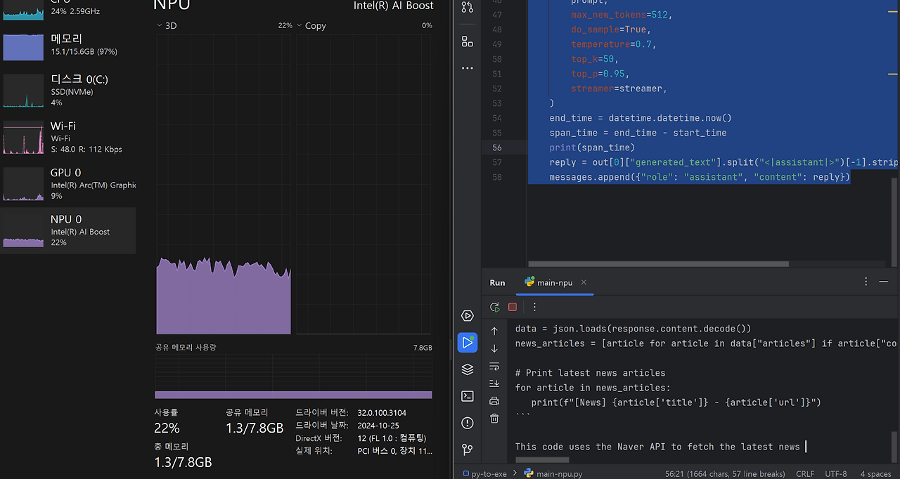

# Intel NPU 가속을 활용한 TinyLlama 챗봇 구현

## Intel NPU Acceleration Library 소개
Intel® NPU Acceleration Library는 Intel Neural Processing Unit (NPU)의 성능을 활용하여 애플리케이션의 효율성을 향상시키는 Python 라이브러리입니다. 호환되는 하드웨어에서 고속 연산을 수행할 수 있도록 설계되었습니다.

## 설치 방법
필요한 라이브러리 설치를 위해 다음 명령어를 실행합니다:

```bash
pip install intel-npu-acceleration-library
pip install transformers==4.42.4
```

!!! note "주의"
      transformers 라이브러리의 버전을 정확히 맞추는 것이 중요합니다. 버전 불일치 시 실행이 되지 않을 수 있습니다.

## 구현 코드
다음은 Intel NPU 가속을 활용하여 TinyLlama-1.1B-Chat 모델을 실행하는 대화형 챗봇의 구현 코드입니다:

```python
import datetime
import torch
import intel_npu_acceleration_library
from intel_npu_acceleration_library.compiler import CompilerConfig
from transformers import pipeline, TextStreamer, set_seed

# 모델 및 설정
MODEL_ID = "TinyLlama/TinyLlama-1.1B-Chat-v1.0"

def load_model():
    """모델 로드 및 NPU 최적화"""
    print("Loading the model...")
    pipe = pipeline(
        "text-generation", model=MODEL_ID, torch_dtype=torch.bfloat16, device_map="auto"
    )
    
    print("Compiling the model for NPU...")
    config = CompilerConfig(dtype=torch.int8)

    try:
        pipe.model = intel_npu_acceleration_library.compile(pipe.model, config)
    except Exception as e:
        print(f"NPU Compilation Failed: {e}")
        exit(1)

    return pipe

def chat():
    """NPU 기반 챗봇 실행"""
    pipe = load_model()
    streamer = TextStreamer(pipe.tokenizer, skip_special_tokens=True, skip_prompt=True)
    set_seed(42)

    messages = [{"role": "system", "content": "You are a friendly chatbot. You can ask me anything."}]
    
    print("NPU Chatbot is ready! Type 'exit' to quit.")
    while True:
        query = input("User: ")
        if query.lower() == "exit":
            break

        messages.append({"role": "user", "content": query})
        prompt = pipe.tokenizer.apply_chat_template(messages, tokenize=False, add_generation_prompt=True)

        start_time = datetime.datetime.now()
        print("Assistant: ", end="", flush=True)

        out = pipe(prompt, max_new_tokens=512, do_sample=True, temperature=0.7, 
                  top_k=50, top_p=0.95, streamer=streamer)

        end_time = datetime.datetime.now()
        print(f"\nResponse Time: {end_time - start_time}")

        reply = out[0]["generated_text"].split("<|assistant|>")[-1].strip()
        messages.append({"role": "assistant", "content": reply})

if __name__ == "__main__":
    chat()
```

## 코드 설명

### 주요 기능
1. **모델 로드 및 NPU 최적화**
    - TinyLlama-1.1B-Chat 모델을 로드
    - Intel NPU를 위한 모델 컴파일
    - bfloat16 데이터 타입 사용으로 메모리 효율성 향상

2. **대화형 인터페이스**
    - 시스템 프롬프트 설정으로 챗봇의 성격 정의
    - 스트리밍 방식의 텍스트 생성으로 실시간 응답
    - 응답 시간 측정 기능

3. **생성 파라미터**
    - max_new_tokens: 512
    - temperature: 0.7
    - top_k: 50
    - top_p: 0.95

## 마무리 
이 구현을 통해 Intel NPU의 성능을 활용하여 효율적인 AI 챗봇을 구현할 수 있습니다. 특히 온디바이스 환경에서 NPU 가속을 활용함으로써 더 빠른 응답 속도를 기대할 수 있습니다. 

