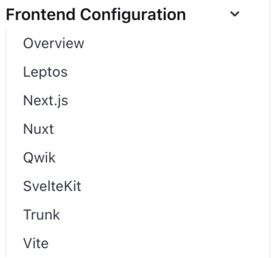
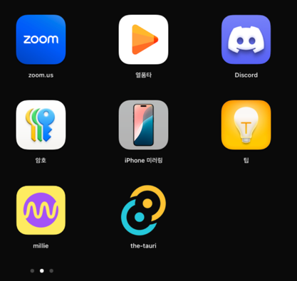
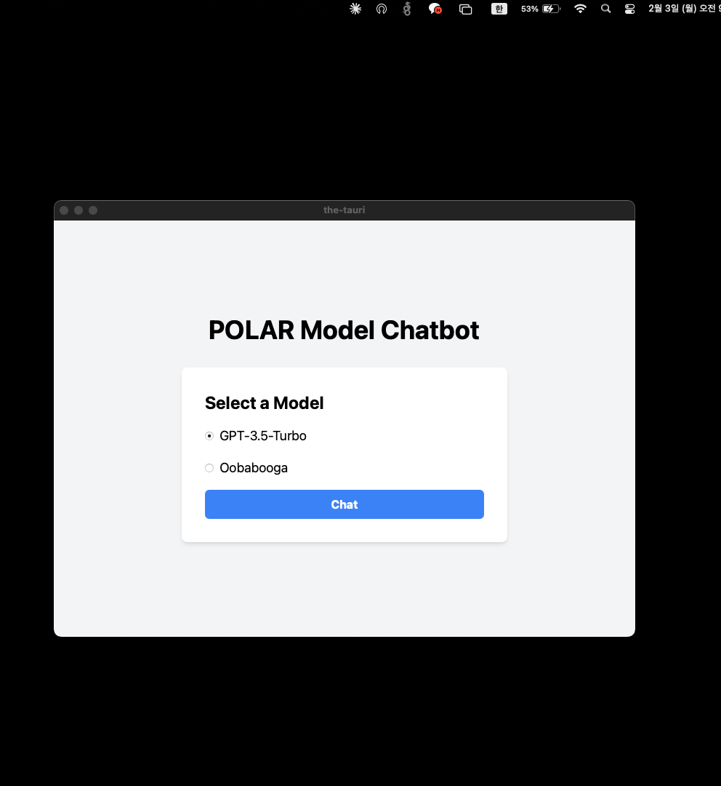

# Tauri 2.0 - 크로스 플랫폼 앱 개발 프레임워크

## 개요
Tauri는 데스크톱 애플리케이션을 구축하기 위한 현대적인 프레임워크입니다. 

* Backend: **Rust** 
* Frontend: webview를 통한 HTML, CSS, JS (React.js, **Next.js** 등) 지원

<br>
{ width="300" height="200" }

## 주요 장점
* 매우 작은 바이너리 크기 (Electron 대비 1/10 ~ 1/20 수준)
* 높은 성능과 낮은 메모리 사용량
* Rust의 안전성과 성능 이점
* 강력한 보안 기능 내장
* 크로스 플랫폼 지원 (Windows, macOS, Linux)

## 개발자 관점에서의 장점
* npm 생태계 활용 가능
* 웹 개발 경험을 데스크톱 앱 개발에 활용
* 시스템 API에 대한 안전한 접근 제공
* 커스텀 플러그인 개발 가능

## 고려사항
* Rust 학습 곡선이 있을 수 있음
* Electron에 비해 생태계가 상대적으로 작음
* OS 네이티브 기능 사용 시 추가 Rust 개발 필요

## 설치 및 설정 가이드

### 1. Rust 설치
```bash
curl --proto '=https' --tlsv1.2 -sSf https://sh.rustup.rs | sh
```

### 2. Next.js 프로젝트 생성
```bash
npx create-next-app@latest --use-npm
```

### 3. tsconfig.json 또는 jsconfig.json 설정
```json
{
  "exclude": [
    "node_modules",
    "src-tauri"
  ]
}
```

### 4. next.config.js 설정
```javascript
/** @type {import('next').NextConfig} */
const nextConfig = {
  output: 'export',
}

module.exports = nextConfig
```

### 5. Tauri 관련 패키지 설치
```bash
npm install --save-dev @tauri-apps/cli@">1.0.0"
npm install @tauri-apps/api@1
```

### 6. package.json 스크립트 추가
```json
{
  "scripts": {
    "tauri": "tauri"
  }
}
```

### 7. Tauri 초기화
```bash
npm run tauri init
```

### 8. main.rs 설정
```rust
#![cfg_attr(not(debug_assertions), windows_subsystem = "windows")]

fn main() {
    tauri::Builder::default()
        .run(tauri::generate_context!())
        .expect("error while running tauri application");
}
```
<br>
<br>
build하면 설치 프로그램도 자동으로 생성된다. 


<br>
<br>

어플리케이션을 실행하면 이렇게뜬다.
<br>
<br>
{ width="300" height="200" }

## 향후 발전 방향
* 사용자 컴퓨터의 내장 GPU나 NPU를 활용한 On-device AI 기능 구현
* LLM 기반 에이전트 통합
* 내장 NPU를 활용한 모델 학습 및 LLM 구동

## 추가 정보
* tray icon 설정 등 상세 기능은 공식 홈페이지 문서 참조
* 빌드 시 설치 프로그램 자동 생성
* UI는 기존 웹 개발 방식으로 구현 가능